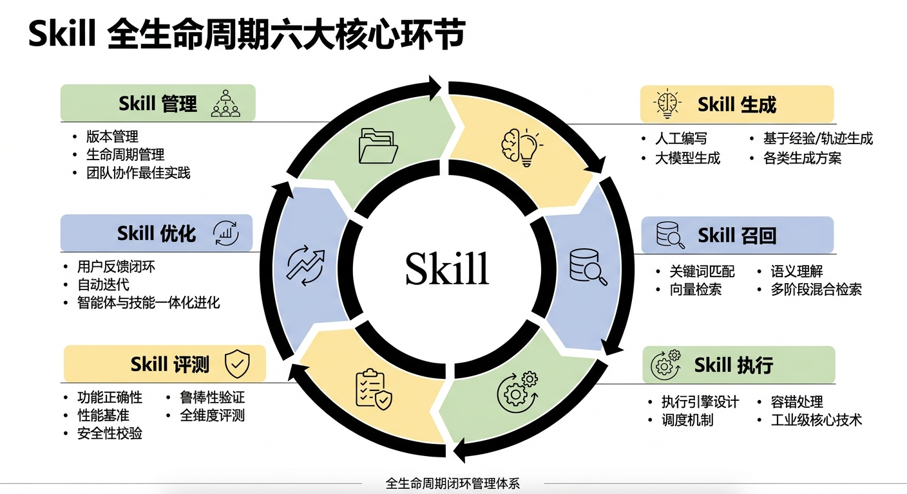

# Skill Radar

<p align="center">
  
</p>

> **追踪 Skills 技术，让 Agent 能力进化有迹可循**

## 什么是 Skill Radar

现在做 AI Agent 开发的团队越来越多，但几乎所有团队都会碰到同一个难题：**Skill 技术体系太零散了**。从技能怎么生成、怎么评测，到怎么召回、怎么执行、怎么迭代优化、怎么全生命周期管理，每个环节都有五花八门的技术方案，想系统学习一遍，得翻几十篇论文、上百个开源项目，还经常找不到完整的技术脉络。

Skill Radar 就是为了解决这个痛点诞生的。它是一个 **Agent 技能全生命周期技术的全景雷达图**，把 Skill 相关的所有技术按照完整的生命周期脉络整理成了一个结构化的知识体系。从最基础的概念定义，到不同技术方案的对比，再到工业界的最佳实践，你都能在这里找到系统的梳理。

### 六大生命周期全覆盖

目前的版本已经完整覆盖了 Skill 全生命周期的六大核心环节：

- **Skill 生成**：人工编写、大模型生成、基于经验/轨迹生成等各类生成方案
- **Skill 召回**：关键词匹配、向量检索、语义理解到多阶段混合检索
- **Skill 执行**：执行引擎设计、调度机制、容错处理等工业级核心技术
- **Skill 评测**：功能正确性、性能基准、安全性校验、鲁棒性验证等全维度评测
- **Skill 优化**：用户反馈闭环、自动迭代、智能体与技能一体化进化
- **Skill 管理**：版本管理、生命周期管理等团队协作最佳实践



### 技术成熟度评估模型

为了让开发者更直观地判断不同技术的落地可行性，Skill Radar 设计了行业内首个针对 Skill 全链路的量化评估体系，从四个核心维度对每项技术做综合评分：

| 评估维度 | 权重 | 评估标准 |
| --- | --- | --- |
| 技术成熟度 | 30% | 从概念验证到成熟产品的完整演进程度 |
| 创新性 | 25% | 技术的原创性和对行业的引领价值 |
| 落地程度 | 25% | 在实际产品/项目中的应用广度和成熟度 |
| 生态活跃度 | 20% | 社区贡献度、项目更新频率、行业关注度 |

成熟度等级用不同颜色标识：

- 🟢 **成熟期**：已有成熟产品级方案，被行业广泛采用
- 🟡 **成长期**：已有可运行原型，开始小范围场景落地验证
- 🔴 **探索期**：概念验证阶段，仅有论文或早期原型

👉 **在线访问**：https://mangooai.github.io/skills-radar/

---

## 站点功能

网站采用单页应用架构，分为两个核心页面，所有技术详情通过**右侧抽屉**就地展开，无需跳转：

### 技术图谱（首页 `/`）

- **Hero 概览**：已收录 / 成熟期 / 成长期 / 探索期 技术数量实时统计
- **技术雷达全景图**：六大领域成熟度分布，悬停查看技术摘要，点击打开详情
- **技术全景流程**：Skill 生命周期六阶段演进路径，点击阶段一键筛选对应技术
- **全量技术列表**：支持卡片 / 列表两种视图
- **多维筛选排序**：按技术领域（生成/召回/执行/评测/优化/管理）、按成熟度筛选；按综合评分、成熟度、创新性、落地、生态等多维度排序
- **右侧抽屉详情**：点击任意技术就地展开，含一句话描述、核心实现（含架构图与 LaTeX 公式）、核心创新、主要能力、适用场景、局限性、四维评分、参考资料

### 演进洞察（`/insights`）

- **各领域综合评分**：六大领域四维评分对比表，点击行展开领域概述与核心目标，一键跳转该领域技术
- **Skill 技术演进时间线**：2023→2026 总体演进（API 插件 → MCP 协议 → Skill 时代 → 技术深化），关键技术的标签可直接跳转对应技术详情
- **技术成熟度评估模型**：四维评估标准 + 四级成熟度等级 + 综合评分计算公式

---

## 快速上手

### 本地开发

```bash
# 克隆项目
git clone https://github.com/MangooAI/skills-radar.git
cd skills-radar

# 安装依赖
npm install

# 启动开发服务器
npm run dev
```

### 构建

```bash
npm run build
npm run preview   # 预览构建结果
```

### 部署到 GitHub Pages

1. 将项目推送到 GitHub 仓库
2. 在仓库 Settings → Pages 中选择 Source: **GitHub Actions**
3. 构建完成后访问: `https://<your-username>.github.io/skills-radar/`

### 技术栈

- Vue 3 + Vite 5
- Pinia（状态管理）
- Vue Router（路由）
- TailwindCSS（样式）
- marked + KaTeX（Markdown 解析与数学公式渲染）

### 项目结构

```
skills-radar/
├── public/
│   ├── data/
│   │   └── radar-data.json          # 技术数据（分类、评分、摘要）
│   ├── docs/radar/
│   │   ├── tech-*.md                # 104 项技术详情文档
│   │   └── images/                  # 技术架构图
│   ├── skill-radar-logo.svg         # 站点 Logo
│   └── agent-insight-logo.svg       # 友情链接 Logo
├── src/
│   ├── components/
│   │   ├── TechRadarChart.vue       # 雷达图（SVG）
│   │   ├── SvgIcon.vue              # 六大领域 SVG 图标
│   │   └── ScoreBar.vue             # 评分进度条
│   ├── constants/
│   │   └── maturity.js              # 评分维度、权重、成熟度阈值（全站单数据源）
│   ├── views/
│   │   ├── Home.vue                 # 技术图谱页（含技术详情抽屉与 techDocMapping）
│   │   └── Insights.vue             # 演进洞察页
│   ├── stores/radar.js              # Pinia 状态管理（数据加载、评分计算）
│   └── router/index.js              # 路由配置
├── vite.config.js
└── package.json
```

---

## 如何贡献

欢迎为 Skill Radar 新增技术！以下是完整流程。

### 整体流程

```
准备四维评分 → 创建技术 MD → 准备架构图 → 更新 radar-data.json → 更新 Home.vue 映射 → 验证
```

### 1. 准备四维评分

对新技术进行四个维度的评分（0.0-1.0）：

| 维度 | 权重 | 评分标准 |
|------|------|----------|
| 技术成熟度 | 30% | 0-0.25 仅论文概念；0.25-0.5 有原型；0.5-0.75 成熟开源项目有应用案例；0.75-1.0 稳定版本大规模应用 |
| 创新性 | 25% | 0-0.25 增量改进；0.25-0.5 有一定创新；0.5-0.75 显著创新被引用多；0.75-1.0 开创性工作引领方向 |
| 落地程度 | 25% | 0-0.25 仅实验室；0.25-0.5 小范围试点；0.5-0.75 多个实际产品采用；0.75-1.0 行业标准大规模部署 |
| 生态活跃度 | 20% | 0-0.25 无社区很少更新；0.25-0.5 小社区低频更新；0.5-0.75 中等社区稳定维护；0.75-1.0 活跃社区高频更新 |

综合评分自动计算：**技术成熟度 × 0.30 + 创新性 × 0.25 + 落地程度 × 0.25 + 生态活跃度 × 0.20**

> 0.6 → 🟢 成熟期 ｜ 0.4-0.6 → 🟡 成长期 ｜ < 0.4 → 🔴 探索期

> ✅ **评分自动更新**：各领域综合评分、Hero 统计数字均为 computed 计算属性，新增技术后无需手动刷新，数据变化即自动重算。

### 2. 创建技术 MD 文件

在 `public/docs/radar/` 下创建 `tech-{技术id}.md`，使用以下模板：

```markdown
# {技术名}：{一句话标题}

> **分类**: {细分分类} | **成熟度**: {🟢/🟡/🔴} | **综合评分**: {评分}

---

## 一句话描述

{1-3句话概括核心技术能力和关键数据指标}

**来源**: 论文/项目、年份、机构
**链接**: arXiv/GitHub/项目主页

---

## 核心实现

**1. {核心实现标题}**
{详细描述}


---

## 主要能力 / 局限性 / 成熟度评分 / 参考资料
（参考现有技术 MD 文件格式）
```

### 3. 准备架构图

放在 `public/docs/radar/images/{技术id}_architecture_overview.png`

### 4. 更新 `public/data/radar-data.json`

在目标分类的 `technologies` 数组末尾新增：

```json
{
  "id": "{技术id}",
  "name": "{技术显示名}",
  "description": "{一句话中文描述}",
  "scores": [技术成熟度, 创新性, 落地程度, 生态活跃度],
  "status": "active|research|open-source|academic"
}
```

分类 ID 对照：`generation`（生成）、`recall`（召回）、`execution`（执行）、`evaluation`（评测）、`optimization`（优化）、`management`（管理）

> ⚠️ 必须加到对应分类的 `technologies` 数组里，首页统计与各领域综合评分才能正确体现该技术。

### 5. 更新 `src/views/Home.vue`

在 `Home.vue` 的 `techDocMapping` 对象末尾新增映射（让抽屉能加载该技术的 MD 详情）：

```javascript
'{技术id}': 'tech-{技术id}'
```

### 6. 验证

```bash
npm run dev
```

1. 在技术图谱页筛选新技术所属领域，确认卡片出现且评分正确
2. 点击卡片，确认右侧抽屉能正确加载 MD 内容（含架构图）
3. 切换到演进洞察页，确认各领域综合评分已自动更新

### 文件修改清单

| 文件 | 修改内容 | 必改 |
|------|---------|------|
| `public/docs/radar/tech-{id}.md` | 新建技术详情 MD | ✅ |
| `public/docs/radar/images/{id}_architecture_overview.png` | 新建架构图 | ✅ |
| `public/data/radar-data.json` | 对应分类 technologies 新增条目 | ✅ |
| `src/views/Home.vue` | techDocMapping 新增映射 | ✅ |

---

## 友情链接

- [Agent Insight](https://atomgit.com/openeuler/agent-insight)
- [AET](https://atomgit.com/leon-wang2021/aet)

## License

MIT
