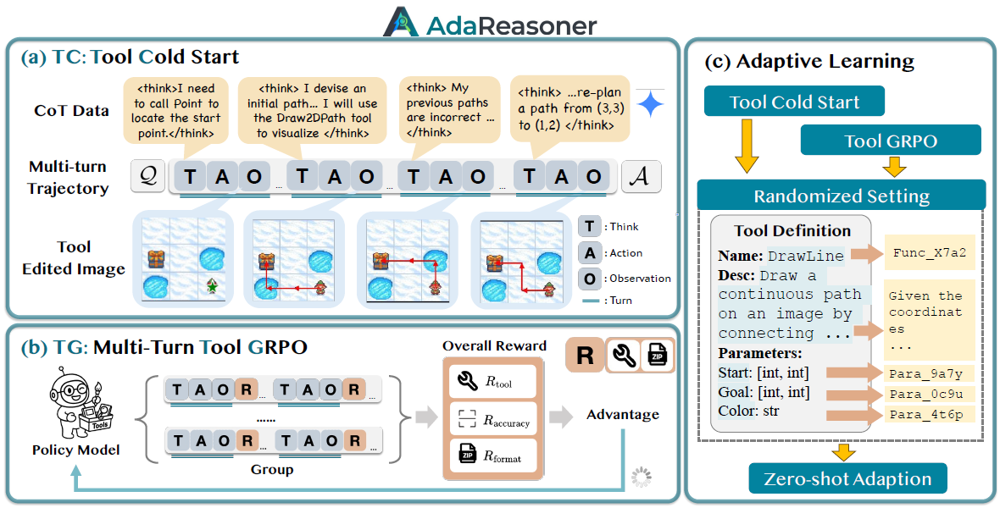

# AdaReasoner

> **分类**: Skill 生成 | **成熟度**: 🟡 成长期 | **综合评分**: 0.53

---

## 一句话描述

AdaReasoner 将工具使用视为可学习的通用推理 Skill，通过**轨迹数据管线**、**Tool-GRPO** 和**自适应学习**三位一体，使模型自主决策何时用何工具、编排多步工具链，7B 模型平均提升 **24.9%**，在 **VSP** 和 **Jigsaw** 上超越 **GPT-5**。

**来源**:
- 学术论文：复旦大学、同济大学、新加坡国立大学、华盛顿大学、电子科技大学、香港中文大学
- 发布年份：2026年

**链接**:
- 论文链接：https://arxiv.org/abs/2601.18631
- GitHub：https://github.com/ssmisya/AdaReasoner
- HuggingFace：https://huggingface.co/AdaReasoner

---

## 核心实现

AdaReasoner 将工具增强的多模态推理形式化为序列决策过程，基于三项核心创新构建：

**1. 高质量轨迹数据管线（TC）**：三阶段生成训练轨迹——首先为每类任务设计抽象最优求解蓝图（VSP 按感知-规划-验证、Jigsaw 按迭代试错），刻意融入反思回溯和显式工具失败两种复杂场景；然后程序化执行工具调用填充输入输出；最后用强 LLM 生成连接每步的 Chain-of-Thought 推理文本，教会模型主动验证假设和从失败中恢复。

**2. Tool-GRPO 强化学习（TG）**：扩展 GRPO 处理多轮工具调用轨迹。奖励由格式、工具调用质量和最终答案精度三部分加权组合，格式奖励单步错误即全轨迹归零，工具奖励按结构、名称、参数名、参数内容四维度层级评分（0-4 分）。采用不对称奖励设计——预测正确时无论是否使用工具均给满分，预测错误时按工具使用质量给部分分，使工具成为不确定性下的后备机制而非强制步骤。

**3. 自适应学习机制（ADL）**：贯穿 TC 和 TG 两阶段，解耦工具使用逻辑与任务绑定。Token 级随机化将工具名和参数名替换为随机字符串，迫使模型从描述和上下文推断功能；语义级重述改写工具和参数描述，保持语义但改变措辞，防止过拟合。

---

## 主要能力

- 自主规划多步工具调用链：动态选择感知（POINT、OCR）、操作（DRAW2DPATH、CROP）、计算（ASTAR）三类视觉工具
- 自适应工具调节：自主学会采纳有益工具、抑制无关工具、根据任务需求动态调节使用频率，无需显式训练这些行为
- 跨工具跨任务泛化：在未见过的工具定义和全新任务分布上，保持高频率和高准确率的工具使用

---

## 局限性

- 当前仅验证了视觉推理领域，文本工具使用能力未评估
- 依赖预定义工具集，工具集扩展需要重新训练
- Tool-GRPO 训练计算开销较大，需要多轮交互采样

---

## 成熟度评分

| 维度 | 评分 (0.0-1.0) | 说明 |
|------|---------------|------|
| 技术成熟度 | 0.55 | 有论文+开源代码+HuggingFace模型数据，实验充分 |
| 创新性 | 0.75 | 工具使用即推理Skill的范式转变+Tool-GRPO+自适应学习三位一体 |
| 落地程度 | 0.40 | 开源可用但仅验证视觉推理，实际部署案例少 |
| 生态活跃度 | 0.40 | 2026年1月发布，GitHub有代码和模型 |

**综合评分**: 0.53

---

## 参考资料

- [论文](https://arxiv.org/abs/2601.18631)
- [代码](https://github.com/ssmisya/AdaReasoner)
- [模型与数据](https://huggingface.co/AdaReasoner)
