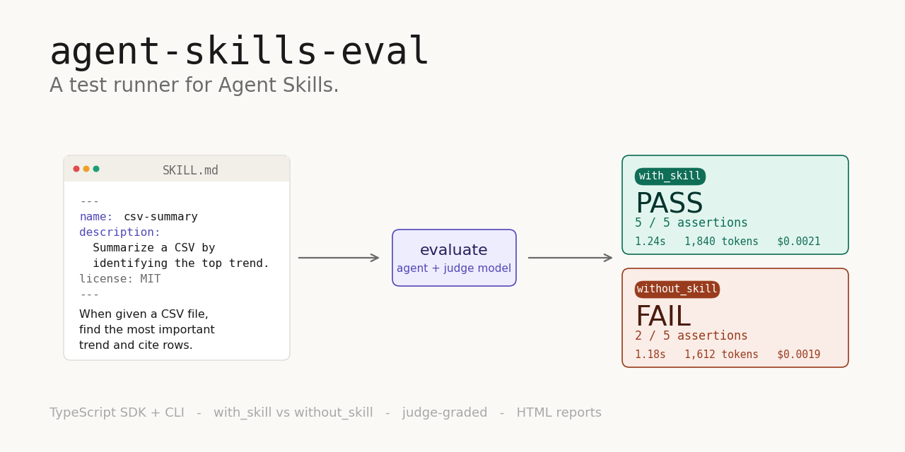

# agent-skills-eval

> **分类**: Skill评测 | **成熟度**: 🟡 早期开源 | **综合评分**: 0.55

---

## 一句话描述

**agent-skills-eval** 是一个与 Agent 运行时解耦的 **AI Agent 技能测试运行器**，通过 **A/B 对比机制**（有技能 vs 无技能）配合 **LLM-as-a-Judge 自动打分**，为 SKILL.md 格式的 Agent 技能提供可量化的有效性验证和可视化 HTML 报告。

**来源**:
- darkrishabh（独立开源开发者）
- 发布年份：2025

**链接**:
- 代码：https://github.com/darkrishabh/agent-skills-eval

---

## 核心实现

**1. A/B 对比双轨运行：有技能 vs 无技能的基线量化**

框架核心采用**两轨并行**的运行机制来量化技能增益。`with_skill` 轨道在 Prompt 上下文中注入目标 SKILL.md 内容后运行目标模型；`without_skill` 轨道保持 Prompt 一致但不加载该技能。通过 `--baseline` 参数激活后，同一模型对同一提示词回答两次，**差分结果即为技能的净贡献值**。这从根本上回答了"这个技能到底有没有用"。

**2. LLM-as-a-Judge 自动裁判：双盲打分 + 推理依据**

框架引入独立的裁判模型（如 `--judge gpt-4o-mini`）进行**双盲评估**——裁判完全不知晓哪边有技能、哪边没有。裁判结合评测配置中声明的 `expected_output`（预期输出）和 `assertions`（断言列表），分别对两侧输出进行独立打分。裁判不仅输出 **Pass/Fail 判定**，还会给出**具体的推理依据**（Reasoning），方便开发者理解评分逻辑并调试技能。

**3. 确定性检查与工具调用评测**

除文本质量的主观评估外，框架支持对 **工具调用（Tool Calls）** 进行确定性检查。可捕获 Agent 是否调用了正确的工具、工具参数是否合规，评估 Agent 行为是否符合预期的**逻辑链**——而不仅仅检查最终文本输出。这让技能验证从"看起来对不对"升级到了"做没做对的事"。

**4. 声明式 YAML/JSON 配置架构**

技能和评测遵循极简的目录规范。每个技能是一个独立文件夹，核心为 **SKILL.md**（含 Frontmatter 元数据和过程化描述）。评测配置放在技能文件夹下的 `evals/` 目录中，以 **YAML 或 JSON** 声明测试用例、输入 Prompt、预期输出和断言条件。配置即文档，零代码即可新增测试。

**5. 便携式静态 HTML 报告**

运行测试后（`npx agent-skills-eval ./skills ...`），框架生成独立的 Workspace 目录并包含**静态 HTML 报告**。报告提供按技能和按用例的**通过率统计**、with/without 输出的**侧栏双栏对比**、每条断言的**证据链与 Judge 思考过程**、以及耗时、Token 消耗、工具调用详情等**消耗统计**。

---

## 主要能力

- **A/B 基线对比量化增益**：同一模型有技能/无技能双轨运行，差分量化技能的真实有效性
- **LLM 双盲自动裁判**：独立 Judge 模型在不知情侧标的条件下评估输出，输出 Pass/Fail + 推理依据
- **工具调用确定性检查**：捕获并验证 Agent 的工具调用是否正确、参数是否合规、行为是否符合逻辑链
- **声明式配置零代码扩展**：YAML/JSON 声明测试用例与断言，无需编写测试代码
- **可视化 HTML 报告**：通过率统计、双侧对比、断言证据链、消耗统计一站式呈现

---

## 局限性

- **LLM 裁判的可靠性**：Judge 模型本身的评估偏差和一致性未在项目中被系统校准，主观文本评估可能引入噪声
- **单技能评测为主**：A/B 机制聚焦单个技能的增益量化，多技能组合协同场景的评估能力尚未覆盖
- **社区验证规模有限**：作为独立开源项目，缺乏大规模技能库的基准测试数据和行业采纳案例
- **运行时适配门槛**：虽然宣称运行时解耦，但不同 Agent 框架的回调集成和工具调用捕获仍需额外适配工作

---

## 成熟度评分

---

## 参考资料

- [代码](https://github.com/darkrishabh/agent-skills-eval)
- [官网](https://darkrishabh.github.io/agent-skills-eval/)