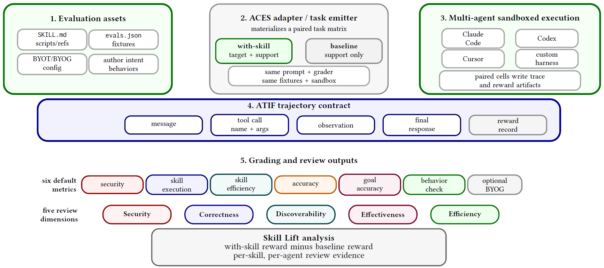

# AgenticContinuousEval

> **分类**: Skill评测 | **成熟度**: 🟢 成熟期 | **综合评分**: 0.63

---

## 一句话描述

**ACES** 是 NVIDIA 提出的技能评测框架，把 agent 技能当**可执行制品**配对跑 with-skill/baseline 两条件，用 **Skill Lift** 量化技能的边际贡献，覆盖扫描、判分、实跑、CI/CD 全链；145 技能中 94.5% 过结构门但两层扫描 Spearman ρ 仅 **0.14**。

**来源**:
- Evaluating Skills, Not Just Agents: Agentic Continuous Evaluation of Skills（Christopher Kevin 等，NVIDIA）
- 发布年份：2026

**链接**:
- https://arxiv.org/abs/2608.20614

---

## 核心实现

立论：扫描技能文档（结构检查、LLM-judge、linter、安全扫描）**不等于运行时能用**——145 技能 94.5% 过结构门，但结构分与 LLM-judge 分的 Spearman ρ 仅 **0.14**，两层扫描互不自洽。ACES 把技能当一等可执行制品配对评测。

**1. 评测资产契约：技能自带测试套件**

- 每技能一份 `evals.json` 含 prompt、ground_truth、`expected_behavior` 行为断言；作者可写 `EVAL.md` 盖过 LLM 生成、挂 BYOT/BYOG 自带任务和评分器。
- 四桶引导（Explicit/Implicit/Contextual/Negative）+ 安全行为自动追加，控制点：作者意图永远盖过 LLM 生成。

**2. 配对 with-skill/baseline 执行：隔离边际贡献**

- 固定 question/agent/model/scorer/支撑技能，仅改目标技能可用性，跑两次取差值。
- baseline 里保留作者配置的参考诱饵技能（如 api-debugger/log-triage），避免把内容贡献和可发现性贡献混算。

**3. ATIF 轨迹契约 + 统一评分层**

- 版本化 JSON schema 的轨迹契约，Claude Code/Codex 原生产出，纯日志 harness 走适配器转合成 ATIF；同一评分层跨 harness 评同一轨迹。
- 六默认指标：security/skill_execution/skill_efficiency（确定性）、accuracy（LLM judge）、goal_accuracy（RAGAS）、behavior_check（按 `expected_behavior` 逐条 yes/no），映射到 Security/Correctness/Discoverability/Effectiveness/Efficiency 五维。

**4. Skill Lift 度量：孤立 vs 群组分解路由溢价**

- 度量式 $Lift_{s,a}=\frac{1}{|M|}\sum_{m}(S^{with}_{s,a,m}-S^{base}_{s,a,m})$，即跨模型平均的配对分差。
- 孤立模式（只放目标技能）vs 群组模式（加诱饵技能），差值是**路由溢价**，给作者改名字/描述的可操作信号；947 用例中 72.8% 为正、87 个为负向可追溯到具体对比。

**5. 动态适配器 + 仓库原生 CI**

- 每次合并重新物化临时任务环境（Dockerfile + verifier + instruction.md），Harbor 后端管容器生命周期。
- `evals/` 目录当 tests/ 用：pull/merge 请求触发深度递进（结构每次跑、判分按需、实跑留给发布候选），`--refine --from-results` 可从保存轨迹把 observed 行为提升为 `expected_behavior`。

---

## 主要能力

- **配对差分评测**：固定支撑技能只改目标技能可用性，Skill Lift 隔离边际贡献，绝对分高不等于技能有用。
- **跨 harness 统一评分**：ATIF 轨迹契约让 Claude Code/Codex/Cursor 在同一评分层下被评，BYOG 接产物级检查补轨迹盲区。
- **孤立/群组分解路由溢价**：Liftgrp − Liftiso 直接量技能名字和描述在邻居中能否被 agent 分辨出来。
- **CI 原生与人在回路精修**：`evals/` 当 tests/ 用，`--refine --from-results` 从保存轨迹把 observed 行为提升为 `expected_behavior`，作者意图永远盖过 LLM 生成。
- **负向 lift 当调试信号**：947 用例 87 个负向被分进"从未发现"和"发现但误用"，可追溯到 with/baseline 两运行间对比。

---

## 局限性

- 语料偏 System Access/Deployment/Platform/Data Infra 四类，不覆盖创意类；四主 harness 单元覆盖不均。
- Skill Lift 是声明工作区下的边际贡献，不识别环境无关"内在"属性；加减技能会改路由压力和上下文分配。
- LLM-judge 的 judge 间一致性、人工校准、不确定性传播未测；三判官 spread 只覆盖文档判分不覆盖轨迹评分。
- 实跑成本随 $N_{\text{skills}} \times K_{\text{agents}} \times C \times A \times 2$ 线性涨，留给发布候选而非每次改动。

---

## 成熟度评分

| 维度 | 评分 (0.0-1.0) | 说明 |
|------|---------------|------|
| 技术成熟度 | 0.66 | 技能当可执行制品 + ATIF 轨迹契约 + CI/CD 全链，NVIDIA 开源 |
| 创新性 | 0.74 | 配对差分 Skill Lift 隔离边际贡献 + 孤立/群组分解路由溢价 |
| 落地程度 | 0.55 | 947 用例 72.8% 正向 87 负向，跨 Claude Code/Codex/Cursor |
| 生态活跃度 | 0.55 | NVIDIA 开源 SkillEvaluator，可复现 |

**综合评分**: 0.63

---

## 参考资料

- [Evaluating Skills, Not Just Agents: Agentic Continuous Evaluation of Skills](https://arxiv.org/abs/2608.20614)
- [ACES 开源实现 NVIDIA SkillEvaluator](https://github.com/NVIDIA/SkillEvaluator)
