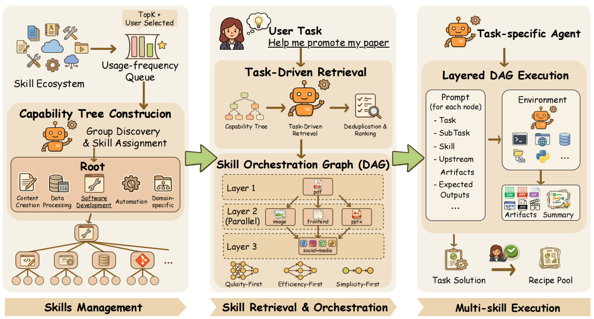

# AgentSkillOS

> **分类**: Agent 技能管理/编排框架 | **成熟度**: 🔴 研究阶段 | **综合评分**: 0.58

---

## 一句话描述

**AgentSkillOS** 是首个面向 **Agent 技能生态系统**的有原则管理框架，通过 **能力树（Capability Tree）** 组织大规模技能集合，并以 **DAG 编排**实现多技能协同执行，解决 28 万+公开技能场景下的技能发现、组合和调用问题。

**来源**:
- Hao Li, Chunjiang Mu, Jianhao Chen, Siyue Ren, Zhiyao Cui, Yiqun Zhang, Lei Bai, Shuyue Hu
- 上海人工智能实验室（Shanghai Artificial Intelligence Laboratory）
- 发布年份：2026

**链接**:
- 论文：https://arxiv.org/abs/2603.02176
- 代码：https://github.com/ynulihao/AgentSkillOS

---

## 核心实现

**1. 能力树构建：层次化技能组织与增量管理**

系统从根节点出发，采用**广度优先策略**逐层递归划分技能集。每层划分分两步：
1. **Group Discovery**：由 LLM 生成类别分组（名称+描述）；
2. **Skill Assignment**：由 LLM 将各技能分配至最匹配类别。解耦两步骤可显著降低遗漏概率。

根节点使用五个人工固定类别（内容创作、数据处理、软件开发、自动化、领域特定）保证顶层稳定。单技能类别直接合并至兄弟节点，未分配技能触发重试或兜底入最大类别。超大规模（超过阈值 K）时启用**使用频率队列**（按安装量排序）只取 Top-K 建树，其余进入**休眠索引**（向量语义检索，按需唤醒）。新技能加入支持增量更新——从根节点逐层分配至叶节点后，自底向上刷新路径节点描述。

**2. 任务驱动技能检索：树遍历 + 向量补充 + 修剪排序**

LLM 从能力树根节点出发，逐层选择相关类别子节点直至叶节点，所有触及叶子构成候选技能集。树内未覆盖技能通过**向量相似度搜索**从休眠索引中补充。候选集经过去重、按任务相关性排序、丢弃无关项，最终保留 Top-M（实验中 M=8）的紧凑列表。用户可在此基础上手动增选私有技能。

**3. DAG 技能编排与分层执行**

确定技能集后，LLM 将用户任务拆解为子任务、分配对应技能、明确子任务间依赖关系，产出一个**有向无环图（DAG）**。提供三种编排策略：
- **Quality-First** 最大化质量（最深、节点最多、依赖最密）；
- **Efficiency-First** 最大化并行度（宽而浅）；
- **Simplicity-First** 只保留必需节点（最紧凑）。执行时同层节点并行、跨层按依赖顺序串行。每个节点的执行 Prompt 包含任务描述、技能调用、上游制品、期望输出和下游消费方式。支持**编排复用**——相似任务可直接复用历史 DAG 方案。

---

## 主要能力

- **大规模技能生态系统组织**：将 28 万+技能层次化组织为能力树，支持从粗到细的逐级定位
- **DAG 多技能协同编排**：三种编排策略（质量/效率/简洁优先）产生拓扑结构根本不同的执行方案
- **增量树更新**：新技能加入无需重建整棵树，沿路径插入并自底向上更新
- **使用频率队列 + 休眠索引**：平衡树规模与覆盖度，高频技能进树，低频技能按需唤醒
- **编排方案复用**：基于任务向量相似度匹配历史 DAG，跳过检索与编排阶段

---

## 局限性

- **技能依赖预收集状态**：框架假定技能已采集就绪，未覆盖从开放来源持续发现与自动采集新技能的流程
- **缺乏自动化质量控制**：未内置技能质量的自动评估和筛选机制，对低质量或恶意技能的治理尚无方案
- **LLM 驱动的分类一致性**：能力树构建依赖 LLM 的 Group Discovery 和 Skill Assignment，大规模下分类一致性和稳定性未充分验证
- **仅 30 任务基准**：自建基准规模有限，五大类别各仅 6 个任务，泛化性有待更大规模验证

---

## 成熟度评分

---

## 参考资料

- [论文](https://arxiv.org/abs/2603.02176)
- [代码](https://github.com/ynulihao/AgentSkillOS)