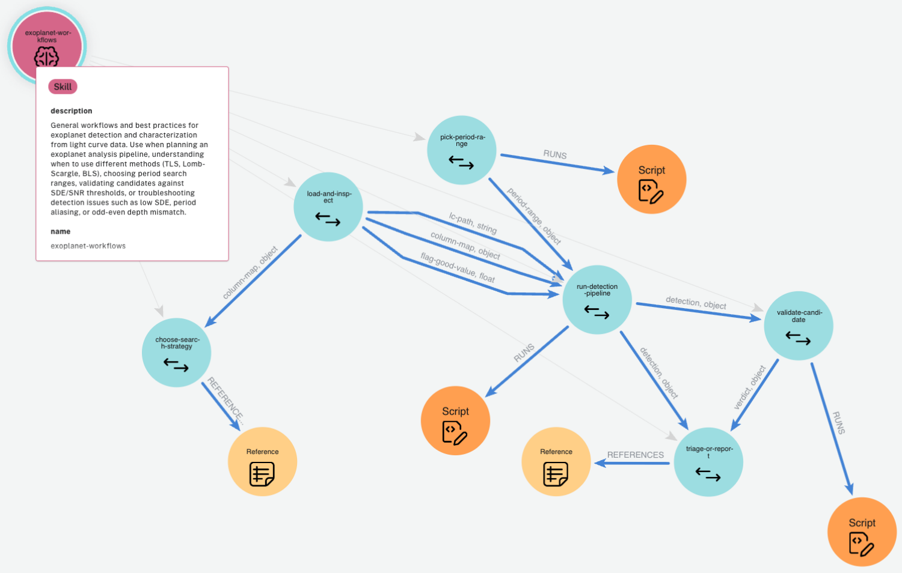

# AIP (Agent Instruction Protocol)

> **分类**: Agent 技能执行 | **成熟度**: 🟡 成长期 | **综合评分**: 0.44

---

## 一句话描述

AIP 将 Agent 技能从**自由文本 Markdown** 重构为一张**有向执行图**：节点是离散的操作步骤（确定性脚本或自然语言描述），边是带类型的输入输出数据流，整体由 **schema 校验的 YAML 规范**严格约束，让技能从"每次重读重理解"变成**按图执行、按节点调试、按类型审计**。

**来源**:
- Neo4j 团队，论文 arXiv: 2606.04781
- 发布年份：2026

**链接**:
- 论文：https://arxiv.org/abs/2606.04781
- 代码：https://github.com/zach-blumenfeld/aip

---

## 核心实现

**1. 节点层：离散操作步骤的二元分类**

每个节点是不可再分的操作步骤，分为两类：
- **确定性脚本节点**承载可运行代码；
- **自然语言节点**仅用于需要判断或交互的环节。

这种分类本身标记了哪些步骤已被工程化固定、哪些仍依赖 Agent 实时推理。

**2. 边层：带类型的输入输出数据流**

节点间通过**显式类型标注的边**连接，步骤 A 输出文件路径、步骤 B 期望接收文件路径，这个契约写在边的类型标签上而非依赖 prompt 的自然语言约定。类型系统在编译期即可捕获数据流不匹配。

**3. Schema 校验层：YAML 规范的严格约束**

整个图结构由 **schema 校验的 YAML 规范**约束，类型错误、字段缺失、结构不一致在编译阶段被捕获。这层校验是自由文本技能不具备的结构化质量保障。

**4. 编译器层：meta-skill 的自动化转换**

编译器本身是一个 **meta-skill**，输入任意形式的人类编写材料，输出符合 AIP schema 的执行图。编译过程是质量门：源材料中的模糊之处必须被解析才能产生有效图，自由文本中隐式的内容在图结构中被迫显式化。

---

## 主要能力

- 将自由文本技能编译为**类型化、schema 校验**的有向执行图
- 支持**节点级可寻址**调试：故障可精确追踪到具体节点，修复不波及其他部分
- 支持**全库结构化审计**：按节点类型或拓扑模式对技能库进行图查询
- 支持**基于图结构的技能检索**：可按节点类型或拓扑模式检索，而非仅依赖语义匹配
- 为技能优化提供**类型化、有边界的 RL 动作空间**，有向图拓扑天然构成动作掩码

---

## 局限性

- 目前仅为 **spec 阶段**，运行时协议尚未实现，论文将其列为 future work
- 实验规模有限（**27 个任务**），需在更大规模任务和更多模型上验证泛化性
- 编译器本身是 **meta-skill**，编译质量依赖底层 LLM 的推理能力
- 对于简单或篇幅较短的技能，图结构的**工程开销可能超过收益**

---

## 成熟度评分

| 维度 | 评分 (0.0-1.0) | 说明 |
|------|---------------|------|
| 技术成熟度 | 0.45 | 有向执行图+Schema校验概念完整，仍处于早期原型 |
| 创新性 | 0.50 | Neo4j团队图数据库背景带来的独特视角 |
| 落地程度 | 0.35 | 论文阶段，尚未见大规模部署 |
| 生态活跃度 | 0.45 | Neo4j团队背书，有GitHub开源代码 |

**综合评分**: **0.44**

---

## 参考资料

- [论文)](https://arxiv.org/abs/2606.04781)
- [代码](https://github.com/zach-blumenfeld/aip)
