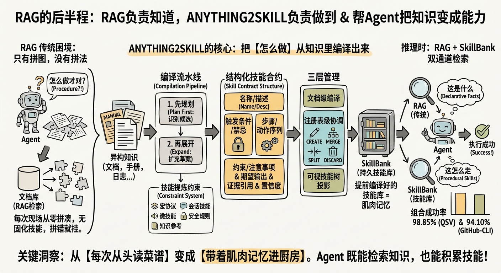
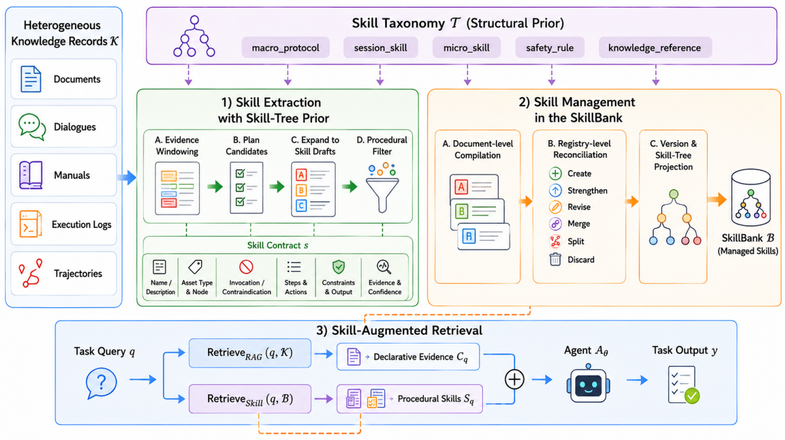

# ANYTHING2SKILL (AutoSkill)

> **分类**: Agent 技能工程 | **成熟度**: 🟢 工程化阶段 | **综合评分**: 0.67

---

## 一句话描述

ANYTHING2SKILL 将异构外部知识（文档、手册、日志）中的**隐性过程性知识提前编译为结构化技能**，推理时与 RAG 组成双通道检索：RAG 提供声明性事实证据，**SkillBank** 提供已验证的操作路径。qsv 上成功率 **98.85%**，GitHub-CLI 上 **94.10%**，SkillBank 单独已超过 RAG 单独。

**来源**:
- 华东师大 & 上海 AI Lab，论文 arXiv: 2606.09316
- 发布年份：2026

**链接**:
- 论文：https://arxiv.org/abs/2606.09316
- 代码：https://github.com/ECNU-ICALK/AutoSkill

---

## 核心实现

**1. 结构化技能合约：四要素的显式契约**

每个技能是一份包含八个字段的结构化合约，核心逻辑：可执行技能必须同时说清楚**什么时候触发、怎么执行、注意什么、产出什么**。包含触发条件与禁忌场景、具体步骤与动作序列、约束与注意事项、期望输出，以及指向原始证据的引用与置信度分数。

**2. 五种资产类型：约束性分类体系防止提取偏差**

所有技能归入严格分类树：**宏协议**（跨任务全局流程）、**会话技能**（多步交互模式）、**微技能**（原子操作）、**安全规则**（危险动作和禁忌）、**知识参考**（事实性信息）。提取时每个候选必须能归入某个节点否则丢弃：这个约束让提取器产出过程性技能而非自由摘要，也为后续合并冲突检查提供类型安全。

**3. 先规划再展开：防幻觉的两阶段提取**

长文档先切分成**证据窗口**（附带标题路径和位置锚点）。
- **规划阶段**：LLM 扫描窗口识别潜在技能候选，只产出轻量提纲。
- **展开阶段**：每个候选独立扩充为完整草案。

防幻觉关键：窗口内容若不直接支撑规划中列出的步骤，展开器返回**空草案而非硬编**；草案必须包含至少一个过程性组件（步骤、动作、约束）才通过过滤。

**4. 三层入库管理：从局部草案到可用技能库**

文档级编译将同源草案按分类键合并为规范技能；注册表级协调用**混合检索（稠密语义+稀疏词汇+分类兼容）**匹配已有技能，管理模型执行七种生命周期动作（CREATE、STRENGTHEN、REVISE、MERGE、SPLIT、UNCHANGED、DISCARD），更新类动作仅在类型和粒度一致时允许；可视技能树将活跃技能投影为可浏览、可检索的导航树。

---

## 主要能力

- 从文档、手册、日志等多种异构来源**自动编译过程性技能**，每个技能可追溯到原始证据
- 推理时提供 **RAG + SkillBank 双通道检索**，声明性知识与过程性技能互补覆盖
- 七种技能生命周期动作（含合并、拆分、强化、废弃）实现技能库的**持续演化管理**
- 五种资产类型的约束性分类体系确保提取产物是**可执行过程知识**而非自由摘要
- 可视化技能树为 Agent 提供**可浏览、可检索的技能导航**，底层有完整版本历史与证据链

---

## 局限性

- **分类体系是手工定义的**，新领域需人工扩展分类树，难以完全自动化适配
- 技能生命周期管理依赖 **LLM 判断**，长尾场景和边缘案例的决策可靠性尚未充分验证
- 当前实验覆盖的命令行工具场景（qsv、GitHub-CLI）相对结构化，**更开放域的泛化性待验证**

---

## 成熟度评分

---

## 参考资料

- [论文](https://arxiv.org/abs/2606.09316)
- [代码](https://github.com/ECNU-ICALK/AutoSkill)
