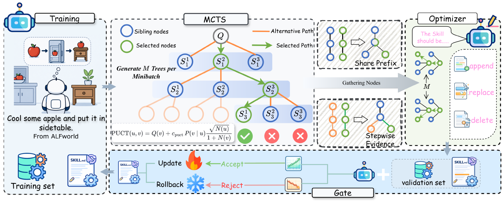

# Branch2Skill

> **分类**: Skill优化 | **成熟度**: 🟡 成长期 | **综合评分**: 0.58

---

## 一句话描述

**Branch2Skill 是从 MCTS 推理树蒸馏技能更新的方法**：沿 elite path 多深度对比选定步骤与共享前缀 sibling 分支，把差异转成 APPEND/REPLACE/DELETE 更新，验证门控保非退步——**token 省 73.2%、聚合增益反涨 9.3%**。

**来源**:
- Branch2Skill: Efficient Skill Evolution Through Reasoning Trees（Yanwei Ren 等，北航 / 香港理工 / 莱斯特大学 / 南洋理工 / 快手科技）
- 发布年份：2026

**链接**:
- https://arxiv.org/abs/2608.08677

---

## 核心实现

立论：单条 rollout 的早期错误会传播，后续步骤继承错误前提而非产独立更新信号；要拿更多失败证据得重复 rollout-诊断-更新循环，**稀疏监督 + 高 token 成本**。MCTS 的 sibling 节点共享前缀、只当前决策分叉，下游结果自然定位局部决策，不需额外错误归因模型。

**1. 树构造：PUCT 选择 + 目标模型自评回传**

目标模型在最大深度、子节点数、迭代预算、探索系数下建树。每次选择分数 PUCT(u,v) = Q(v) + c·P(v|u)·√max(1,N(u))/(1+N(v))——Q(v) 为回传均分、N(·) 为访问数——前半项利用高分节点、后半项探索少访替代。生成子节点后目标模型读完整前缀给一个标量进度分回传到根；预算耗尽、无合法扩展或达最大深度停。剩余深度/预算小时**强制完成路径**保可比终局结果。

**2. 共享前缀证据提取：同父对比把归因收窄到该层决策**

搜索后保留一条代表路径（优先成功终止路径，否则最强失败路径）。对每一深度，取选定节点的所有 sibling：它们与选定节点共享同一父、同一前缀、首次不同就在该层，所以下游结果差异把归因收窄到该层决策——比独立轨迹对比更局部（独立轨迹可能在多处早步就分叉）。每条证据含共享前缀、选定步骤、评估 sibling、下游结果、搜索统计。**完整树不发给 skill 模型，也不另用模型定位错误**，对比结构本身就把错误定位了。

**3. 技能修订三操作：每步只调一次返完整候选**

M 棵树的证据合并连同当前技能发 skill 模型，**每次更新步只调一次**返回完整候选技能（不是一组松散建议）。三操作：APPEND 引入缺失规则/条件/前置；REPLACE 修复行动/对象/条件/范围冲突的指导；DELETE 移除误导/冗余/反复关联失败分支的指导。多树合并能区分反复弱点（跨树反复出现）与孤立失误（单树偶发）。

**4. 验证非退步门控：候选直接推理比旧技能，任一指标降就回滚**

候选在固定验证集上**直接推理（不用树搜索）**评，与当前技能同条件比。门控规则要求候选按分量无任何指标下降才接受、否则恢复旧技能——防局部合理修订削减更广效用；并保留验证最强检查点做最终评估。

控制要点：密度增益来自同父对比结构而非多搜——whole-tree 反输所有 sibling 证据反比同父精选差 **13.7** 点；搜索分支是改进未来推理的可复用证据，不只是解当前问题。六基准 30 设置中 26 最佳，均值 50.8→**69.1**；GPT-5.5 下用 141.3M token（比 SkillOpt 省 **73.2%**），每百万 token 增益 0.224→0.911 涨 **4.07×**，聚合增益反涨 **9.3%**。

---

## 主要能力

- **一次树多证据**：沿 elite path 多深度 sibling 对比，一棵树产多个技能更新信号，token 从 **526.7M 砍到 141.3M**（省 73.2%）
- **六基准一致领先**：30 设置 26 最佳，均值 50.8→**69.1**，每百万 token 增益 **4.07×**
- **三操作修订 + 非退步门控**：APPEND/REPLACE/DELETE + 按分量验证保单调曲线
- **跨模型迁移**：GPT-5.4 演化技能冻结给 GPT-5.5 涨 18.9 点，分支证据跨模型身份
- **消融可归因**：depth/children/iterations 逐层增益递减，证据选择方法贡献最大

---

## 局限性

- **跨数据集迁移增益小**：OlympiadBench→Omni-MATH 仅 +2.8–3.5 点，远小于域内，技能可复用性有域边界
- **强 skill 模型依赖**：难数学推理（LiveMath）GPT-5.5 作 skill 模型领先 2.8–9.3 点，弱优化器在难域掉链
- **搜索容量边际递减**：深度 4→6、迭代 20→40 增益递减，树越大边际越低
- **验证门控双刃**：保非退步但后期平台化拒绝后修，部分有效修订可能被弃

---

## 成熟度评分

| 维度 | 评分 (0.0-1.0) | 说明 |
|------|---------------|------|
| 技术成熟度 | 0.58 | MCTS 树蒸馏技能更新 + 三操作 + 验证门控，未开源 |
| 创新性 | 0.76 | 沿 elite path 多深度 sibling 对比产多证据，共享前缀收窄归因 |
| 落地程度 | 0.50 | 六基准 26/30 最佳，省 73.2% token 增益反涨 9.3% |
| 生态活跃度 | 0.45 | 单篇论文，未开源 |

**综合评分**: 0.58

---

## 参考资料

- [Branch2Skill: Efficient Skill Evolution Through Reasoning Trees](https://arxiv.org/abs/2608.08677)
