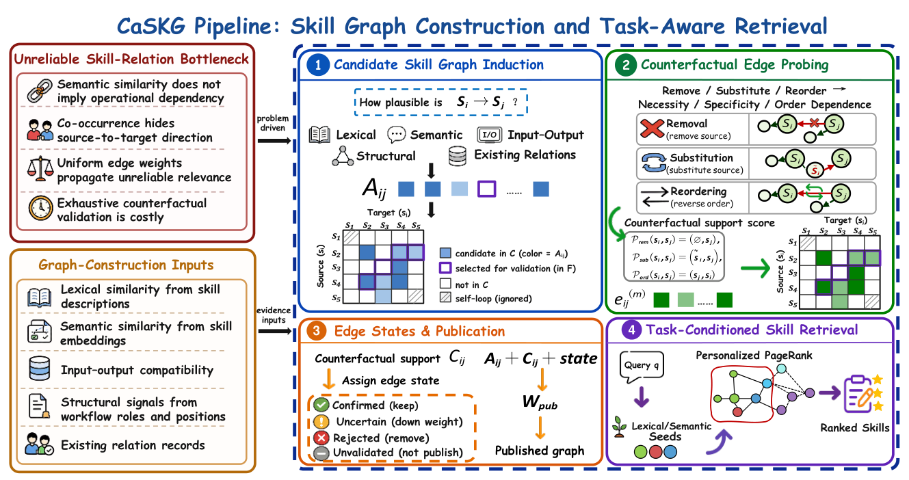

# CaSKG

> **分类**: Skill召回 | **成熟度**: 🟡 成长期 | **综合评分**: 0.60

---

## 一句话描述

CaSKG 把技能图构建形式化成**有预算的边置信度校准**问题，用**反事实探针**（移除/替换/倒序）估必要性/特异性/方向性，按**状态闸门**发布校准图供个性化 PageRank 检索，6 模型 12 场全胜、ScienceWorld 从 72.62 升到 80.50。

**来源**:
- CaSKG: Counterfactual-Causal Skill Graphs for Scalable Agent Skill Retrieval（Zhiyuan Li, Linyuan Gao 等，吉林大学人工智能学院 / Ant Group）
- 发布年份：2026

**链接**:
- https://arxiv.org/abs/2608.25500

---

## 核心实现

CaSKG 是离线建图加运行时检索的框架，核心立论是**把关联发现与边可靠性评估分离**。它解决图检索里"弱边污染传播"的瓶颈：全发布增覆盖但让相关性沿弱边扩散，全剪枝丢有用路径，全量评估又随库平方增长不可行。

**1. 多信号候选诱导：高召回优先**

- 输入技能库，输出有向候选边集。用**词法、语义、输入-输出、结构**四类活跃证据通道加**修复证据**和可选 **LLM 裁判**，加权成每条边的关联分。
- 控制要点：仅活跃信号参与加权，不可用信号不当负证据；结构地板保住非词法的程序工作流证据不被词法弱分淹没。预算化校验前沿送探针，前沿之外的候选留作"未验证"而非当负证据。

**2. 反事实边探针：三视图估必要性/特异性/方向性**

- 对前沿里每条候选边做三探针：**移除**源技能测必要性、**替换**成低重叠技能测源特异性、**倒序**测方向性，LLM 返回 0–1 分。
- 控制要点：方向条件化，三视图共用同一支持方向可直接聚合，互补不冗余。

**3. Beta 平滑与状态闸门发布：四态分级**

- 探针分经 **Beta(1,1) 累加**（记极性、记离中点距离带地板）得每条边的可靠性分。
- 用对称阈值把边分**确认/不确定/拒绝/未验证**四态：确认全权传导、不确定降权、拒绝删、未验证留低权脚手架保覆盖。输出冻结图供检索用。

**4. 任务条件化检索：个性化 PageRank**

- 输入查询，词法语义出种子排序，在冻结图上跑**个性化 PageRank** 把相关性从种子沿可信边扩散，按分排序返回紧凑技能包。
- **不改 agent 策略和任务接口**：图离线建好冻结，运行时仅传播扩展。

---

## 主要能力

- **边可靠性校准**：用反事实探针把"话题相关"和"操作依赖"分开，给图加可靠性闸门，避免弱边沿多跳传播污染技能上下文。
- **状态化图发布**：确认全权传导、不确定降权、拒绝删、未验证留低权脚手架，在覆盖与噪声间可控取舍而非全删全发。
- **零侵入检索**：图离线建好冻结，运行时仅个性化 PageRank 扩展，不改 agent 策略、任务接口、环境交互循环。
- **多信号高召回候选**：词法/语义/输入-输出/结构/修复五类证据，结构地板保住非词法程序依赖，候选阶段宽为校准前提。

---

## 局限性

- 反事实校准靠 LLM 文本级探针估、不是真执行因果，可靠性分反映文本判断非实测操作依赖。
- 静态构建时轨迹共现和关系历史两条自演化通道是预留接口未激活，动态技能库更新未验证。
- 增益在强模型上收窄（GPT-5.6-Luna 仅 +1.25 分），接近直接检索的任务上图结构帮助有限甚至偶尔引入干扰。

---

## 成熟度评分

| 维度 | 评分 (0.0-1.0) | 说明 |
|------|---------------|------|
| 技术成熟度 | 0.60 | 反事实探针边校准 + 状态闸门四态分级，开源代码与基准 |
| 创新性 | 0.78 | 反事实探针估必要性/特异性/方向性 + 个性化 PageRank 首创 |
| 落地程度 | 0.52 | 6 模型 12 场全胜，但强模型收窄，接近直接检索任务帮助有限 |
| 生态活跃度 | 0.48 | 单篇论文，GitHub 开源 |

**综合评分**: 0.60

---

## 参考资料

- [CaSKG: Counterfactual-Causal Skill Graphs for Scalable Agent Skill Retrieval](https://arxiv.org/abs/2608.25500)
- [CaSKG 代码](https://github.com/ZhiyuanLi218/Caskg)
