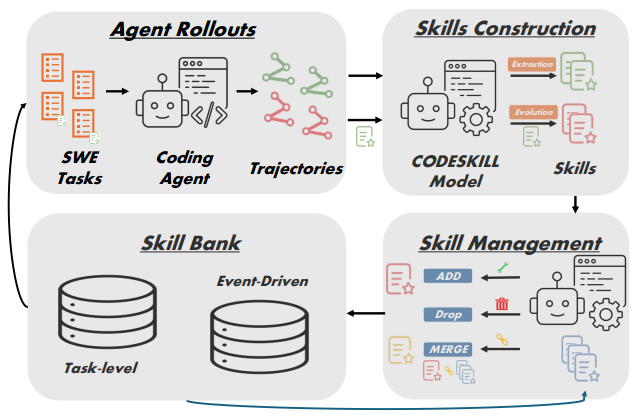

# CODESKILL

> **分类**: Skill 管理 | **成熟度**: 🟡 成长期 | **综合评分**: 0.51

---

## 一句话描述

CODESKILL 将技能提取与技能库维护重新定义为**可学习的技能管理策略**，通过**GRPO 强化学习**混合**rubric 质量评分**与**下游 agent 执行反馈**，从 coding agent 轨迹中抽取**任务级 + 事件驱动级双粒度程序性技能**，在三大 SWE benchmark 上平均 pass rate 提升 **9.69 点**（相对提升约 33%），同时将技能库规模稳定控制在 **676 个**。

**来源**:
- 学术论文：南洋理工大学（NTU）& 浙江大学
- 发布年份：2026年

**链接**:
- arXiv：https://arxiv.org/abs/2605.25430

---

## 核心实现

CODESKILL 的核心想法是把"管技能"这件事本身当成一个可优化的问题——不是硬编码何时提取、何时合并、何时删除，而是让一个 LLM（skill manager，基于 Qwen3.5-4B）学会做这些决策，通过强化学习让它在真实的下游 coding agent 身上试出最优策略。

**1. 技能管理循环**：skill manager 拿到 coding agent 的任务轨迹，从当前技能库里捡出相关上下文，输出一个操作。操作类型五选一（extract、evolve、add、merge、drop），内容可能是一条新技能，也可能是一个维护决策。执行后技能库原地更新。优化的目标很简单：更新后的技能库能不能让下游 agent 在未来任务上拿到更高的 pass rate。

**2. 双粒度技能库**：
- **任务级技能（task-level）**：捕获跨任务族的高层策略，比如怎么检查仓库结构、怎么定位问题、怎么验证修复——通常从解决同类问题的多条轨迹中蒸馏出来。
- **事件驱动级技能（event-driven）**：提供局部执行事件的即时指引，比如命令失败、特定错误信息、测试输出模式出现时 agent 该怎么反应——由于同类执行事件跨任务反复出现，这类技能的可迁移性很强。

**3. 混合奖励设计**：纯靠下游任务成功与否来给信号太稀疏，纯靠 LLM-as-judge 打分又可能跟真实效果脱节。CODESKILL 的做法是把两者拼在一起：
- **质量奖励 RQ**：rubric-based LLM-as-judge 从 grounding、reusability、specificity、format、actionability 五个维度打分
- **执行奖励 RE**：在反向检索匹配的评估实例上，比较加载技能前后的 pass rate 差值
- **对齐因子 RA**：判断 agent 的 rollout 是否真的匹配了技能的触发条件和指引内容——解决"执行奖励到底该归功于谁"的 attribution 问题

最终奖励：R = RQ + RA × RE

**4. 三阶段课程训练**：
- **Phase 1**：纯技能提取训练，让模型学会从轨迹中生成可复用的技能或跳过
- **Phase 2**：加入技能进化，基于新的或失败的轨迹证据修编已有技能
- **Phase 3**：加入技能库维护，对候选技能执行 add/merge/drop 操作

**关键设计**

- SFT 预热阶段用 teacher model（GPT-5.4-mini）从轨迹证据 + 技能库上下文中生成 12,856 条监督信号
- GRPO 优化：每组采样 G 个操作，组内归一化 advantage，带 KL 惩罚项防止偏离 reference model
- 技能检索基于 sentence-transformers/all-MiniLM-L6-v2 构建稠密索引，任务级技能匹配任务目标，事件级技能匹配当前执行上下文

---

## 主要能力

- **跨任务泛化**：仅在 EnvBench + SWE-Bench Verified 上训练，在 Terminal-Bench 2（OOD benchmark）上同样提升 pass rate（25.88 → 34.12），证明学到的管理策略不是过拟合
- **跨 coding agent 泛化**：用 Qwen3.5-35B-A3B 训练的策略，部署到 GPT-5.4-mini 下游 agent 上同样有效（+8.93 over no-skill），说明管理能力是 agent-agnostic 的
- **技能库自动精简**：full lifecycle（含 maintenance）相比 extraction-only 把技能库从 1,252 个压缩到 676 个，几乎砍半，而 pass rate 仅下降约 2%——证明 merge/drop 操作有效去除了冗余
- **推理效率提升**：技能引导使已解决实例的平均推理步数从 44.12 降至 35.15，说明程序性知识不仅提高成功率，还让 agent 更快找到正确路径

---

## 局限性

- **技能表示形式受限**：当前仅支持自然语言指令技能，不支持可执行脚本、API 定义、工具扩展等结构化技能——在 agent 可以自行扩展工具链的场景下会吃亏
- **单步操作粒度**：每次只能对一个候选技能做一个操作（add/merge/drop 三选一），无法像"同时修改多个相关技能"或"拆分一个过宽技能"这种更复杂的维护决策
- **训练代价不低**：GRPO 训练需要 4×H100 80GB、210 小时、500 RL step + 下游 coding agent 大量 rollout——对小团队或个人研究者门槛偏高
- **环境奖励噪声大**：技能效果要经过"技能→检索→注入→agent 在长程任务中遵循→成功"这条长链才能体现，中间任何一个环节出问题都会污染奖励信号

---

## 成熟度评分

| 维度 | 评分 (0.0-1.0) | 说明 |
|------|---------------|------|
| 技术成熟度 | 0.50 | 学术论文阶段，三阶段课程训练+GRPO优化，三大SWE benchmark验证有效 |
| 创新性 | 0.70 | 首次将技能管理建模为可学习的RL策略，双粒度技能+混合奖励+对齐因子设计新颖 |
| 落地程度 | 0.40 | 研究阶段，仅在coding agent场景验证，尚未大规模开源采用 |
| 生态活跃度 | 0.40 | 南洋理工+浙大联合研究，单篇论文，社区生态待构建 |

**综合评分**: 0.51

## 参考资料

- [论文](https://arxiv.org/abs/2605.25430)
