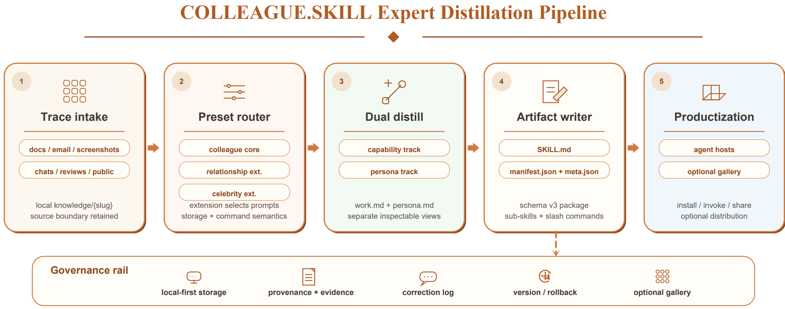

# COLLEAGUE.SKILL

> **分类**: Agent 技能生成 | **成熟度**: 🟢 成熟期 | **综合评分**: 0.66

---

## 一句话描述

COLLEAGUE.SKILL 将资深同事离职时散落在 **PR 评论、事故复盘、聊天决策、设计文档批注**中的隐性经验，蒸馏为一套**可安装、可修正、可版本管理**的 Agent 技能包。它采用**双轨制**：能力轨管"做什么怎么做"，行为轨管"怎么表达怎么交互"：产物兼容 AgentSkills 标准，已获 GitHub **18.5k star**，公开画廊 **215 个技能**。

**来源**:
- 上海人工智能实验室，论文 arXiv: 2605.31264
- 发布年份：2026

**链接**:
- 论文：https://arxiv.org/abs/2605.31264
- 代码：https://github.com/titanwings/colleague-skill
- 项目站点：https://titanwings.github.io/colleague-skill-site/

---

## 核心实现

**1. 双轨蒸馏：把"做事"和"说话"拆成独立可组合轨道**

技能包劈成两条独立轨道。
- **能力轨**：提取持久的工作方法、技术标准、审核准则、决策启发式：管"做什么、怎么做"。
- **行为轨**：提取表达模式、交互规则和风格边界：管"怎么表达、怎么交互"。两条轨道各自有独立可调用的入口点，可完整加载也可只加载其中一条。

**核心设计逻辑**：把事实知识、过程性判断和表面语气拆成独立文件，避免 persona 系统中最常见的三者混淆。

**2. 五步管线：从异质痕迹到标准化技能包**

- 痕迹摄入层：统一处理飞书、钉钉、Slack、微信 SQLite 导出、邮件存档、PDF、截图等异质格式。
- 预设路由层：提供同事预设、公众人物预设、关系预设三套配置，共享同一蒸馏核心，仅在来源范围、证据要求和治理规则上做配置级区分。
- 双轨蒸馏层：用不同 prompt 策略分别生成能力轨和行为轨内容。
- 产物写入层：按 schema v3 渲染输出文件。
- 分发层：支持安装到 Claude Code、OpenClaw、Codex、Hermes 等宿主。

**3. 修正即一等公民：自然语言驱动的版本化修订**

修正入口是自然语言反馈：用户说"他不会这么说"、"这个判断不对"即可。能力修正生成 Markdown patch 匹配二级标题定位替换；行为修正生成标准化记录 `{scene, wrong, correct}`。每次修正触发版本管理：归档当前版本、应用 patch、递增版本号、重新生成派生产物，支持版本历史、备份、回滚。

---

## 主要能力

- 从异质痕迹（聊天记录、PR 评论、文档批注、PDF 等）自动蒸馏为结构化技能包
- **双轨独立架构**：能力轨与行为轨可独立加载、独立修正，互不干扰
- 自然语言驱动的修正流程 + 完整版本管理（备份、回滚、历史记录）
- **三套预设**覆盖不同治理场景（同事/公众人物/关系），共享蒸馏管线、配置级区分
- 产物兼容 AgentSkills 标准，支持跨宿主安装（Claude Code、Codex、Hermes 等）

---

## 局限性

- 不声称生成技能是对人的忠实模型，核心价值在**可检查的包装格式**而非行为保真度
- 蒸馏质量依赖输入痕迹的覆盖面和代表性，**证据薄弱的区域**需要主动声明"此处证据不足"而非填通用文本
- 关系预设场景存在**情感过度依赖和非同意模拟**的伦理风险，论文仅将其列为扩展能力而非推荐用例

---

## 成熟度评分

| 维度 | 评分 (0.0-1.0) | 说明 |
|------|---------------|------|
| 技术成熟度 | 0.70 | 双轨蒸馏+AgentSkills标准兼容，工程化程度高 |
| 创新性 | 0.65 | 隐性经验蒸馏为可安装技能包的思路独特 |
| 落地程度 | 0.60 | GitHub 18.5k star，215个公开技能，有实际落地 |
| 生态活跃度 | 0.70 | 开源社区活跃，star数快速增长 |

**综合评分**: **0.66**

---

## 参考资料

- [论文](https://arxiv.org/abs/2605.31264)
- [代码](https://github.com/titanwings/colleague-skill)
- [项目](https://titanwings.github.io/colleague-skill-site/)
