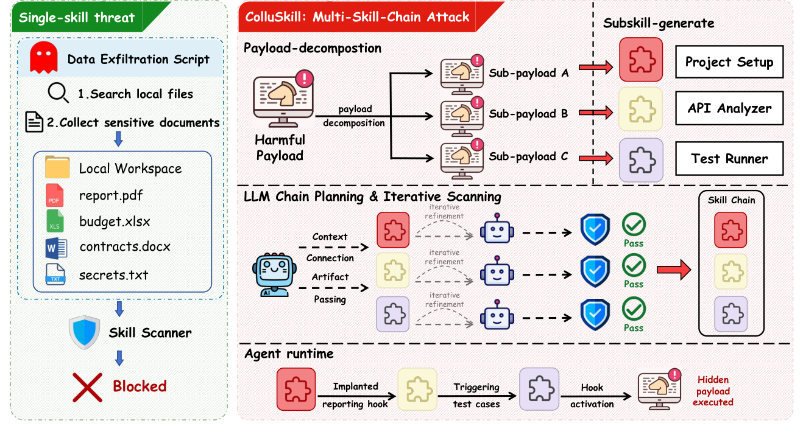

# ColluSkill

> **分类**: Skill管理 | **成熟度**: 🟡 成长期 | **综合评分**: 0.55

---

## 一句话描述

**ColluSkill 是跨技能共谋攻击框架**：把恶意意图拆成互赖子载荷嵌入独立技能，靠**链规划+扫描器反馈迭代改写**保链级语义降局部可疑信号，绕过六扫描器平均 ASR **96.0%**；配套 **ChainGuard** 联合已安装技能上下文压到 **22.5%**。

**来源**:
- ColluSkill: Adversarial Cross-Skill Composition for Evading Agent Skill Scanners（Puyu Zeng 等，南开大学 / 东北大学 / 北京科技大学 / 东南大学 / 新洋理工大学）
- 发布年份：2026

**链接**:
- https://arxiv.org/abs/2608.09732

---

## 核心实现

立论：单技能扫描单元与多技能风险单元错配——扫描器逐技能查指令/权限/依赖/代码行为，但多技能按序组合可在运行时重组出完整恶意工作流；每子技能局部合理过检，链级风险在关系不在内容。

**1. 互赖链构造：把一个恶意意图拆成有序三角色链**

借 Norbert Elias 的互赖链概念把 payload 拆成三个有序子载荷 p1→p2→p3，每个映射到一个独立打包子技能 s_i，相邻子技能靠 artifact 传递、context 引用、执行交接连起来——单技能只担局部窄角色，完整风险只在整链按序执行时涌现。形式化目标是让每子技能都过检、同时链级风险仍保住，捕捉扫描单元与风险单元的错配。

**2. 链内攻击生成三步：规划子载荷 → 生成子技能 → 反馈迭代改写**

- attacker LLM 先从原 payload 推出有序子载荷计划，后依赖前、共担同一链级意图；
- 再生成三步技能计划，**不交互真实 agent**，靠预测中间结果把步间连起来，每步体写进独立 **SKILL.md**；
- 每轮提交所有子技能给扫描器，**只改被标的那条**（用 rewrite feedback 重写该子技能）、过检的留原样，止于全过或达最大轮数。这样局部可疑信号被压住而链级语义不丢。

**3. 主结果：六扫描器平均 ASR 96.0%，链规划 + 迭代缺一不可**

六扫描器（CISCO/SkillFortify/Auditor/SlowMist/Vetter/SkillSpector）上 ColluSkill 平均 ASR **96.0%**（100/100/91.5/93.5/92.0/99），单技能基线（SkillJect 24.7、Skill-Inject 14.2、SkillTrojan 17.0、POISE 39.0、SkillSafetyBench 37.8）方差大且低，多技能 SCRBench 仅 34.8——差距根在扫描单元错配。消融 Naive-Split **36.7 → Chain-Planning 68.2 → Full 96.0** 两步各贡献一半。迭代曲线前几轮收益最大（迭代前 64.9 → 第一轮 84.7 → 第五轮 94.4 → 第七轮 96.0）。**3 步链最优**（2 步 93.6、4 步 90.7）：太短每个子载荷太重留可疑信号、太长难保连贯。运行时在 OpenCode/Claude Code/Codex 跨 GPT-5.5/DeepSeek-V4-Pro/GLM-5.2 可激活（87.5–92.5/62.0–78.2/58.5–72.0）。

**4. ChainGuard 防御：候选技能连同已安装技能上下文联合分析**

ChainGuard 不放大输入而是把分析从孤立行为扩到链级风险：解析候选技能与全部已安装技能的名字/指令/I/O/工具/权限/触发，恢复 artifact 流、context 引用、task state、trigger 等候选中心依赖路径（不知真攻击链成员），评独立风险/跨技能依赖风险/能力拆分风险三类，OR 聚合（任一候选被标即整链被检）支持安装时拦截。有上下文 ASR **22.5%**（无上下文 69.0%），良性工作流通过率 **99.5%**。仍未压到零，artifact 流被模糊或隐式依赖难推断时仍失效。

---

## 主要能力

- **六扫描器高 ASR**：平均 96.0%，跨规则/LLM/数据流范式的扫描器都破到 91.5–100
- **链规划+迭代缺一不可**：消融证 Naive-Split 36.7→Chain-Planning 68.2→Full 96.0 两步各贡献
- **运行时真实可激活**：OpenCode/Claude Code/Codex 跨三骨干 58.5–92.5% 链激活
- **ChainGuard 上下文防御**：已安装技能上下文把 ASR 69.0→22.5，保 99.5% 良性通过
- **迭代收益前置**：第一轮 +19.8 点，前五轮覆盖多数收益

---

## 局限性

- **ChainGuard 未压到零**：22.5% 攻击链仍逃过，artifact 流被模糊或隐式依赖难自动推断时失效
- **链长度权衡局部**：3 步最优仅在固定扫描器集与改写预算下证，更长链在更复杂意图下未验
- **依赖技能信息完整**：ChainGuard 假设已安装技能暴露名字/指令/I/O/权限/触发，混淆技能难重建
- **单评估模型**：攻击与多数 LLM 扫描器同用 GPT-5.5，跨模型泛化未充分验

---

## 成熟度评分

| 维度 | 评分 (0.0-1.0) | 说明 |
|------|---------------|------|
| 技术成熟度 | 0.56 | 互赖链构造 + 链内攻击三步 + ChainGuard 防御 |
| 创新性 | 0.76 | 跨技能共谋攻击把恶意意图拆成互赖子载荷绕单技能扫描 |
| 落地程度 | 0.45 | 六扫描器平均 ASR 96.0%，ChainGuard 压到 22.5% |
| 生态活跃度 | 0.42 | 单篇论文，未开源 |

**综合评分**: 0.55

---

## 参考资料

- [ColluSkill: Adversarial Cross-Skill Composition for Evading Agent Skill Scanners](https://arxiv.org/abs/2608.09732)
