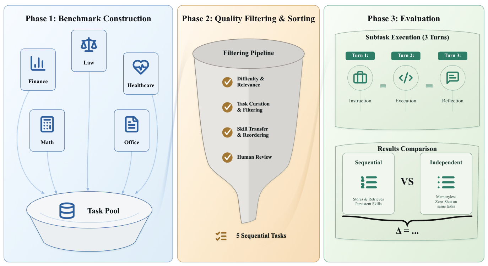

# ContinualSkillBench

> **分类**: Skill评测 | **成熟度**: 🟡 成长期 | **综合评分**: 0.54

---

## 一句话描述

**ContinualSkillBench 是评估 agent 持续 skill 学习的动态基准**：5 域×100 排序互联子任务，三 turn 协议对照 Sequential/Independent/in-context，发现**显式 skill 维护平均≈纯 in-context（0.602 vs 0.605）**、弱模型堆碎 skill。

**来源**:
- ContinualSkillBench: Can LLM Agents Truly Evolve Their Capabilities?（Tianyi Guan 等，北大/北京通用人工智能研究院）
- 发布年份：2026

**链接**:
- https://arxiv.org/abs/2608.03874
- https://github.com/gtynnn060110-hash/continual-skill-bench-final

---

## 核心实现

ContinualSkillBench 三阶段构建 + 评测，全程按 skill 复用机会组织任务流。

**1. benchmark 构造：5 域 × 三层难度梯度 × 三宏观能力轨**

从 Healthcare/Law/Math/Finance/Office 五域收约 3 万任务，源数据集分三层梯度：基础（OlympiadBench/LawBench/TAT-QA）→ 中间（GAIA/ClawBench/MedAgentsBench/MathCoder）→ 最难（OneMillionBench），每域再设三宏观能力轨（基础动作 → 复合决策）。这层梯度保 progressive learning 的难度递进。

**2. 过滤排序：LLM 标 skill → 依赖图排序 → 人工 review**

- LLM 标每个任务所需 skill、过滤相关性、给初始难度；
- 两两依赖评估转有向图，图排序置易者先且优先支撑后续任务多的；
- 人工 review 质量、难度递进、传递关系合理性。每域出 100 排序子任务。结构验证：**69.5%** 任务复用早先核心 skill，**35.5%** 需求有前序语义对应（cosine≥0.85），比随机排列覆盖高。

**3. 评测：三 turn 协议 + 四类评估器 + raw/normalized 双指标**

三 turn 协议（指令-执行-反思），反思时可 Create/Modify Skill 更新库，下个任务生效。比 Sequential（带 skill 库维护）vs Independent（每任务重置）vs 纯 in-context（同序列同反馈但不建 skill）。四类评估器（EM/F1/Numeric $\leq 10^{-4}$/Rubric Judge/Programmatic）适配异构输出：raw reward 全任务平均，normalized 只算两者都有效输出的交集，减去格式/解析失败偏置。

**4. 关键发现：显式 skill 维护平均≈纯 in-context，弱模型堆碎 skill**

控制要点在这几条：显式 skill 维护平均≈纯 in-context（Codex 在 Law/Finance/Healthcare 上 normalized **0.602 vs ICL 0.605**）——说明 Sequential-Independent 增益大头来自保留 context 与反馈而非 skill 抽象本身；显式 skill 只在 rigid 输出/执行要求任务上稳住可复用流程（Healthcare Programmatic 0.250→0.500）但开放式任务上 over-specialize（Rubric 反输 ICL 更高）。弱模型堆多而碎 skill：GPT-4o 五域最终 skill pool 58/78/87/90/100 vs Codex 44/49/44/52/51，调用频次也低；增益随模型域差异大——长链域 Healthcare 涨狠（+0.149 normalized）、独立已强域反掉（Opus 4.7 Math -0.008）。

---

## 主要能力

- **动态评测 skill 进化**：5域×100排序互联子任务按 skill 复用机会组织，测经验能否固化复用
- **结构验证排序有效**：69.5% 任务复用早先核心 skill，35.5% 需求有前序语义对应，比随机排列覆盖高
- **拆解显式 vs in-context**：消融发现两者平均相当，挑战"做 skill 抽象必然更好"
- **识别弱模型瓶颈**：弱模型堆碎 skill（多而碎少复用），强模型精炼（少而精高复用）
- **多评估器适配异构**：EM/F1/Numeric/Rubric/Programmatic 组合，不让输出形态差异污染评测

---

## 局限性

- **域固定5个**：Healthcare/Law/Math/Finance/Office，其他域（编程、科研等）未覆盖，泛化性待验
- **三模型单次**：仅 GPT-4o/Codex/Opus 4.7，跨更多模型复现未做
- **显式 vs in-context 拆分粗**：消融未细分"哪种 skill 抽象"对"哪类任务"更有效，选择性收益机制待深挖
- **依赖 LLM judge**：Rubric Judge 用 LLM 打分，judge 偏置影响开放式任务评测可靠性

---

## 成熟度评分

| 维度 | 评分 (0.0-1.0) | 说明 |
|------|---------------|------|
| 技术成熟度 | 0.56 | 5 域×100 排序互联子任务 + 三 turn 协议 + 多评估器，开源 |
| 创新性 | 0.72 | 动态 skill 进化基准拆解显式 vs in-context，挑战 skill 抽象必然更好 |
| 落地程度 | 0.45 | 三模型单次，显式 skill 维护≈纯 in-context，弱模型堆碎 skill |
| 生态活跃度 | 0.42 | 单篇论文，GitHub 开源 |

**综合评分**: 0.54

---

## 参考资料

- [ContinualSkillBench: Can LLM Agents Truly Evolve Their Capabilities?](https://arxiv.org/abs/2608.03874)
- [ContinualSkillBench 代码](https://github.com/gtynnn060110-hash/continual-skill-bench-final)
