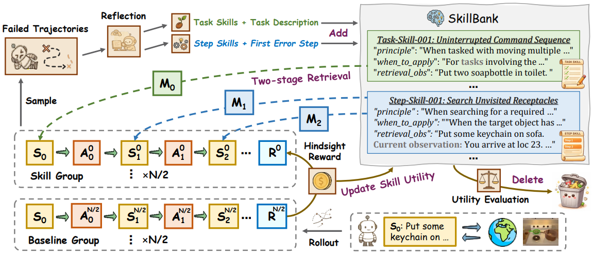

# D2Skill

> **分类**: Skill 生成 | **成熟度**: 🟡 成长期 | **综合评分**: 0.52

---

## 一句话描述

D2Skill 是面向智能体强化学习的**动态双粒度技能库**（**任务技能 + 步骤技能**），通过**配对轨迹性能差距**构建效用信号驱动策略与技能库协同进化，辅以**反思驱动生成**、**效用感知检索与剪枝**，持续维护高可用动态技能库。

**来源**:
- 学术论文：中国科学院自动化研究所、鹏城实验室、中山大学
- 发布年份：2026年

**链接**:
- 论文链接：https://arxiv.org/pdf/2603.28716
- 代码链接：https://github.com/TU2021/D2Skill-AgenticRL

---

## 核心实现

D2Skill 的核心是**双粒度技能建模**与**策略-技能库协同进化的联合训练范式**，整体框架由三大核心模块构成：

**带技能注入的 RL 联合训练**：在每一轮训练中，对每个任务同时采样两组平行轨迹——技能组轨迹的每一步检索并注入对应技能，基线组使用相同策略但不注入技能。基于两组性能差异，同时完成三个环节的计算：(1) 事后技能效用更新——技能组与基线组的成功率差值作为任务级技能效用信号；(2) 事后内在奖励塑形——技能注入轨迹表现优于基线组时获得额外奖励；(3) 策略优化——将内在奖励融入总回报，基于 GRPO 算法完成策略更新。

**反思驱动的技能生成**：当任务组表现低于阈值时自动触发反思机制，分析技能组的失败轨迹和成功轨迹，从中提炼出新的任务技能和步骤技能，经去重后加入技能库。

**技能检索与库管理**：设计两阶段检索流程——第一阶段根据语义相似度检索 top-m 候选技能，第二阶段结合归一化语义相似度、技能效用和 UCB 探索项的综合分数排序，选出 top-k 技能注入策略上下文。同时通过效用导向的定期剪枝防止技能库无限膨胀，新生成的技能享有保护期以确保充分评估。

---

## 主要能力

- 双粒度技能抽象：任务技能提供高层战略指导，步骤技能提供细粒度战术纠错
- 策略-技能库协同进化的联合训练范式
- 动态效用评估与技能库剪枝维护

---

## 局限性

- 技能库管理机制仍有优化空间
- 跨领域迁移能力有限

---

## 成熟度评分

| 维度 | 评分 (0.0-1.0) | 说明 |
|------|---------------|------|
| 技术成熟度 | 0.50 | 有论文和代码开源 |
| 创新性 | 0.75 | 双粒度+协同进化的创新设计 |
| 落地程度 | 0.35 | 学术验证阶段 |
| 生态活跃度 | 0.40 | 有开源代码 |

**综合评分**: 0.52

---

## 参考资料

- [论文](https://arxiv.org/pdf/2603.28716)
- [代码](https://github.com/TU2021/D2Skill-AgenticRL)
- [详解](https://zhuanlan.zhihu.com/p/2022678212954657726)
