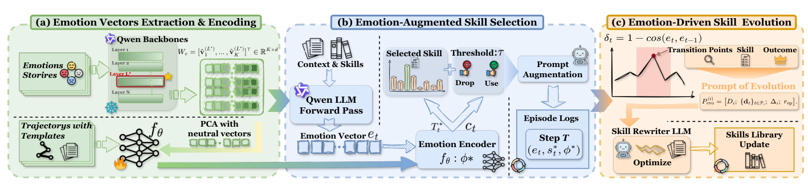

# Emotion2Skill

> **分类**: Skill召回 | **成熟度**: 🟡 成长期 | **综合评分**: 0.58

---

## 一句话描述

**Emotion2Skill 是用 LLM 内部情绪信号驱动技能选择与演化的框架**：从残差流抽**27 维情绪向量**经 3 层 MLP 编码成置信度门控摘要注入路由 prompt，并用情绪轨迹突变点定位失败段驱动 SOP 改写，ALFWorld/WebShop +25.5/+26.9 pp。

**来源**:
- Emotion2Skill: Model-Internal Emotion Signals for Adaptive Skill Selection and Evolution（Bohan Lin, Hejia Geng, Xinyi Xie, Heng Zhou, Qinghua Xing, Bo Liu, Chen Zhang, Yudong Zhang 等，中国科学技术大学（含苏州高等研究院）/ 牛津大学 / 亚利桑那大学 / 上海人工智能实验室）
- 发布年份：2026

**链接**:
- https://arxiv.org/abs/2608.09248

---

## 核心实现

立论：技能路由只看任务描述、历史、观测等**外部文本**，模型自己的内部决策状态（累积不确定性、对先前动作的评估、轨迹级自信）从未被观测；同样的外部上下文在不同内部状态下该选不同技能。LLM 残差流里存在与 GoEmotions 27 类对齐、因果影响 agent 行为的线性情绪方向（Sofroniew et al. 2026），Emotion2Skill 把它当决策级信号。

**1. 情绪向量抽取（离线）：从残差流到 27 维情绪方向**

对 **27 个情绪概念**，Qwen3-8B 各生成 **100 个短故事**（3–5 句不点名情绪，零样本分类器须排进 top-3）。每故事前向传播取各层激活、token ≥ 50 处均值池化，情绪方向 = 类内激活均值减全局均值。再用 **PCA 去噪**投掉中性故事 top-10 主成分。最优层按 GoEmotions 准确率选：Qwen3-8B（36 层）选第 **24 层**，准确率 **37.2%**（随机 8.2%）；Qwen3-14B 选第 **26 层**，**39.4%**——峰值约在 2/3 深度处。推理时取 Assistant: 分隔符 token 激活投影过抽取矩阵再 ℓ2 归一化得一个 27 维情绪向量。

**2. 情绪编码器：3 层 MLP 把向量变成模板索引 + 置信度**

3 层 MLP（27→64→128→128，ReLU，**<27K 参数**）把 27 维情绪向量映成 128 维嵌入，导出两样东西：(i) **12 个模板**里余弦最近的那一个（可学习原型作参照）；(ii) 一个标量**置信度**（sigmoid 输出，0–1）。两样拼成复合摘要。编码器在 warm-up（约 500 episode）用**监督对比损失** + **模板分类损失**联合训练，共激活热图还显出 curiosity→ProductSearch 这类语义可解释配对（GPT-4o 一致率 76.5%，κ=0.81）。

**3. 置信度门控技能选择：低置信退回纯文本不扰主决策者**

置信度 ≥ 阈值 τ 时把模板索引和置信度拼进标准 prompt；< τ 时省略退回纯文本选择（τ=1 退回基线）。**LLM 仍是主决策者**，情绪摘要只作辅助上下文从同一输入通道注入。τ=0.3 在 WebShop 验证集选，**72% 步被门控准入、28% 退回纯文本**。

**4. 情绪驱动技能进化：用轨迹突变点取代 episode 级二元信号**

核心决策变量是步间余弦距离 $\delta_t=1-\frac{e_t^\top e_{t-1}}{\|e_t\|\|e_{t-1}\|}$——按全 27 维算不预选维度，能抓任何内部状态重组（探索→挫败、自信→困惑、认知模式切换）。转移点定义是 $\delta_t$ 超过 episode 均值一个标准差的步。对成功率 < 0.4 的技能，取技能特定转移点周围 3 步诊断上下文（观测/技能/模板/δ）+ 口头化总结拼进进化 prompt，驱动 SOP 改写。跑 **3 轮**，每轮 100 episode。比 episode 级二元结果信号更精确地定位失败段。

整个过程数值锚定在 Qwen3-8B 的 ALFWorld **47.4%**（+25.5）、WebShop **29.7%**（+26.9），Heat 任务单点涨 47.3 pp（9.6→56.9）；Qwen3-14B 增益更大（ALFWorld +28.9、WebShop +21.3）。复用第 24 层情绪向量不重抽到 MATH +14.4 pp、MBPP +11.8 pp 证信号领域无关。

---

## 主要能力

- **Heat 任务 +47.3 pp**：ALFWorld Heat 从 9.6% 涨到 56.9%，情绪向量在显式失败信号前捕获累积困惑
- **跨两基准一致 SOTA**：Qwen3-8B 上 WebShop Succ. **29.7%**（+26.9 pp vs Zero-Shot）、ALFWorld **47.4%**（+25.5 pp），一致超五基线，标准差 ≤1.6 pp
- **正向 scaling**：Qwen3-14B 增益更大（ALFWorld +28.9 pp、WebShop +21.3 pp），14B 情绪保真度更高
- **域外迁移**：复用 $L^*=24$ 情绪向量不重抽，MATH +14.4 pp、MBPP +11.8 pp，证信号领域无关
- **语义可解释映射**：共激活热图四模式（curiosity→ProductSearch 等），GPT-4o 一致率 **76.5%**（κ=0.81）

---

## 局限性

- **需白盒残差流访问**：限制直接用于 API 服务 LLM，蒸馏到黑盒模型是自然扩展但未实现
- **指令微调变体需重抽**：Qwen3-8B-Instruct GoEmotions 准确率 28.1% vs 基座 37.2%，隐藏状态几何变了
- **不均匀主导所有任务**：ALFWorld Cool（高度刻板动作序列）上 Qwen3-8B 时被 MASA 反超，情绪重路由收益小
- **warm-up 数据依赖**：编码器训练需约 500 episode（<10 min），虽少但仍需骨干可白盒前向

---

## 成熟度评分

| 维度 | 评分 (0.0-1.0) | 说明 |
|------|---------------|------|
| 技术成熟度 | 0.56 | 27 维情绪向量 + 3 层 MLP 编码器 + 置信度门控，开源 |
| 创新性 | 0.80 | LLM 内部情绪信号驱动技能选择与演化，领域无关迁移 |
| 落地程度 | 0.50 | ALFWorld/WebShop 一致 SOTA + 正向 scaling，但需白盒残差流访问 |
| 生态活跃度 | 0.46 | 单篇论文，GitHub 开源 |

**综合评分**: 0.58

---

## 参考资料

- [Emotion2Skill: Model-Internal Emotion Signals for Adaptive Skill Selection and Evolution](https://arxiv.org/abs/2608.09248)
- [Emotion2Skill 代码](https://github.com/BoHan-LIN04/Emotion2Skill)
