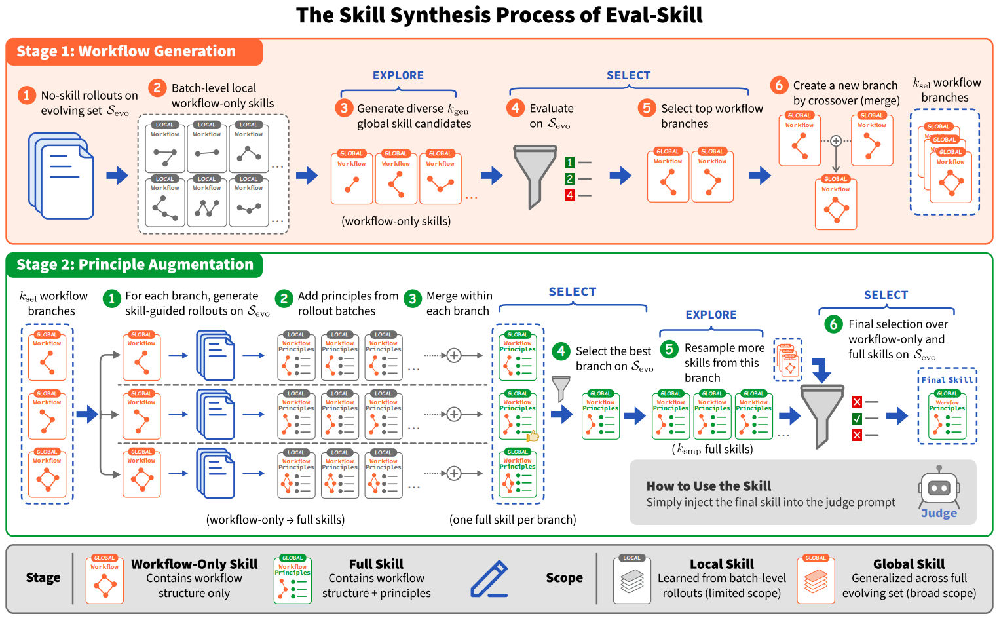

# Eval-Skill

> **分类**: Agent 技能评测 | **成熟度**: 🟡 成长期 | **综合评分**: 0.52

---

## 一句话描述

Eval-Skill 将 LLM 评估标准从"**每次查询在线生成 rubric**"改为"**每个领域离线进化一次可复用技能**"：实验发现自生成 rubric 经常让 Judge 模型表现不如裸评（**跌 6.4 个百分点**），根源在于 rubric 从查询推断而非从候选回答差异分布中归纳。Eval-Skill 将评估知识固化为 Workflow+Principles 双组件技能，RewardBench 2 上三底座最多涨 **18.51 个百分点**，技能可跨底座迁移。

**来源**:
- 浙江大学 & 小红书，论文 arXiv: 2606.07040
- 发布年份：2026

**链接**:
- 论文：https://arxiv.org/abs/2606.07040
- 代码：https://github.com/xing-stellus-yue/Eval-Skill

---

## 核心实现

**1. 故障归因：rubric 生成的三个系统性失败模式**

Qwen3-8B 裸评准确率 57.04%，加上自生成 rubric 后跌到 **50.63%**（-6.4pp）。用 RIFT 分类法对 200 个失败案例归因发现三类模式：
- **缺失判别标准（34.2%）**：rubric 从查询文本生成，无法感知候选回答之间的实际差异；
- **错位或僵化（24.1%）**：rubric 过度指定表面要求，将 Judge 引向无区分度的维度；
- **criterion-list 格式本身表达力瓶颈**：无法表达条件化决策逻辑。根源一致：rubric 是从查询推断而非从实际候选回答差异分布中归纳。

**2. Workflow + Principles 双组件技能结构**

将评估标准从"每个查询一次"改为"每个领域一次"。
- **Workflow**：告诉 Judge 怎么做评估（先看什么、后看什么、维度不相上下时如何分岔、优先级和排名处理），不是一列"检查要点"而是一套"操作流程"。
- **Principles**：列出领域内反复出现的关键判别维度，每条从实际候选回答对的差异中提炼而非从查询推断。

Workflow 和 Principles 交叉迭代进化：Workflow 多分支搜索不同评估路径结构在进化集上评分选优，Principles 从最佳 Workflow 路径 rollout 中提取并再筛选。

**3. 离线一次性计算 + 推理时零额外开销**

整个进化过程离线一次性完成，产出的 .md 技能文件本地缓存。推理时技能直接注入 Judge 的 prompt 上下文，每轮评估不需要额外 rubric 生成或额外模型调用。**进化时间缩放行为**显示增加进化样本数（50→100→200）技能质量持续提升，曲线未触顶：离线投入越多、推理收益越大，且推理成本完全不变。技能编码"对一个领域的好评估标准"而非"某个模型的偏好"，天然跨底座可迁移。

---

## 主要能力

- **领域级离线进化**：100 个样本离线搜索和筛选，产出可复用的 Workflow+Principles 评估技能
- Workflow（操作流程）替代 criterion-list（检查要点列表），支持条件化分岔决策逻辑
- 跨底座可迁移：一个模型进化出的技能注入另一个模型的推理上下文，效果**优于目标模型裸评**
- 下游 best-of-N 推理中 Eval-Skill 引导的选择在胜率、平局减少和质量一致性上均优于基线
- 进化时间缩放曲线未触顶，离线计算投入与在线收益呈持续正相关

---

## 局限性

- 每个领域仅用 **100 个进化样本**，若领域内子任务类型差异大，少数覆盖的子类型对应的 Workflow 分支和 Principles 偏稀疏
- Workflow 候选分支数是**手动设定的探索参数**，未做系统性消融揭示"多远的分支宽度对什么任务最优"
- 技能**跨领域泛化边界不清晰**：从安全领域到对话质量评估等大跨度迁移的效果未测试
- 当前仅在 Reward Bench 类 RM 基准上验证，更广泛的下游应用场景（如 RLHF 训练流水线）待探索

---

## 成熟度评分

| 维度 | 评分 (0.0-1.0) | 说明 |
|------|---------------|------|
| 技术成熟度 | 0.55 | Workflow+Principles双组件架构设计合理 |
| 创新性 | 0.55 | 离线进化可复用评估技能替代在线rubric的思路新颖 |
| 落地程度 | 0.45 | RewardBench 2三底座最多+18.51pp，有开源代码 |
| 生态活跃度 | 0.50 | 浙大+小红书出品，社区关注度待积累 |

**综合评分**: **0.52**

---

## 参考资料

- [论文](https://arxiv.org/abs/2606.07040)
- [代码](https://github.com/xing-stellus-yue/Eval-Skill)
