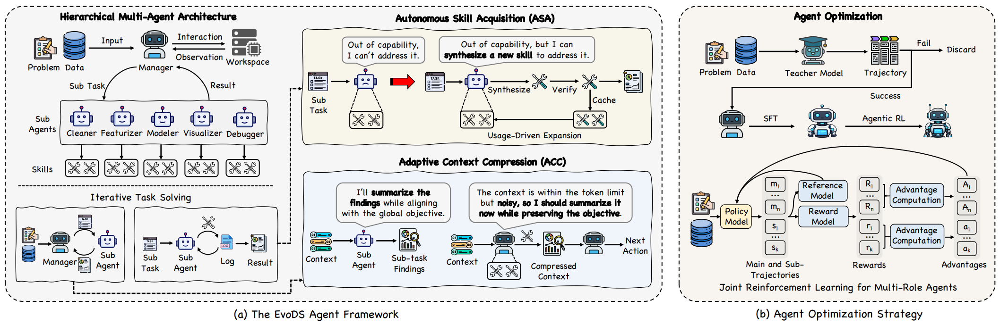

# EvoDS

> **分类**: Agent 技能生成 | **成熟度**: 🟡 成长期 | **综合评分**: 0.54

---

## 一句话描述

EvoDS 让数据科学 Agent 在任务执行中**自主合成新技能、验证、入库、复用**：不再受困于固定工具空间：同时通过**自适应上下文压缩（ACC）**将"保留什么、丢弃什么"做成可学习的 RL 动作，解决技能和中间产物不断累积导致上下文爆炸的伴生问题。四个基准上平均性能比最先进开源方案高 **28.9%**，完全消除超 token 上限的运行中断。

**来源**:
- 港科大（广州），论文 arXiv: 2606.03841
- 发布年份：2026

**链接**:
- 论文：https://arxiv.org/abs/2606.03841
- 代码：https://github.com/usail-hkust/EvoDS

---

## 核心实现

**1. 分层多智能体架构：Manager + 五个专业化 Sub-Agent**

- 顶层 **Manager Agent** 负责全局推理、任务分解和跨 Agent 协调。
- 下层五个专业化 Sub-Agent 各维护独立局部技能空间：**Cleaner**（数据清洗）、**Featurizer**（特征工程）、**Modeler**（模型训练与调参）、**Visualizer**（可视化）、**Debugger**（错误诊断修复）。每个专业 Agent 的动作空间仅含其领域操作和培育的专属技能，Agent 间互不干扰。理论分析证明，工具分配到互斥专业空间后每个 Agent 的选择错误率低于统一大空间。

**2. 自主技能获取（ASA）：从成功经验中长出可复用新工具**

当 Sub-Agent 执行了一段从未出现的成功操作序列，且满足条件（成功完成子任务、模式在库中无对应项、是流程级新模式而非简单参数变化），成功轨迹被送去合成候选技能。候选先在同类子任务上重跑验证真伪，通过后以"名称+功能说明+可执行代码"存入专属仓库。配套**按使用频度淘汰**：高频保留、长期未用退场，避免技能膨胀占用上下文。

**3. 自适应上下文压缩（ACC）：把压缩做成可学习的 RL 动作**

不同于硬截断，ACC 将压缩作为 Manager Agent 的可选动作：对上下文中每段信息做保留、摘要或丢弃。压缩决策纳入 RL 目标：压缩错误导致后续失败被惩罚，压缩后仍高效完成任务且省 token 被奖励。ASA 和 ACC 呈现互补关系：ASA 往上下文加入新技能，ACC 控制上下文总量保证新技能不挤掉关键信息，两者联合使用增益最大。

---

## 主要能力

- **自主技能获取（ASA）**：从成功经验中合成、验证、入库可复用技能，按频度淘汰，让工具空间随任务持续进化
- **自适应上下文压缩（ACC）**：压缩做成可学习的 RL 动作而非被动截断，模型自行判断每段信息的保留/摘要/丢弃决策
- 分层多智能体解耦全局协调与专业执行，各 Sub-Agent 独立技能空间降低工具选择错误率
- 两阶段训练（SFT→Agentic RL）中技能空间和上下文预算**同时动态变化**，训练条件与部署条件一致

---

## 局限性

- ASA 验证依赖同类子任务重跑，若 **同类子任务太少**验证本身会比较脆弱，可能放过仅一次偶然匹配的伪技能
- ACC 的压缩粒度由模型语言判断驱动，**缺乏结构化信息度量**，基座模型对信息价值的判断偏差可能导致关键推理被过度压缩
- 教师模型决定 SFT 上限，若教师生成的 ASA/ACC 决策有**系统偏差**，RL 可能无法在合理训练预算内纠偏
- 当前仅验证数据科学领域，分层架构和 ASA+ACC 联合优化在其他领域的泛化性待探索

---

## 成熟度评分

| 维度 | 评分 (0.0-1.0) | 说明 |
|------|---------------|------|
| 技术成熟度 | 0.60 | 分层多智能体+ACC架构设计较完整 |
| 创新性 | 0.60 | 自主合成+验证+入库+复用的闭环思路创新 |
| 落地程度 | 0.45 | 四个基准超基线28.9%，有开源代码 |
| 生态活跃度 | 0.50 | 港科大广州出品，社区关注度待积累 |

**综合评分**: **0.54**

---

## 参考资料

- [论文](https://arxiv.org/abs/2606.03841)
- [代码](https://github.com/usail-hkust/EvoDS)
