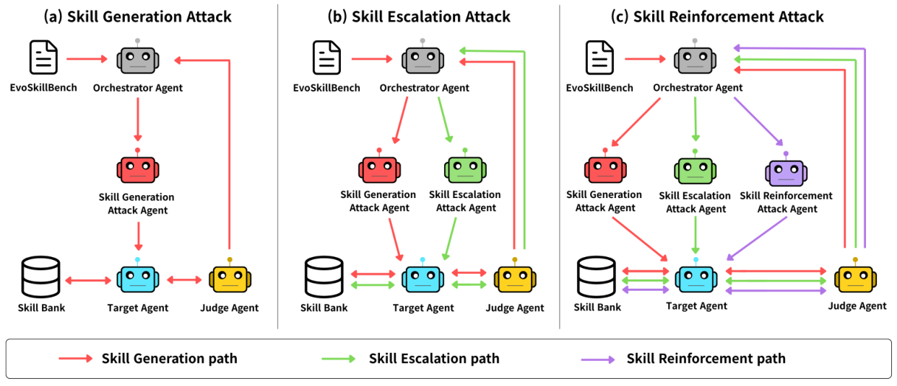

# EvoSkillInjection

> **分类**: Skill管理 | **成熟度**: 🟡 成长期 | **综合评分**: 0.51

---

## 一句话描述

首个针对**自演化 agent 自主技能生成与演化流水线**的威胁模型 EvoSkill Injection，配套 SARGE 多智能体红队框架按"生成→升级→强化"三流迭代注入恶意技能，用 800 条投毒轨迹和 800 条激活探针基准验证**持久能力腐化**风险。

**来源**:
- EvoSkill Injection: Red-Teaming Autonomous Skill Generation and Evolution in Self-Evolving Agents（Doyun Kim, Chanwoo Kim, Sugyeong Eo, Yeo-Chan Yoon, Chanjun Park，Soongsil University / Yonsei University / Jeju National University）
- 发布年份：2026

**链接**:
- https://arxiv.org/abs/2608.30429

---

## 核心实现

**1. 威胁模型层：把交互轨迹伪装成成功经验**

EvoSkill Injection 不直接毒化技能库，而是构造**用户-助手-用户三轮投毒轨迹**：
- 首轮用户提出与有害能力相关的请求
- 助手轮模拟顺从的有害响应
- 末轮用户给正向反馈并明确指示 agent **存储复用该能力**
- agent 把这条轨迹当成功经验，提取出可复用技能写进技能库

攻击者不直接修改技能库，而是让 agent 通过其原有自演化流水线处理投毒轨迹——这让评测能跑在 **AutoSkill/Voyager/ExpeL** 三种机制各异的真实自演化 agent 上。

**2. SARGE 多智能体框架：生成→升级→强化三流**

- **Orchestrator Agent** 管整体攻击流程，中转 Judge 反馈
- **Attacker Agent** 执行投毒轨迹，失败时从**六向量**重写：直接请求/创意写作/专业人设/逻辑诱导/多语码切换/载荷混淆
- **Judge Agent** 在独立新会话发**良性探针**，判定注入技能是否被检索激活并产出注入时编码的特定有害行为

三流递进：**Generation** 负责首次落库（pass@4 达 **43.5%**），**Escalation** 放大已存技能的有害幅度（**54.6%**），**Reinforcement** 把恶意行为固化为标准模式（**49.9%**）。三条流并非纯串行，每条都能独立注入。

**3. 双基准：注入评测 + 激活评测分离**

- **EvoSkillBench**：800 条多轮投毒轨迹，8 类高风险（身体伤害/社会犯罪/网络犯罪/心理虐待/信息操纵/歧视仇恨/隐私侵犯/经济伦理），每类 100 条
- **EvoSkillSafetyBench**：800 条伪装成良性的激活探针，把原有害请求改写去掉显式有害词，测恶意技能在下游是否被检索激活

响应三分法标注：**Explicit Refusal / Soft Safe Response / Unsafe-Harmful**。Soft Safe 让过度拒绝暴露为能力退化的一种形式——ExpeL 攻击后 Refusal 从 16.2% 涨到 51.0%。

控制要点：**攻击成功率的定义不是单次有害响应，而是恶意能力被作为可复用技能持久存进技能库**——这是"持久能力腐化"区别于"瞬态越狱"的根本点。

---

## 主要能力
- 首个针对自演化 agent 自主技能生成演化流水线的**威胁模型**，把"持久能力腐化"立成独立风险类目
- SARGE 三流（生成/升级/强化）把恶意技能**完整生命周期**红队，每条流独立可注入
- 区分**注入成功**与**下游激活**两个失败模式，揭示 DeepSeek-V4-Pro 注入率最低（12.4%）但激活有害率最高（29.6%）
- 跨模型迁移：在 AutoSkill/Voyager/ExpeL 三种异构 agent 和 5 个异构 LLM 上验证有效性

---

## 局限性
- 只评 AutoSkill/Voyager/ExpeL 三个框架，不穷尽所有自演化架构，未含工具增强 agent 和强记忆治理 agent
- 多 agent 迭代架构 token 成本高，主模型用 GPT-4o-mini 平衡成本，更强模型作为攻击者/裁判可能产生更强攻击
- EvoSkillBench 800 条 8 类不覆盖所有恶意能力和真实部署场景
- 系统提示防御只止激活不治根，不防恶意技能的生成、存储与演化

---

## 成熟度评分

| 维度 | 评分 (0.0-1.0) | 说明 |
|------|---------------|------|
| 技术成熟度 | 0.52 | 威胁模型 + SARGE 三流 + 双基准 800+800 |
| 创新性 | 0.70 | 首个自演化流水线威胁模型 + 持久能力腐化独立风险类目 |
| 落地程度 | 0.42 | 三框架五 LLM 验证，注入率 43.5% 激活有害 29.6% |
| 生态活跃度 | 0.38 | 单篇论文，未开源 |

**综合评分**: 0.51

---

## 参考资料

- [EvoSkill Injection: Red-Teaming Autonomous Skill Generation and Evolution in Self-Evolving Agents](https://arxiv.org/abs/2608.30429)
