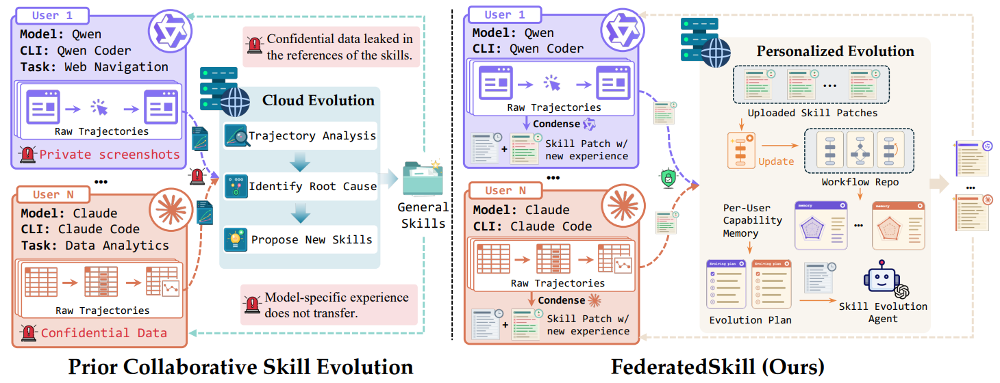

# FederatedSkill

> **分类**: Agent 技能协同进化 | **成熟度**: 🟡 实验阶段 | **综合评分**: 0.53

---

## 一句话描述

FederatedSkill 将**联邦学习的隐私保护思路**搬到 Agent 技能进化空间：每个客户端在本地完成轨迹反思和提炼，仅上传**语义技能 patch**（ADD/EDIT/DELETE），服务器端通过 POMDP 推断每个用户的能力边界并生成**个性化技能更新**。相比纯自进化基线，任务成功率最高提升 **44.4%**，计算成本节省 **37.5%**。

**来源**:
- UCSB、MIT-IBM Watson AI Lab、Cisco Research，论文 arXiv: 2606.03143
- 发布年份：2026

**链接**:
- 论文：https://arxiv.org/abs/2606.03143
- 代码：https://github.com/UCSB-NLP-Chang/FederatedSkill

---

## 核心实现

**1. 客户端：轨迹不出门，只出语义技能 patch**

每个客户端用当前技能库执行任务生成轨迹后，本地 patcher 将轨迹压缩和反思转换为技能 patch δ。patch 仅含三类语义操作：**ADD**（加新技能）、**EDIT**（改已有技能）、**DELETE**（删过时技能），不包含任何原始交互文本。patcher 被提示产出可跨任务泛化的经验，task-specific 的具体值和一次性输出不准写入 patch。原始轨迹、验证器输出、中间文件全部留在本地。传输单元是语义级 patch 而非模型权重，天然跨异质模型和框架可复用。

**2. 服务器端：从 patch 推断用户能力边界，生成个性化更新**

服务器每轮收到各客户端上传的 patch 和静态档案（基座模型、Agent 框架），**从未见过任何原始轨迹**。演化 Agent 将聚合建模为 **POMDP**：客户端真实任务环境是隐藏状态，通过每轮 patch 动态更新对各客户端能力边界的隐式模型：哪些任务频繁出 ADD 对应能力空白，哪些技能常被 EDIT 对应表述偏差，哪些正被 DELETE 对应过时操作。基于不断更新的理解，M 为每个客户端生成定向技能更新而非全局平均库。

**3. 消融验证：个性化 vs 全局平均库差异显著**

把个性化模块拆掉，用统一全局库替代每个用户的个性化库，平均性能下降 **12.2 个百分点**。

---

## 主要能力

- **隐私保护构造性约束**：仅语义 skill patch 离开本地，原始轨迹、截图、表格、私人对话永不传输
- 语义级 patch 天然跨异质模型和框架可复用，比参数级联邦学习更灵活
- 服务器端通过 POMDP 推断用户能力边界，生成**个性化而非平均化**技能更新
- 协作进化同时提升成功率（最高 **+44.4%**）和效率（成本节省 **37.5%**）

---

## 局限性

- **patch 质量绑定客户端模型反思能力**：弱模型可能漏掉关键模式或将偶然成功提炼为不靠谱策略，服务器无轨迹无法交叉验证
- 安全路径验证为**规则驱动**，隐式信息泄露（文件名、目录结构）可能通过更隐蔽方式流入 patch，语义侧信道无防护
- **冷启动问题未讨论**：完全新用户无技能无轨迹无 patch 可上传，初始种子机制缺失

---

## 成熟度评分

---

## 参考资料

- [论文](https://arxiv.org/abs/2606.03143)
- [代码](https://github.com/UCSB-NLP-Chang/FederatedSkill)
