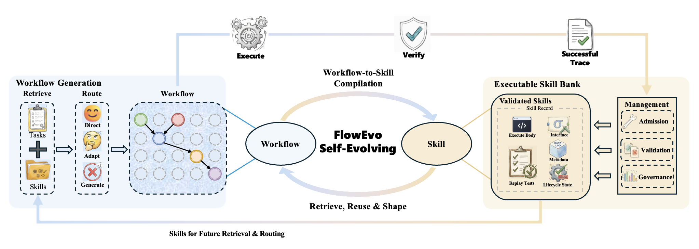

# FlowEvo

> **分类**: Skill优化 | **成熟度**: 🟡 成长期 | **综合评分**: 0.49

---

## 一句话描述

FlowEvo 是一个**训练无关的 agent 自进化框架**，将成功的工作流轨迹编译为**可调用、可验证、可管理的技能记录**存入持久技能库，后续任务通过**直接执行**或**技能条件生成**两种路由复用这些技能，实现推理时的能力累积而无需更新模型参数。

**来源**:
- FlowEvo: Self-Evolving Agents through the Co-Evolution of Workflows and Executable Skills
- 发布年份：2026

**链接**:
- https://github.com/DEFENSE-SEU/FlowEvo

---

## 核心实现

FlowEvo 的核心链路围绕 **workflow-to-skill 编译 → skill-to-workflow 反馈 → skill 策展** 三个耦合机制展开，形成一个推理时自进化的闭环。

**1. Workflow-to-Skill 编译**

输入是 agent 成功完成任务的 verified trace，编译器从中提取可执行制品，不是文本摘要。每个技能记录包含五个要素：
- 可执行体与入口函数
- 显式调用接口
- 一组回放式测试
- 元数据（来源任务、复用约束、路由偏好）
- 生命周期状态

编译只在验证通过的轨迹上进行，编译结果是一个**带接口、测试和使用历史的可调用对象**。

**2. 入库三道检查**

每条候选技能须通过三道关：
- **接口合规检查**：入口函数和签名在预期条件下是否可正常调用
- **功能正确性验证**：回放测试和留出验证是否支撑技能声称的行为
- **安全合规**：是否触碰禁用导入（os、subprocess）或禁用调用（eval、exec）

未通过的技能进入影子区或降级为仅上下文模式，不会激活为直接可执行状态。

**3. 三种路由模式**

- **直接执行**：技能与当前任务高度兼容时，作为可调用子程序直接运行，跳过探索交互
- **技能条件生成**：技能不够可靠时，将其紧凑视图（签名、任务模式、代码骨架）注入 prompt 作为结构化上下文，指导而非替代 workflow 生成
- **动态生成**：前两种均不适用时，回退到无技能上下文的从零构建

检索器按词法重叠、任务模式兼容性和历史效用信号打分，路由器决定走哪条。

**4. 对比效用评估策展**

入库后技能持续被追踪。系统定期比较"启用该技能"与"禁用该技能"的同类任务成功率，计算对比差值。当差值持续为负（<-0.1），技能被自动压制。论文在 ALFWorld 的 pick_two 任务上捕获了一个 -0.23 的实际压制案例。

---

## 主要能力

- **推理时技能累积**：不改模型参数，靠技能库的持续增长实现能力自进化
- **跨任务可执行复用**：编译后的技能可直接运行，也可作为结构化生成上下文，优于纯文本记忆
- **生命周期策展**：持续追踪下游效用，自动压制产生负迁移的技能
- **跨 benchmark 表现**：ALFWorld 82.8%（+23.6 vs 最强基线），token 消耗不到最高效基线的一半

---

## 局限性

- 依赖可验证的环境反馈判断成功与否，在反馈延迟、局部、有噪声的场景下编译和策展质量可能下降
- 底模必须具备一定成功率才能启动编译-复用循环，几乎从不成功的 agent 无法建起技能库
- 长时间运行下技能库的修订、合并、退休、去重等维护问题尚未系统评估

---

## 成熟度评分

| 维度 | 评分 (0.0-1.0) | 说明 |
|------|---------------|------|
| 技术成熟度 | 0.50 | workflow-to-skill 编译+三道检查+三种路由设计完整，训练无关 |
| 创新性 | 0.70 | 将成功轨迹编译为可调用技能对象+对比效用策展，自进化思路原创 |
| 落地程度 | 0.35 | 学术原型，依赖可验证环境反馈，跨 benchmark 验证未产品化 |
| 生态活跃度 | 0.40 | GitHub 开源仓库 DEFENSE-SEU/FlowEvo，社区规模尚小 |

**综合评分**: **0.49**

---

## 参考资料

- [论文](https://arxiv.org/abs/2607.21596)
- [代码](https://github.com/DEFENSE-SEU/FlowEvo)
