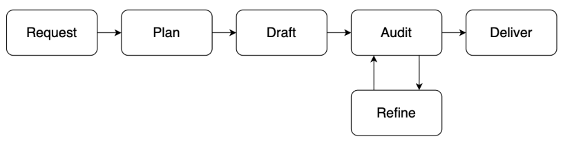

# GEIS

> **分类**: Skill生成 | **成熟度**: 🟡 成长期 | **综合评分**: 0.45

---

## 一句话描述

**GEIS** 是一个基于技能（Skill）的长文生成框架，将写作拆为 **Request → Plan → Draft → Audit → Refine → Deliver 六个阶段**，通过**成对比较评测**生成可执行的诊断报告，再将反复出现的评测发现**映射为写作技能的永久规则补丁**，形成"生成→评测→改进"闭环。

**来源**:
- GEIS: A Generation–Evaluation–Improvement Loop of Agent Skills for Long-Form Article Generation
- 发布年份：2026

**链接**:
- https://arxiv.org/abs/2607.11503

---

## 核心实现

**1. 六阶段写作技能（article-writer）**

写作过程被分解为六个显式阶段，每个阶段有明确的输入输出和验证标准。
1. Request：重述目标、受众和约束，缺失信息显式假设。
2. Plan：生成 Section 级提纲，包含预期深度和可视锚点（Visual Anchor）为后续图表渲染预留插入点。
3. Draft：产出完整正文，内容密度最低要求写入阶段定义。
4. Audit：中途检查结构、事实一致性、清晰度和可操作性。
5. Refine：定点修复薄弱章节。
6. Deliver：只输出成品，中间规划痕迹全部内部保留。

**2. 技能解耦与锚点机制**

写作、浏览器检索、架构图渲染被拆为独立技能，通过渐进式暴露按需加载。文本与视觉元素通过确定性锚点标记（`[[DIAGRAM:...]]` 和 `[[IMAGE:...]]`）解耦，下游 Markdown/Word/PDF 管道独立解析。

**3. 成对比较评测（pdf-comparison-evaluation）**

评测采用成对比较而非绝对打分，同一话题两篇文档对照评分。四维评分卷轴覆盖结构质量、内容质量、视觉质量、PDF 交付质量。评测报告包含话题对齐、评分卡、发现项清单和修订路线图，形成可执行诊断。

**4. 评测驱动的技能进化（article-writer-improving）**

改进技能读评测报告，按分诊逻辑区分写作问题与导出工具问题。输出三级：计划级（根因分析）、会话覆盖级（临时约束）、永久补丁级（跨多份报告反复出现时直接修改技能文件）。在 20 话题实验中，反复发现被合成为 **八条永久补丁**，不改模型权重、只改写作流程规则。

---

## 主要能力

- 六阶段写作过程每一步可检查、可定位，出错时知道哪个阶段出了问题
- 写作、检索、图表、评测、改进各自为独立技能，可单独替换和优化
- 成对比较评测生成结构化诊断报告，不仅是打分
- 评测发现可自动映射为写作技能的永久规则变更，形成进化闭环
- 视觉锚点机制将文本生成与图表渲染彻底解耦

---

## 局限性

- 当前为离线闭环（评一轮→改一轮→写一轮验证），评测常态化和补丁自动化尚未实现
- 统一补丁对部分话题造成微幅下降（20个话题中3个下降），需要话题感知的进化策略
- 评测依赖 LLM-as-a-Judge，生成器与裁判分离降低了自评偏差，但裁判偏差仍存在
- 仅覆盖维基百科风格长文，对其他长文类型（技术报告、提案等）的迁移性未验证

---

## 成熟度评分

| 维度 | 评分 (0.0-1.0) | 说明 |
|------|---------------|------|
| 技术成熟度 | 0.45 | 六阶段写作+评测进化闭环已完整实现，仅20话题实验验证，属原型阶段 |
| 创新性 | 0.70 | 评测发现映射为写作技能永久规则补丁，生成-评测-改进闭环显著创新 |
| 落地程度 | 0.30 | 仅覆盖维基风格长文，无产品部署，迁移性未验证 |
| 生态活跃度 | 0.30 | 论文发布，无开源代码，社区关注度有限 |

**综合评分**: **0.45**（0.45×0.30 + 0.70×0.25 + 0.30×0.25 + 0.30×0.20）

---

## 参考资料

- [论文](https://arxiv.org/pdf/2607.11503)
