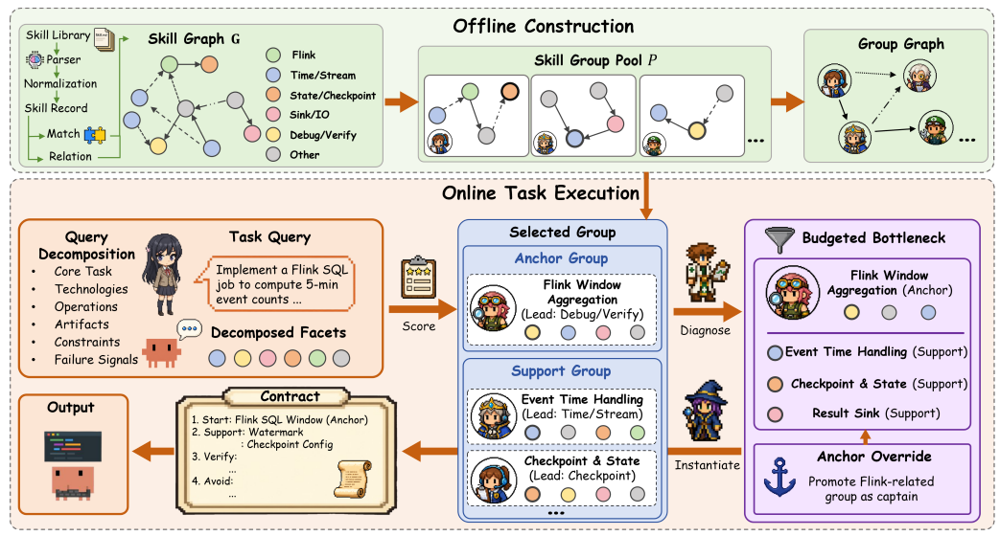

# GOSKILLS

> **分类**: Skill 召回 | **成熟度**: 🟡 成长期 | **综合评分**: 0.52

---

## 一句话描述

GOSKILLS 提出**推理时组结构检索**——检索单元从"原子技能"变为"锚点中心技能组"，把给 Agent 看的东西从扁平列表变成带角色标签的**执行契约**（START/SUPPORT/CHECK/AVOID），在 6 个主流模型下全面跑赢现有技能检索基线，**must-hit 率达到 1.00**。

---

## 核心实现

核心决策：不给 Agent 看原子技能列表，而是看带有明确角色的技能组。离线建组图，在线走五步流水线。

**离线阶段——从技能图中挖技能组**：把技能库表示成带类型标签的技能图（依赖、工作流、语义、替代等边类型），从中提取锚点中心技能组——每个组包含一个锚点技能（执行入口）、至多两个支撑成员（各有明确角色：预处理器/解析器/格式化器/检查器/回退方案）、适用性标签、可见需求线索。再在组之间建一张组图（support/artifact/visible-check/fallback/incompatibility 边），作为推理时的检索基板。

**在线阶段——五步流水线**：查询模式提取（7 个维度描述任务）→ 锚点组选择（固定权重线性评分，跨任务跨模型同一套权重）→ 支持组扩展（贪心，最多 1 锚点 + 2 支持）→ 瓶颈化（精筛原子技能负载，控 token 预算）→ 覆盖回填 + 契约渲染。覆盖回填是最后一道保险：计算查询中必须覆盖的高置信度特征减去已呈现的，剩余债务显式回填，而不是静默丢弃。

**执行契约格式**：START（入口 + 负责技能）、SUPPORT（辅助技能 + 何时用）、CHECK（必须满足的可见条件）、AVOID（绝对不能做的事）。Agent 看到的是有先后顺序和角色标注的执行参考，不用自己从一堆技能描述里推断"从哪开始、谁是辅助、哪些约束不能碰"。

---

## 主要能力

- 检索单元从技能升级为技能组，交付物从"你可以用这些技能"变成"你应该这样用这些技能"
- 执行契约中的角色标签（锚点/支撑/检查/禁止）省掉了 Agent 从技能描述里反向推断调用顺序的整段推理开销
- 覆盖回填在 token 预算紧张时显式兜底关键技能——去掉后 must-hit 从 1.00 暴跌到 0.73
- 固定权重评分策略不依赖学习，跨任务跨模型一致，行为可预测——出问题时能定位到是被检索层还是执行层

---

## 局限性

- 不训模型、不改环境，库里没有的能力只能写进 DEBT，不能无中生有
- 依赖离线阶段的 metadata 质量——技能没有 tag、类型标注、文档时建群效果打折
- 长链条交互任务（如 ALFWorld）上提升幅度比 SkillsBench 小，需要的不只是"知道从哪开始"而是多轮动态决策

---

## 成熟度评分

| 维度 | 评分 (0.0-1.0) | 说明 |
|------|---------------|------|
| 技术成熟度 | 0.60 | 有论文验证 |
| 创新性 | 0.55 | 组结构检索的创新 |
| 落地程度 | 0.50 | 学术验证阶段 |
| 生态活跃度 | 0.45 | 有代码链接 |

**综合评分**: 0.52

---

## 参考资料

- [论文](https://arxiv.org/abs/2605.06978)
- [代码](https://anonymous.4open.science/r/Group-of-Skills-E861)
- [详解](https://zhuanlan.zhihu.com/p/2038336476589597585)