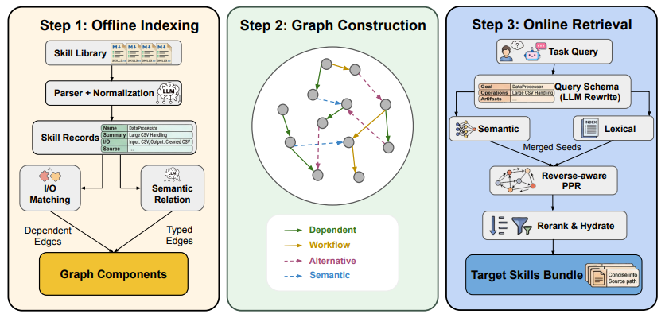

# Graph of Skills

> **分类**: Skill 召回 | **成熟度**: 🟡 成长期 | **综合评分**: 0.70

---

## 一句话描述

Graph of Skills (GoS) 是推理时**结构感知检索系统**，通过构建 **Skill 依赖图**捕获技能间依赖、工作流、语义和替代关系，采用**反向加权 PageRank** 一次性返回完整可执行 Skill 包，兼顾成功率与 Token 效率。

**来源**:
- 学术论文：宾夕法尼亚大学、马里兰大学等
- 发布年份：2026年

**链接**:
- 论文链接：https://arxiv.org/pdf/2604.05333
- 代码链接：https://github.com/davidliuk/graph-of-skills

---

## 核心实现

GoS 的核心设计是把所有 Skill 及其依赖关系组织成一张结构化的有向图，检索时不仅返回语义相关的 Skill，还会自动补全所有前置依赖。整套体系分为两个阶段，全程不需要人工标注依赖关系：

**1. 离线建图——自动生成 Skill 依赖网络**：将所有本地 Skill 包解析成标准化节点（名称、能力描述、输入输出格式、依赖工具、脚本路径等），自动生成四种类型的边：
   - **依赖边**：A 的输出格式匹配 B 的输入要求A → B，权重最高
   - **工作流边**：两个 Skill 经常在同一业务流程中先后使用
   - **语义边**：两个 Skill 能力高度相似，属同一功能领域
   - **替代边**：两个 Skill 可互相替换实现同一功能

**2. 在线检索——反向扩散生成完整可执行 Skill 包**：
   - **混合语义-词汇种子检索**：将用户查询重写为结构化检索 schema，同时用语义向量和词汇匹配找到最相关的核心 Skill 作为种子
   - **反向加权个性化 PageRank**：以种子 Skill 为起点沿依赖边反向扩散评分，不同边类型分配不同权重（依赖边 1.0、工作流边 0.5、语义边 0.2、替代边 0.1），自动补全所有前置依赖
   - **预算重排与水化**：按上下文窗口预算限制重排候选 Skill，每个 Skill 附带本地路径和执行说明，Agent 可直接使用

---

## 主要能力

- 自动生成 Skill 依赖网络（四种边类型，无需人工标注）
- 依赖感知的结构化检索（反向扩散算法自动补全前置依赖）
- 完整可执行 Skill 包返回（附带本地路径和执行说明）

---

## 局限性

- 复杂开放场景下 Skill 提取和依赖识别效果不佳
- 跨领域迁移时依赖关系准确率有明显下降
- 多 Skill 执行流程仍需 Agent 自主判断，不能自动生成最优执行方案
- 自动提取的 Skill 可能隐藏恶意指令或安全漏洞

---

## 成熟度评分

| 维度 | 评分 (0.0-1.0) | 说明 |
|------|---------------|------|
| 技术成熟度 | 0.70 | 有完整论文和代码开源 |
| 创新性 | 0.60 | 依赖图+反向扩散的创新 |
| 落地程度 | 0.65 | 实验验证充分 |
| 生态活跃度 | 0.50 | 有开源代码 |

**综合评分**: 0.70

---

## 参考资料

- [论文](https://arxiv.org/pdf/2604.05333)
- [代码](https://github.com/davidliuk/graph-of-skills)
- [详解](https://zhuanlan.zhihu.com/p/2028146364282880663)
