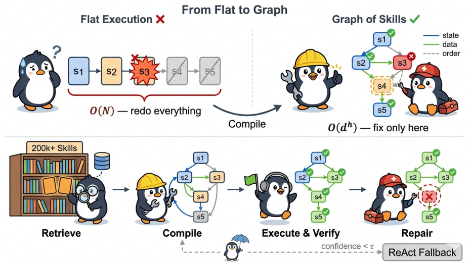

# GraSP

> **分类**: Skill 召回 | **成熟度**: 🟡 成长期 | **综合评分**: 0.51

---

## 一句话描述

GraSP（Graph-Structured Skill Compositions）在技能检索和执行之间插入了一个**编译层**，把扁平技能列表转成带类型边的 **DAG（有向无环图）**，用状态边/数据边/顺序边显式管理技能间依赖，配合**局部修复算子**将重规划成本从 $O(N)$ 压到 $O(d^h)$。

---

## 核心实现

GraSP 不换检索器、不改执行器，在检索和执行之间插入四个模块：

**双维度检索**：在语义相似度之外乘上历史成功率 —— 这个技能过去好不好使，加权融合后每个技能附带置信度分数，执行中低于阈值就降级。

**DAG 编译**：将检索到的技能列表转成类型化有向无环图。状态边传递前置条件（"找到苹果"是"拿起苹果"的前提），数据边传递输入输出（"读文件"→"解析 JSON"），顺序边绑定不可颠倒的步骤。编译器通过前置匹配、输入输出匹配、历史共现三条规则自动建边，并做循环检测。遵循最小执行集原则，无关技能全部剪掉。

**局部修复**：节点执行失败不重跑整条链路，修复限定在失败节点的 $h$ 跳邻居（默认 $h=2$），已成功节点不动。五种算子：REBIND（改参数重试）、INSERTPREREQ（补前置步骤）、SUBSTITUTE（换等效技能）、REWIRE（修正边方向）、BYPASS（跳过已满足节点）。重规划成本从 $O(N)$ 压到 $O(d^h)$。

**置信度路由**：技能置信度太低时自动退回 ReAct 模式走传统推理路径，作为安全兜底。

---

## 主要能力

- 语义相似度 × 历史成功率联合打分，每个技能附带置信度分数，解决"看着相关但实际没用"的问题
- 将扁平技能列表转成带状态边/数据边/顺序边的有向无环图，技能间的依赖关系被显式编码为图结构，不再靠 LLM 自己猜
- 遵循最小执行集原则，DAG 只保留和当前任务直接相关的技能，无关的全部剔除——技能库再大，塞给 Agent 的始终是精简后的子集
- 执行失败时只修受影响子图（h 跳邻居），已成功节点不动，重规划复杂度从 $O(N)$ 压到 $O(d^h)$

---

## 局限性

- DAG 编译依赖技能文档里显式声明输入输出和前置条件，`SKILL.md` 写得不清楚时编出的图容易缺边
- 类型化边的三分类（State/Data/Sequential）在多步骤深度嵌套场景下可能不够用
- 论文在 SkillsBench（87 个任务）上验证，规模有限，大规模技能池下编译效率未测试
- 局部修复的 h 值（默认 2）是手工设的，不同任务可能需要不同半径

---

## 成熟度评分

| 维度 | 评分 (0.0-1.0) | 说明 |
|------|---------------|------|
| 技术成熟度 | 0.55 | 有论文验证 |
| 创新性 | 0.65 | DAG编译层的创新设计 |
| 落地程度 | 0.45 | 学术验证阶段 |
| 生态活跃度 | 0.40 | 论文发布 |

**综合评分**: 0.51

---

## 参考资料

- [论文](https://arxiv.org/pdf/2604.17870)
- [详解](https://zhuanlan.zhihu.com/p/2030329792248202507)