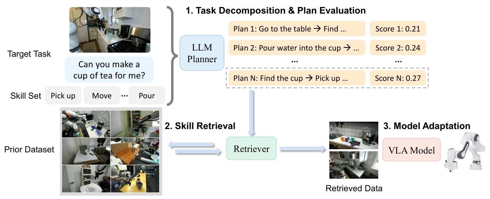

# HierarchicalSkillRetrieval

> **分类**: Skill召回 | **成熟度**: 🟡 成长期 | **综合评分**: 0.56

---

## 一句话描述

HSR 是面向长程机器人操作任务的**分层技能检索**框架，用 **LLM** 把目标任务分解为技能子任务、按先验库估的**技能可学性**筛分解方案，再做**语言+行为特征混合检索**和**两阶段适配**，LIBERO 上比最强基线高 **10.3** 个百分点、真实机器人整体 **48/80**。

**来源**:
- Hierarchical Skill Retrieval for Data-Efficient Adaptation of Vision-Language-Action Models（Haoran Hao, Shahram Najam Syed, Jeff Schneider, Jeffrey Ichnowski，卡内基梅隆大学机器人研究所）
- 发布年份：2026

**链接**:
- https://arxiv.org/abs/2608.24042

---

## 核心实现

立论：长程任务检索失败的根是粒度没对上任务结构——整任务匹配在先验库里匹配不到，但子技能大量存在。HSR 把目标任务拆到技能层去检索，用先验库自己估的技能可学性给 LLM 分解落地。

**1. 技能聚类：从先验库发现可复用技能**

- 对先验库 $D_{prior}$ 所有任务指令用 **BERT** 抽文本嵌入，**K-means** 聚成 **K=10** 个技能簇（如 Pick、Open、Close、Pour）。每个簇是一个可复用技能，供后续落地评估。

**2. 技能置信度：无 rollout 的可学性代理**

- 把 $D_{prior}$ 切训练/验证两半，在训练半上微调预训练 **SmolVLA-450M** 得 $\pi_{\theta}'$，在验证半上按簇算平均轨迹级 BC 损失并做长度归一化。
- 折算式 $C(s_i)=\exp(-\alpha\tilde{L}_{val}-\beta\tilde{H})$ 把损失和平均轨迹长度合成置信度（$\alpha=0.6,\beta=0.8$），偏好**易模仿、不易累积误差**的技能，避免 LLM 分解出机器人学不动的子任务。

**3. 任务分解与方案评估：语义 × 可学性**

- **Qwen3-VL-4B** 给目标任务生成 10 个候选分解方案，每个子任务归到最近技能簇。方案分 = LLM 给的语义分乘各子任务置信度连乘，选最高分方案做检索查询。
- 控制要点：语义分保任务覆盖和逻辑一致，置信度保可执行性，两者相乘防"看起来合理但机器人做不到"的分解。

**4. 混合技能检索：语言捞 + 行为重排**

- 先用语言相似度从 $D_{prior}$ 捞 top **10%** 片段，再用 **Behavior Retrieval 的 VAE** 抽行为特征，按到最近目标帧的负距离重排，保留 top **30%**（约先验库 3% 帧）。
- 语言保语义相关、行为保执行兼容，过滤运动相似但目标不同的误导数据。

**5. 两阶段适配：预训练学通用 + 微调做专精**

- 先在语言检索数据上**预训练**学通用技能，再在目标数据 $D_t$ 加重排帧上**微调**做任务专精，避免单阶段共训练被检索数据带偏。
- 真实机器人第二阶段只微调目标数据不混检索数据，是对跨具身差距的妥协。

---

## 主要能力

- 把长程任务拆到**技能级子任务**独立检索，解决了整任务语言匹配在长程任务上系统性失效的问题
- 用先验库估的**技能置信度代理**给 LLM 分解落地，避免分解出机器人学不动的子任务，逼近人工分解质量
- **语言+行为特征混合检索**同时保语义相关和执行兼容，过滤运动相似但目标不同的误导数据
- **两阶段预训练+微调**把通用技能学习和任务适配分开，对跨具身差距大的真实机器人场景更鲁棒
- 在 LIBERO 长程组合任务上比最强基线 STRAP 高 **11.6 个百分点**，真实机器人整体成功率 **48/80**

---

## 局限性

- 只在**操作任务和单一 VLA 骨干 SmolVLA-450M** 上验证，跨策略架构、跨具身、跨数据模态的鲁棒性未测
- LLM 只用于**训练时任务分解**，未进闭环重规划和失败恢复，部署时失效无法在线修正
- 技能置信度用 **BC 损失代理真实成功率**，在长程技能上虽折算轨迹长度但仍是间接度量
- 真实机器人第二阶段只微调目标数据不混检索数据，是对跨具身差距的妥协，限制了检索数据在第二阶段的价值

---

## 成熟度评分

| 维度 | 评分 (0.0-1.0) | 说明 |
|------|---------------|------|
| 技术成熟度 | 0.58 | 分层检索 + 技能置信度代理 + 两阶段适配，项目主页 |
| 创新性 | 0.68 | 技能可学性置信度给 LLM 分解落地 + 语言/行为混合检索 |
| 落地程度 | 0.52 | LIBERO +10.3pp、真实机器人 48/80，仅单一 VLA 骨干 |
| 生态活跃度 | 0.42 | 单篇论文，项目主页 |

**综合评分**: 0.56

---

## 参考资料

- [Hierarchical Skill Retrieval for Data-Efficient Adaptation of Vision-Language-Action Models](https://arxiv.org/abs/2608.24042)
- [HSR 项目主页](https://hoar012.github.io/HSR-Project/)
