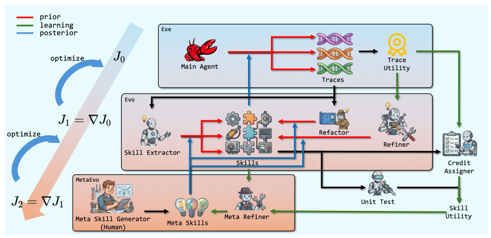

# HiSME

> **分类**: Skill 优化 | **成熟度**: 🟡 成长期 | **综合评分**: 0.53

---

## 一句话描述

**HiSME** 将技能进化拆为两层：第一层技能本身在进化（从轨迹中学习），第二层**进化策略本身也在进化**——通过 **Meta-Skill** 从管理技能的经验中学习如何更好地提炼、评估、维护技能，让"管技能的那个管家"也不会停滞。

**来源**:
- 清华大学 & 华为联合研究
- 发布年份：**2026**

**链接**:
- 论文：https://arxiv.org/pdf/2605.28390

---

## 核心实现

**1. 两层残差优化框架**

**第一层技能优化**：Executor（执行 Agent）固定、参数不可更新，进化算法 EVO 通过从执行轨迹中学习不断更新技能库 S。**第二层 Meta 优化**：EVO 本身被视为"有缺陷的先验"（由人类按自己理解设计的进化策略），Meta-EVO 从 EVO 的操作历史和执行反馈中学习，产出 **Meta-Skill** 来修正 EVO 在提取、评估、维护各环节的行为。

**2. Meta-Skill：教进化策略怎么做进化的技能**

Meta-Skill 与普通技能一样从执行反馈中自动提炼，区别在于输入是**进化策略的操作轨迹**——提取了什么、合并了什么、评估结果是什么、后续验证是对还是错。当同样失败模式反复出现（如提取器总生成过拟合技能），Meta-EVO 生成一条 Meta-Skill 指导进化策略下次如何调整。**本质上是将人类工程师对进化策略的"调参"自动化了。**

**3. 技能的分阶段生成与四信号评估**

技能生成采用提取器（单条轨迹识别可复用片段）和重构器（跨轨迹寻找重复模式，用 Embedding + N-gram 构建相似性图提取团）两种策略。每份技能由四个信号评估：Bundle Tester（LLM 构建测试用例）、Credit Assigner（从真实执行轨迹回溯贡献）、使用统计（检索次数和被执行次数）。

---

## 主要能力

- **进化策略的自我进化**：不只是技能在变好，"管技能的策略"也在从管理经验中变好
- **Meta-Skill 多样化自适应**：不同场景下产出风格截然不同的 Meta-Skill（激进提取 vs 保守维护），策略真正学会因地制宜
- **四信号技能评估档案**：单元测试 + 集成测试 + 回溯信用 + 使用统计，构成每份技能的完整评估画像
- **轻量文本空间优化**：两层更新均在测试时、文本空间中完成，不碰底层模型参数

---

## 局限性

- **双层优化的复杂性**：引入 Meta 层增加了系统复杂度和诊断难度，Meta-Skill 质量退化时难以快速定位
- **多维基准实验细节不足**：论文未充分展开跨领域 Meta-Skill 迁移效果的数据
- **评估依赖 LLM 一致性**：Bundle Tester 构建测试用例的质量依赖于 LLM 的稳定性

---

## 成熟度评分

| 维度 | 评分 (0.0-1.0) | 说明 |
|------|---------------|------|
| 技术成熟度 | 0.50 | 学术论文阶段，清华+华为联合研究，有开源代码，双层进化框架完整 |
| 创新性 | 0.80 | 首次将元学习引入技能进化，Meta-Skill从管理经验中学习如何更好地管理，第二层进化创新性强 |
| 落地程度 | 0.35 | 代码已开源但研究阶段，需与其他技能系统集成 |
| 生态活跃度 | 0.40 | 清华+华为联合，学术界工业界双重背书 |

**综合评分**: 0.53

---

## 参考资料

- [HiSME 论文](https://arxiv.org/pdf/2605.28390)
- [代码](https://anonymous.4open.science/r/HiSME-BD45)
