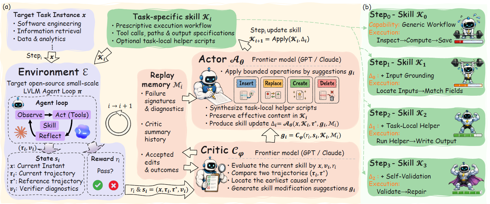

# SKILLER

> **分类**: Skill生成 | **成熟度**: 🟢 成熟期 | **综合评分**: 0.61

---

## 一句话描述

**SKILLER 是语言级强化学习框架**：把**文本 skill 当可优化策略**、小模型 agent loop 当 environment、前沿模型当 actor/critic，RL 信号**全走自然语言不更新小模型权重**，生成 executor-specific skill 让 Qwen3.5-4B 在 SWE 反超 9B。

**来源**:
- SKILLER: Language-Level Reinforcement Learning for Reusable Skill Extraction in Small Language Models（Chenhao Dang、Siyuan Xiong 共同一作；Conghui He、Weijia Li 通讯作者；上海交通大学 / 上海人工智能实验室 / 哈尔滨工业大学（深圳）/ 清华大学深圳国际研究生院）
- 发布年份：2026

**链接**:
- https://arxiv.org/abs/2608.10538

---

## 核心实现

立论：为强前沿模型写的 skill **不能直接迁移到小模型**（model-mismatch）——小模型易幻觉参数、跳验证、被多分支指令带偏，强模型 skill 注入触发认知过载致灾难性失败；现有 skill 生成方法（AutoSkill/EvoSkill/SkillX/Manus）都为强模型优化。SKILLER 把文本 skill 本身当 policy、不更新小模型权重，通过语言级策略迭代专为小模型行为空间生成 skill。

**1. 形式化：冻结小模型，把 skill 当可优化策略在策略空间里搜**

冻结小模型 π，skill 条件化动作分布——π 在 skill K 下选动作的概率等于 π 读历史 + skill K 后选动作的概率。目标是找使期望 verifier 奖励最大的 skill。**不微分 π 或 environment**，而是靠 verifier-grounded natural-language policy updates K0→K1→…→KI 探索策略空间——计算开销集中在 skill 构造时，产出可解释、可直接部署的工件。

**2. 五组件闭环：环境 → 状态 → critic → 记忆 → actor**

- Environment 包装 benchmark 工具 + workspace + 官方 verifier，产出轨迹、标量奖励（0–1，二值任务成功或归一化测试通过率）、verifier 诊断；
- State 是四元组 (任务实例, 当前轨迹, 参考成功轨迹, verifier 诊断)——参考成功轨迹**仅优化侧用、绝不作运行时输入**，配对当前轨迹暴露最早在哪步偏离成功路径；
- Critic（前沿模型）读状态、奖励、当前 skill、记忆，对比当前轨迹与参考轨迹**定位最早因果分歧**，分清缺失指导 vs 工具误用 vs 契约违反，给的是局部编辑指令而非整篇重写请求；
- Replay Memory 存 failure signatures + accepted edits + critic summary，防重复失败、保有效行为、支持回滚；
- Actor（前沿模型）四操作 Insert/Replace/Create/Delete 做 bounded edit，并在小模型搞不定长易错流程时合成 task-local helper script 卸载过程推理。

**3. 渐进演化：每步纳入更细约束，缩小小模型易错行为**

Step0 通用 workflow（Inspect→Compute→Save）→ Step1 +Input Grounding（定位输入匹配字段）→ Step2 +Task-Local Helper（跑 helper 写输出）→ Step3 +Self-Validation（验证→修复）。连续 Δ 把过程推理从自然语言挪到确定性外部工具——SKILLER skill 534 词、TF-IDF 余弦 **0.07**（与人类作者持平、最特化）、scripts 2.96 个 / LOC 15747 最多，**少啰嗦多代码卸载**正合小模型有限上下文窗口。离线用 **GPT-5.4** 作 actor/critic，下游评估 token 不计入成本。

整个过程数值锚定在 Qwen3.5-9B 五基准：SWE-Skills-Bench **82.80**、SkillsBench 73.91、SkillLearnBench 32.11、GAIA 49.40、EarthBench 76.08；Qwen3.5-4B 配 SKILLER 在 SWE-Skills-Bench **66.70** 超 9B 配任一基线 skill（Manus 62.40），且比 Haiku 4.5 配 curated skill 便宜 71 倍还高 4.4 pp。消融去 critic Generation 73.91→36.44 证翻译是决定性功能、去 actor Scripts 73.91→55.34 证 executable abstraction 是中央桥梁。

---

## 主要能力

- **优化的自然语言策略打过参数规模**：Qwen3.5-4B 配 SKILLER 在 SWE-Skills-Bench **66.70** 超 9B 配任一基线 skill（Manus 62.40）
- **逼近前沿低成本**：9B 比 Haiku 4.5 配 curated skill 便宜 **71 倍**且高 4.4 pp，4B 比 Sonnet 4.5 便宜 **167 倍**
- **五基准一致领先**：9B 增益 **4.3–20.4** pp、4B **1.8–13.3** pp，零样本 9B GAIA 49.59 / EarthBench 72.31 最高证提取可复用规则非过拟合
- **结构适配小模型**：skill 冗长度与 TF-IDF 均接近人类作者最低，scripts / LOC 最多
- **消融可归因**：去 critic Generation 73.91→36.44 证翻译是决定性功能；去 actor Scripts 73.91→55.34 证 executable abstraction 是中央桥梁

---

## 局限性

- **信息检索任务帮助有限**：GAIA 失败常因事实缺失非过程错误，critic 能重塑搜索策略但补不了缺失事实
- **offline 依赖强前沿模型**：Stage I/II actor 与 critic 用 GPT-5.4，生成成本 $8.95 仍高于 EvoSkill $1.95
- **非单调收敛**：SkillLearnBench Step2 最佳后续保留不超，最优停止步随 benchmark / executor 变，需 snapshot 回滚
- **通用性未充分验证**：只测 Qwen3.5-9B/4B 两尺度，未在 Gemma 4 等其他小模型族复现

---

## 成熟度评分

| 维度 | 评分 (0.0-1.0) | 说明 |
|------|---------------|------|
| 技术成熟度 | 0.62 | 五组件环形式化清晰，消融逐层可归因，公开代码/基准/skill 快照 |
| 创新性 | 0.80 | language-level RL 把文本 skill 当 policy 不更新权重首创 |
| 落地程度 | 0.50 | 五基准 SOTA + 零样本泛化，但 offline 依赖 GPT-5.4 仅测 Qwen3.5 两尺度 |
| 生态活跃度 | 0.48 | 单篇论文，GitHub 开源，引用 skill 获取/演化文献丰富 |

**综合评分**: 0.61

---

## 参考资料

- [SKILLER: Language-Level Reinforcement Learning for Reusable Skill Extraction in Small Language Models](https://arxiv.org/abs/2608.10538)
- [SKILLER 项目](https://github.com/DANG-ai/SKILLER)
