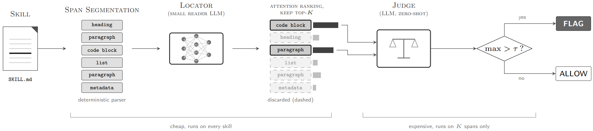

# Locate-and-Judge：基于注意力的Agent技能恶意注入检测

> **分类**: Skill安全 / 技能检测 | **成熟度**: 🟡 成长期 | **综合评分**: 0.57

---

## 一句话描述

两阶段恶意技能检测框架：小模型用**注意力信号**定位可疑片段，大模型**零样本判定**。在**13.4万真实技能**上以约$34成本确认**131个恶意技能**（precision 83%），其中82个为隐藏攻击，现有扫描器几乎全部漏检。

**来源**:
- 论文：Etteib et al., "Detecting Malicious Agent Skills in the Wild using Attention"
- 发布年份：2026
- 机构：University of Luxembourg

**链接**:
- arXiv: 2606.23416v1
- 数据集已开源

---

## 核心实现

**1. 威胁建模：技能作为新攻击面**

Agent Skill通过第三方市场分发，Agent运行时加载不认识的人写的指令并执行。**传统prompt注入防御靠"受信任指令"和"不可信数据"之间的边界来区分**，但技能本身就是整篇第三方指令，恶意注入多出的几行和合法指令走同一个通道、继承同等权威。这条边界在技能场景下直接失效。

**2. 结构化分段与注意力定位**

将技能文件按Markdown结构切成span（标题、段落、列表、代码块、元数据字段），喂给0.5B小模型。prompt不直接问"有没有恶意"，只引导模型关注"可执行、强制性、操作相关"的内容。读最后四层注意力权重，聚合到span上取top-K。控制要点：
- post-softmax sum：快速扫描
- logit-z：加了log变换和z-score归一化，精度更高
- **注入要被执行，就得抓住模型的注意力**

**3. 零样本判定与成本控制**

DeepSeek-V4-Flash对locator筛出来的top-K片段做零样本判定，不用标注数据。任一span分数超阈值τ就标记。控制要点：便宜的小模型跑全量，贵的judge只看K个片段。**输入token省了2.84倍**，总judge成本约$34 vs 全文$76。K=3时F1达0.955，高于全文扫描的0.921。

**4. 市场级部署验证**

Lobehub（10.2万）、Clawhub（3万）、Skills.sh三个市场全量扫描，359个标记，131个确认恶意（precision 83%），82个HMS（隐藏）。对比现有扫描器：SkillSpector recall 20%，Cisco 15.4%，L&J 95.4%。发现五组跨"作者"共享攻击者控制域名的协调攻击集群。

---

## 主要能力

- 注意力定位：小模型注意力权重筛span，Hit@K=0.95，不靠关键词所以没正则匹配的召回天花板
- 零样本判定：DeepSeek-V4-Flash直接判，不需要针对技能恶意做训练或微调
- 隐藏攻击检出：82个HMS检出68个（83%），全文仅45%，locator把可疑片段拎出来解决信号稀释
- 市场级部署：三个真实市场全量扫描总成本$34，检测到有组织的协调攻击集群
- 精确率可控：K=3时F1=0.955高于全文，三段超过全文的效果说明locator改善了judge判断质量

---

## 局限性

- 注意力pattern在不同reader模型上是否一致没验证，攻击者可能用对抗样本绕开
- segment parser切分粒度是硬依赖，单行base64 payload没切成独立span就漏
- 阈值在Skill-Inject上校准的zero-FP，实地跑出27个假阳（约7.5%），模式固定但还没自动过滤
- 漏的22个里大多是judge判无罪，召回天花板在judge能力上不在locator

---

## 成熟度评分

| 维度 | 评分 | 说明 |
|------|------|------|
| 技术成熟度 | 0.55 | 两阶段管道已验证，三个市场全量部署，但跨模型注意力一致性未验证 |
| 创新性 | 0.75 | 注意力定位替代关键词扫描，零样本判定不依赖标注，是技能安全检测新范式 |
| 落地程度 | 0.50 | 三个市场实际部署扫描总成本$34，但阈值校准仍有约7.5%假阳 |
| 生态活跃度 | 0.45 | 数据集已开源，但工具本身尚未作为可安装产品发布 |

**综合评分**: 0.55×0.3 + 0.75×0.25 + 0.50×0.25 + 0.45×0.2 = **0.57**（🟡 成长期）

---

## 参考资料

- [论文](https://arxiv.org/abs/2606.23416)

