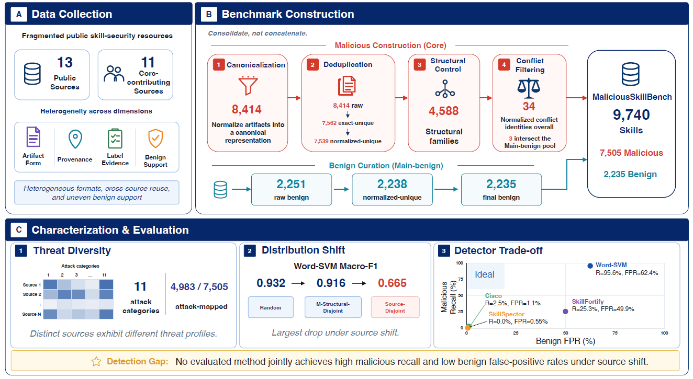

# MaliciousSkillBench

> **分类**: Skill评测 | **成熟度**: 🟡 成长期 | **综合评分**: 0.54

---

## 一句话描述

MaliciousSkillBench 是面向 **Agent Skill 恶意检测**的综合基准，整合 13 个公开源、8,414 条恶意记录经四阶段归约到 **9,740 条冲突干净技能**（7,505 恶意 / 2,235 良性），用源外推评测暴露学习检测器随机 Macro-F1 从 **0.932 掉到 0.665**、良性误报涨到 62.4%。

**来源**:
- MALICIOUSSKILLBENCH: A COMPREHENSIVE BENCHMARK FOR MALICIOUS AGENT SKILL DETECTION（Yue Wang 等，南京大学 / Griffith University / Nanyang Technological University / Wake Forest University / University of New South Wales）
- 发布年份：2026

**链接**:
- https://arxiv.org/abs/2608.19901

---

## 核心实现

立论：现有恶意技能数据集碎片化——制品形式、溯源、标签证据、良性覆盖各异，跨源重复和结构变体复用让直接拼接虚报规模并污染划分。MaliciousSkillBench 整合而非拼接，用源外推让源耦合压力显形。

**1. 资格层：冻结源、保守准入核心恶意池**

- 冻结 13 个公开源，其中 11 个满足**核心恶意规则**：能拿到实际技能制品、保源原生恶意主张和证据、惰性静态输入可溯源到冻结修订。
- 每条记录拿稳定规范化 ID，同时保留源 ID、标签、修订、溯源、证据类型——只标"漏洞/可疑/双用途"的**不升级**为恶意真值。
- **8,414 条原始核心记录** → 7,562 精确唯一 → **7,539 规范化唯一身份**；SRC002/SRC004 借作者提供的历史快照补回缺失制品。

**2. 去重与冲突层：三层分治 + 跨标签剔除**

- **精确身份**（SHA-256）、**规范化文本身份**（确定性保守文本归一）去重；**结构复用族**（阈值 0.68 静态相似度管线产 **4,588 个操作结构族**，只用于复用审计和恶意侧结构外推划分，无攻击语义）。
- 48,217 良性候选按证据强度分主池/辅助池，主良性要求实际制品加强/中等证据得 2,251 条原始。
- 34 个规范化身份跨恶意/良性拿冲突标签，**全剔除出主评测**留作审计。最终 **9,740 条规范化唯一技能**（7,505 恶意 / 2,235 良性）。

**3. 刻画层：只用源原生标签映射 11 类攻击**

- 只用源原生标签 + 确定性强语义映射，不靠文本臆测。对 7,505 条恶意身份里 **4,983 条（66.4%）**划到 11 个多标签攻击类别。
- 执行/代码投递 3,320（66.6%）、指令操纵 1,671（33.5%）、权限滥用 1,013（20.3%）。源高度集中——SkillTrustBench 撑起执行攻击多数。

**4. 评测层：三视图 + 学习基线与扫描器同台**

- **Random**（标签分层 70/10/20）、**Malicious-Structural-Disjoint**（结构族整族不跨划分）、**Source-Disjoint**（留出 SRC009/SRC011/SRC012）。
- 学习基线只用惰性主技能指令文本（词 TF–IDF 配 LR/SVM、字符 char wb TF–IDF 配 SVM）。三个固定扫描器：Cisco-local-behavioral、SkillFortify-offline、SkillSpector-static。

控制要点：随机分高不等于跨源能打；检测质量天生双边，召回和误报必须同报。

---

## 主要能力

- **整合而非拼接**：13 源 8,414 条经四阶段归约到 9,740 条冲突干净技能，三层去重控住虚报
- **源外推暴露真实落差**：学习检测器随机 Macro-F1 **0.882–0.932**，源外推掉到 **0.653–0.665**
- **双边评测**：词 SVM 源外推召回 **95.6%** 但良性误报 **62.4%**，误报是主失败非漏检
- **11 类攻击刻画**：4,983 条映射身份，源高度集中（SkillTrustBench 撑执行攻击多数）
- **两控制消不掉落差**：类均衡和脚手架去标记后源外推仍低于随机分，源耦合非单一因素

---

## 局限性

- **良性覆盖窄于恶意侧**：主良性池偏好标签置信牺牲生态平衡，2,235 条良性覆盖 7,505 条恶意，SRC011 一个源就贡献 293 个假阳性
- **源外推不分离单一因子**：源与溯源、构造、标签策略、类组成耦合，Source-Disjoint 是源条件压力非因果机制
- **攻击/影响映射有限**：攻击映射覆盖 66.4%，影响映射仅 28.4%，交集 25.2%，均为有限子集不推全集
- **静态制品范围限制**：只测主技能指令文本，排除包级/运行时行为；SkillSpector 用 no-LLM 静态模式，数值不可与全包/运行时/云服务直接互换

---

## 成熟度评分

| 维度 | 评分 (0.0-1.0) | 说明 |
|------|---------------|------|
| 技术成熟度 | 0.58 | 13 源整合四阶段归约 9474 条 + 三视图评测，开源 |
| 创新性 | 0.66 | 源外推评测暴露源耦合落差，整合而非拼接 |
| 落地程度 | 0.46 | 学习检测器随机 0.932 掉到源外推 0.665，良性误报 62.4% |
| 生态活跃度 | 0.44 | 单篇论文，GitHub + HuggingFace 开源 |

**综合评分**: 0.54

---

## 参考资料

- [MALICIOUSSKILLBENCH: A COMPREHENSIVE BENCHMARK FOR MALICIOUS AGENT SKILL DETECTION](https://arxiv.org/abs/2608.19901)
- [MaliciousSkillBench 项目主页](https://protectskills.github.io/MaliciousSkillBench/)
- [MaliciousSkillBench 代码仓库](https://github.com/protectskills/MaliciousSkillBench)
- [MaliciousSkillBench 数据集](https://huggingface.co/datasets/ProtectSkills/MaliciousSkillBench)
