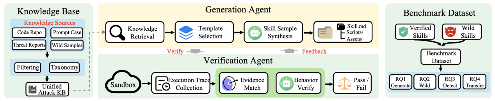

# MalSkillBench

> **分类**: Agent 技能管理 | **成熟度**: 🟡 成长期 | **综合评分**: 0.50

---

## 一句话描述

MalSkillBench 是首个**恶意技能验证基准**，包含 **3,944 个恶意技能**（每个经 Docker 沙箱运行时双重验证），覆盖三维攻击分类体系（攻击向量 × 15 种恶意行为 × 8 种插入策略，共 **108 个攻击单元**）。实测 12 个检测工具：代码注入召回最高 **98.4%**，提示注入检测**全线崩塌**，没有任何单一工具能同时覆盖两条攻击向量。

**来源**:
- 南大、NTU、川大、DIGIDATIONS 联合研究，论文 arXiv: 2606.07131
- 发布年份：2026

**链接**:
- 论文：https://arxiv.org/abs/2606.07131

---

## 核心实现

**1. 混合攻击面建模：技能同时承载代码注入和提示注入**

Agent 技能包同时装了自然语言指令、可执行脚本和工具权限，构成不属于任何现有防御范式范围的混合攻击面。**代码注入**和**提示注入**两类攻击可在同一技能中交叉出现，现有检测工具均未训练或测试过这种交叉模式。

**2. 108 格三维分类体系 + 闭环生成-验证-反馈管线**

分类体系覆盖两个攻击向量、15 种恶意行为和 8 种插入策略，共 **108 个攻击单元**。3,214 个样本经闭环管线双重验证：生成器产出候选恶意技能→验证器在 Docker 沙箱中实际执行→用 strace 和 inotifywait 抓系统调用行为→LLM Judge 判断实际行为与标签匹配→失败样本连结构化反馈一起送回生成器。**关键设计**：验证从"数据标注了恶意"改为"沙箱确认运行时确实执行了恶意行为"。

**3. 检测工具全面测量：单一工具无法跨两类攻击**

实测 12 个工具分三类：技能专用检测器代码注入召回最高 **98.4%**，但提示注入全线崩塌，最好 F1 仅 88.6%。天真拼接两类工具输出在 4,000 良性样本上产生 **3,979 个误报**：代码证据和指令证据不能简单用"或"逻辑合并。用野生样本和全量 benchmark 测同一检测器，召回率可差 **66 个百分点**。

---

## 主要能力

- 首个覆盖三维攻击分类体系的恶意技能基准：**3,944 个恶意技能 + 4,000 配对良性样本**
- Docker 沙箱运行时双重验证（strace syscall trace + LLM Judge），验证从标签升级为行为证据
- 12 个检测工具在同尺度下系统测量，揭示代码注入和提示注入之间**检测能力的结构性分裂**
- 703 个野生技能分析揭示当前实际攻击生态：**86.3% 为依赖冒充变体**，81% 来自仅两个账户
- 发现新型攻击目标：劫持 Agent 控制平面（伪造身份声明、注入会话指令），对当前所有检测工具是盲区

---

## 局限性

- 沙箱环境和真实 Agent 运行环境之间存在 **gap**：沙箱中验证通过的恶意行为模式在生产中可能表现不同
- 闭环生成的知识库**有时间滞后**：代码注入种子来自恶意包知识库，提示注入来自公开 jailbreak 语料，对全新攻击模式覆盖有延迟
- 良性技能配对为**同类匹配**，误报率在同领域对比中测得，跨领域对比下表现可能不同
- 当前仅覆盖 12 个检测工具，更广泛的工具生态覆盖待扩展

---

## 成熟度评分

| 维度 | 评分 (0.0-1.0) | 说明 |
|------|---------------|------|
| 技术成熟度 | 0.55 | 3944恶意技能+108攻击单元+Docker双重验证，体系完整 |
| 创新性 | 0.55 | 首个恶意技能基准，填补了安全评估空白 |
| 落地程度 | 0.40 | 12个检测工具的对比实验有参考价值，但基准本身待广泛采用 |
| 生态活跃度 | 0.50 | 南大+NTU+川大联合出品，论文公开 |

**综合评分**: **0.50**

---

## 参考资料

- [论文](https://arxiv.org/abs/2606.07131)
