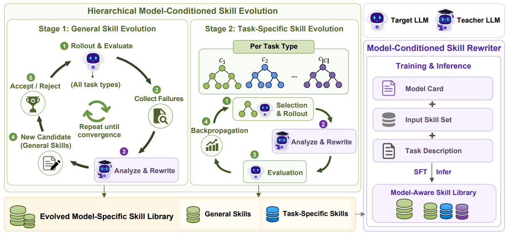

# MASA

> **分类**: Agent 技能优化 | **成熟度**: 🟡 成长期 | **综合评分**: 0.54

---

## 一句话描述

MASA 打破了"一套技能库适配所有模型"的默认假设。实验表明**同内容不同表达粒度的技能**在不同参数规模模型上效果差异巨大，甚至可以让某些模型表现**低于无技能基线**。MASA 通过**模型条件化的分层技能进化搜索**和**轻量技能改写器**，将搜索过程压缩为一次前向推理，让技能表达适配目标模型的特定行为模式。

**来源**:
- 华东师范大学，论文 arXiv: 2605.30723
- 发布年份：2026

**链接**:
- 论文：https://arxiv.org/pdf/2605.30723
- 代码：https://github.com/jianxiangyu/MASA_

---

## 核心实现

**1. 模型条件化搜索：以能力档案为显式约束**

MASA 为每个目标模型维护一份**能力档案（model card）**，包含架构元数据、训练来源和能力画像。教师模型在每次改写时以该档案为条件：不是"教师觉得怎么写最好"，而是"教师判断对这个特定模型怎么写最可能有效"。搜索在任务类型粒度上操作，同一模型内不同任务类型对同一组技能的反应差异可超 **60 个百分点**。

**2. 分层技能进化：通用技能爬山 + 任务特定技能 UCB 树搜索**

技能库分两层独立优化。Stage 1 用爬山搜索优化通用技能：教师分析失败轨迹中系统性问题，结合能力档案和历史高奖励技能改写，全任务评估后只接受高于当前分数的改写。Stage 2 固定通用技能，每个任务类型跑独立 UCB 树搜索优化任务特定技能，节点选择用 UCB1 平衡开采与探索。奖励含 **NHR（nothing-happens rate）惩罚**，抑制"无害但无用"的技能表达。

**3. 技能改写器：将搜索压缩为一次前向推理**

训练基于 **Qwen3-4B** 的轻量改写器，输入能力档案、技能和任务描述，一次前向传播输出适配技能。关键在训练数据的**多样性暴露**：输入来源覆盖进化管道各阶段中间产物、跨模型迁移结果、加噪截断变体，确保改写器学到"不管输入多差都能改好"而非仅对高质量输入有效。

---

## 主要能力

- **模型条件化技能适配**：以能力档案为显式条件，让技能表达匹配目标模型的行为模式
- 分层技能进化：通用技能爬山搜索 + 任务特定 UCB 树搜索，两层独立避免归因混淆
- **NHR 惩罚机制**：在奖励中扣除无环境反馈的"空转"步骤，引导搜索远离无用表达
- 轻量改写器（4B）在一次前向传播中完成适配，**推理成本几乎可忽略**，跨环境跨任务泛化
- 实验覆盖多种模型族（Qwen3、Gemma3）和三类环境，验证模型特异性技能的普遍需求

---

## 局限性

- **进化管道计算成本高**：全环境 rollout、教师模型调用、目标模型评估构成真实计算开销，限制迭代轮次
- 能力档案当前为**静态预定义文档**，进化过程中新发现的行为模式无法反向注入更新档案
- 实验仅在文本具身、Web 购物、检索 QA 三类环境上验证，更多领域有待覆盖

---

## 成熟度评分

| 维度 | 评分 (0.0-1.0) | 说明 |
|------|---------------|------|
| 技术成熟度 | 0.60 | 模型条件化搜索+轻量改写器设计较完整 |
| 创新性 | 0.60 | 打破一套技能适配所有模型假设的思路醒目 |
| 落地程度 | 0.45 | 论文阶段，实验结论待独立复现验证 |
| 生态活跃度 | 0.50 | 华东师大出品，有GitHub开源代码 |

**综合评分**: **0.54**

---

## 参考资料

- [论文](https://arxiv.org/pdf/2605.30723)
- [代码](https://github.com/jianxiangyu/MASA_)
