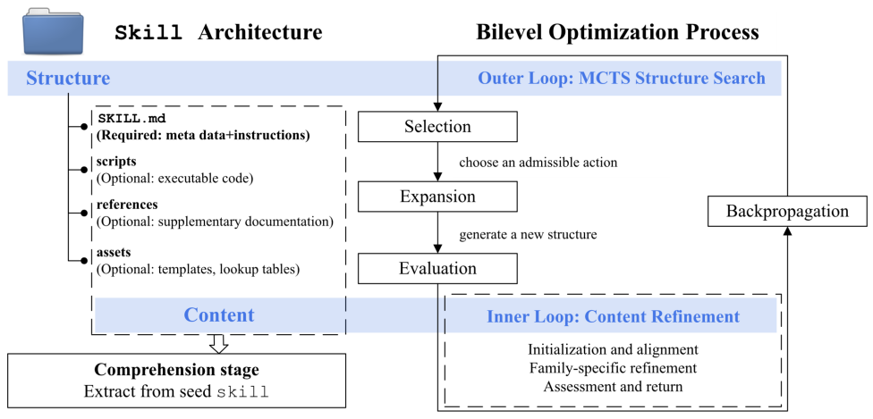

# 双层MCTS

> **分类**: Skill 优化 | **成熟度**: 🔴 探索期 | **综合评分**: 0.45

---

## 一句话描述

将 Skills 优化建模为**双层优化问题**——外层用 MCTS 搜索最优技能结构（章节组织、文件拆分），内层用 LLM 精炼具体内容，在 ORQA 基准上**自动优化的技能反超了人工手调版本**（90.625% → 93.75%）。

---

## 核心实现

框架将技能抽象为 S = (θ, φ)，θ 是结构配置（哪些文件、哪些章节），φ 是内容实例（具体写了什么）。外层 MCTS 搜结构，内层 LLM 磨内容，两轮交替推进。

**技能的形式化定义**：将技能拆为结构 θ 和内容 φ 两个独立变量，结构决定组件如何组织（章节增删、文件拆分合并），内容决定每个组件里写什么。两者解耦后才能各用各的工具来优化。

**外层 MCTS 结构搜索**：用 UCB 策略在搜索树里选最有潜力的结构节点，LLM 根据历史性能数据生成结构修改建议（加/删/重排章节、移内容到不同文件），执行后把任务得分反向传播更新树。MCTS 天然适合这种改完结构才能知道好不好的延迟反馈场景。

**内层内容优化**：收到新结构后分三步——对齐（把旧内容往新结构里搬，能复用就复用）、分类型优化（章节调整时重点磨文本，脚本改动时重点修代码跑测试）、保守选择（用下置信界 LCB 选最稳的版本，不选分数最高但可能只是运气好的）。

**为什么选 LCB 而不是最高分**：测试有噪声，最高分可能只是运气好。论文数据显示最新候选的期望 Δ 是 -3.1pp，而最佳候选是 +8.1pp。保守选择能大幅降低上线后性能回归的概率。

---

## 主要能力

- 自动搜索技能的最优结构配置——章节怎么排、内容放哪个文件、元数据怎么写——不再依赖人的经验和直觉
- 内容优化和结构优化联动：改了结构后内容自动适配，改了内容后结构同步调整，不会出现改了章节划分但文本还停留在旧布局的情况
- 保守选择策略用统计方法替代"选最高分"的直觉做法，减少因测试噪声导致的假优化，对生产环境更友好
- 一套固定流程覆盖技能优化的全链条：从结构草案到内容精炼到最终选优，不需要人工介入

---

## 局限性

- 只在 ORQA（运筹学问答）单一基准上验证，任务类型偏选择题，其他领域的结构搜索空间可能差异很大
- MCTS 搜索每轮评估都需要多次 rollout，计算开销不小，技能库规模大了以后搜索效率是个问题
- 保守选择依赖 LCB 的统计假设，小样本下可能过于保守，错过真实的大幅提升

---

## 成熟度评分

| 维度 | 评分 (0.0-1.0) | 说明 |
|------|---------------|------|
| 技术成熟度 | 0.40 | 有论文验证 |
| 创新性 | 0.75 | 双层MCTS的创新设计 |
| 落地程度 | 0.30 | 学术验证阶段 |
| 生态活跃度 | 0.35 | 论文发布 |

**综合评分**: 0.45

---

## 参考资料

- [论文](https://arxiv.org/abs/2604.15709)
- [详解](https://zhuanlan.zhihu.com/p/2030972051096332121)