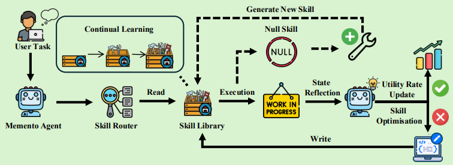

# Memento-Skills

> **分类**: Skill 生成 | **成熟度**: 🔴 探索期 | **综合评分**: 0.40

---

## 一句话描述

Memento-Skills 将可执行技能作为**外部记忆基本单元**，通过 **Read-Write Reflective Learning** 闭环让 Agent 自主构建、适配和优化技能，**无需修改底层 LLM** 即可实现能力持续进化。

**来源**:
- 学术论文：伦敦大学学院、香港科技大学（广州）、吉林大学
- 发布年份：2026年

**链接**:
- 论文链接：https://arxiv.org/pdf/2603.18743
- 代码链接：https://github.com/Memento-Teams/Memento-Skills

---

## 核心实现

Memento-Skills 基于 **Stateful Reflective Decision Process（有状态反思决策过程）** 理论，核心运行逻辑是 **Read-Write Reflective Learning（读写反思学习）** 闭环：

**读取（Read）**：面对新任务时，检索当前最相关的技能来指导冻结的大语言模型执行，Agent 不再依赖静态提示词或原始历史轨迹，而是靠一个不断主动优化的技能库来行动。

**写入（Write）**：根据执行结果直接修改可复用的技能工件，而非被动记录日志：
- 执行成功 → 提升对应技能的效用评分，增加后续被选中概率
- 执行失败 → 先进行失败归因，定位到具体技能的哪个环节出了问题，然后针对性优化（添加边界条件、修改执行逻辑、调整 Prompt 模板）
- 现有技能无法覆盖 → 自动生成全新技能，经过测试后加入技能库

**技能路由器**：优化目标从传统检索的"语义匹配"改为"任务成功"，采用多正例 InfoNCE 损失做硬负例对比学习，精准区分语义相似但执行逻辑不同的技能。混合检索架构结合稀疏 BM25 召回、稠密向量检索和分数感知的倒数秩融合，可选交叉编码器重排。

**自动单元测试关卡**：每次技能更新后，系统自动生成相关测试用例，验证修改后的技能在历史任务上的表现，确保技能不会越改越差。

---

## 主要能力

- 读写反思学习闭环：从经验中学习，犯错后总结教训，提炼成可复用技能
- 失败归因与针对性技能优化：精准定位失败根因并修改对应技能工件
- 自动生成全新技能并通过单元测试验证，确保不会越改越差

---

## 局限性

- 跨领域迁移能力有限
- 技能库收敛需要时间

---

## 成熟度评分

| 维度 | 评分 (0.0-1.0) | 说明 |
|------|---------------|------|
| 技术成熟度 | 0.40 | 有论文和代码开源 |
| 创新性 | 0.90 | 可执行技能作为记忆单元的创新设计 |
| 落地程度 | 0.25 | 学术验证阶段 |
| 生态活跃度 | 0.30 | 有开源代码 |

**综合评分**: 0.40

---

## 参考资料

- [论文](https://arxiv.org/pdf/2603.18743)
- [代码](https://github.com/Memento-Teams/Memento-Skills)
- [详解](https://zhuanlan.zhihu.com/p/2027479618127405311)
