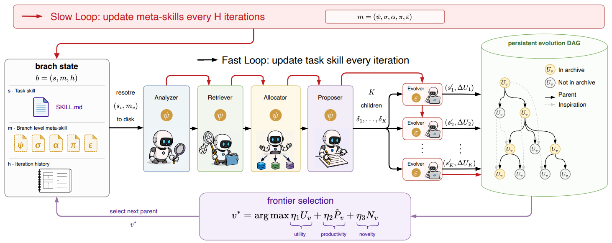

# MetaSkill-Evolve：双时钟元技能进化

> **分类**: Skill 优化 | **成熟度**: 🟡 研究验证阶段 | **综合评分**: 0.62

---

## 一句话描述

**MetaSkill-Evolve** 将 Agent 技能自改进的递归层级向前推了一步：不仅让"技能"可以变，让"**怎么变**"也成为可演化的对象。通过**快慢双时钟**交替——快时钟用元技能改进任务技能，慢时钟收集进化表现反向改进元技能——在 **OfficeQA**（**+23.54**）、**SealQA**（**+16.09**）和 **ALFWorld**（**+1.92**）上均超越单层进化基线，且所有增益来自技能和元技能的演化，**基座模型冻结、无微调、无新增训练数据**。

**来源**:
- MetaSkill-Evolve: Recursive Self-Improvement of LLM Agents via Two-Timescale Meta-Skill Evolution
- 发布年份：2026 年 7 月

**链接**:
- https://arxiv.org/abs/2607.05297v1

---

## 核心实现

**1. 一套流水线**

每个进化分支维护两个状态：**任务技能 $s$**（告诉 Agent 怎么做任务），**元技能 $m$**（告诉改进系统怎么改 $s$）。两者用同一种 Markdown 格式，同一套五 Agent 流水线，区别仅在目标文件不同。

**元技能的五个组件**，各自控制改进流水线的一个环节：
- **ψ（Analyzer）**：如何诊断失败——打什么标签、产什么分析
- **σ（Retriever）**：如何跨分支分享经验——按什么条件拉取修正案例
- **α（Allocator）**：每个父节点该生成多少子代、何时加大搜索
- **π（Proposer）**：如何根据诊断和检索结果提出编辑方案
- **ε（Evolver）**：如何把编辑写回技能文件并验证一致性

**2. 两套时钟**
- **快时钟（任务技能进化）**：每次迭代选一个前沿分支，用其元技能改进其任务技能。从选中分支恢复盘上快照，在训练集上跑一遍，挑得分最差的样本做诊断目标。Analyzer 打标签出分析 → Retriever 按标签从进化图拉取跨分支修正案例 → Allocator 决定产多少孩子 → Proposer 对每个孩子生成不同编辑提案 → Evolver 写入文件并做前后哈希校验 → 验证集评估算出 $ΔU$。只有 $ΔU > 0$ 的孩子进入档案有资格做父节点；$ΔU ≤ 0$ 的孩子保留在图里作为可引用经验但不可做父节点。
- **慢时钟（元技能进化）**：每 H 次迭代触发。将过去 H 个孩子的标签、诊断、结果和平均元生产力装进合成元故障 trace——把进化历史伪装成训练样本。然后重跑五 Agent 流水线，目标从 task-skill 换成 meta-skill。三个操作细节：(1) Analyzer 被约束为只诊断 m 中最有责任的组件，诊断不出按轮转 fallback；(2) 整体重写指子代同时编辑全部五个 meta-skill 文件，Proposer 串行出方案、Evolver 并行落地；(3) 增量累积子代指第 $k+1$ 个子代读的是第 $k$ 个已写的文件，逐步精炼。

**3. 如何选下一个进化的分支**
**前沿评分**用三因素选父节点：**$前沿评分 = η₁·U(s) + η₂·P̂(m|s) + η₃·N$**，其中 $U(s)$ 是验证准确率，$P̂(m|s)$ 是最近 H 个孩子的平均效用增益（衡量改进策略是否在持续产出更好的后代），N 是选型冷却（防止少数分支垄断预算）。三个因素各扛一种失败模式：贪心、血统垄断、随机游走。三元组合让搜索在利用和探索间自动平衡。

---

## 主要能力

- **双时钟递归自改进**：快时钟进化任务技能，慢时钟进化元技能，改进策略本身被选择压力优化
- **元生产力分离**：P̂ 将分支"持续产生改进后代的能力"从当前技能分数中分离，让搜索投资于"正在变好的方向"
- **冻结基座零微调**：所有 Agent 共享冻结 Gemma-4 31B，所有增益来自技能和元技能文件的文本演化
- **跨分支经验共享**：进化图 G 记录所有孩子的诊断和结果，Retriever 按标签跨分支拉取修正案例

---

## 局限性

- **依赖演化预算**：快时钟和慢时钟都需要多次验证集评估，计算成本随迭代次数线性增长
- **慢时钟间隔 H 需手工设定**：H 太小元技能没足够信号，H 太大反馈延迟，缺乏自动调 H 的机制
- **基座依赖**：所有 Agent 共享同一冻结模型，在更弱或更强的基座上的行为模式尚未验证
- 在 ALFWorld 上增益仅 +1.92，已接近饱和空间，对于解法已成熟的领域改进空间有限

---

## 成熟度评分

| 维度 | 评分 (0.0-1.0) | 说明 |
|------|---------------|------|
| 技术成熟度 | 0.55 | 完整论文+五Agent流水线实现，在OfficeQA/SealQA/ALFWorld上验证，但尚未开源 |
| 创新性 | 0.80 | 双时钟递归自改进——元技能本身成为演化对象，快慢时钟交替设计新颖 |
| 落地程度 | 0.40 | 学术验证阶段，3个benchmark，冻结基座零微调便于迁移但尚无生产部署 |
| 生态活跃度 | 0.45 | arXiv论文，代码尚未开源，社区关注度待观察 |

**综合评分**: 0.57

---

## 参考资料

- [论文](https://arxiv.org/abs/2607.05297v1)
