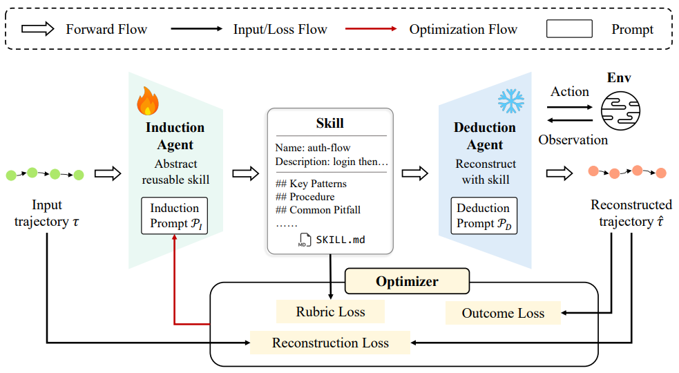

# MIND-Skill

> **分类**: Skill 生成 | **成熟度**: 🟡 成长期 | **综合评分**: 0.50

---

## 一句话描述

**MIND-Skill** 是 **首个为技能生成过程加入闭环质量保证的框架**：归纳智能体从成功轨迹提炼技能，演绎智能体（冻结）持技能重建执行，用 **三重文本损失函数（重建、结果、量规）** 联合优化，将"技能好不好"从主观判断变成可测量、可优化的过程。

**来源**:
- NTU、早稻田大学、浙江大学、东南大学联合研究
- 发布年份：**2026**

**链接**:
- 论文：https://arxiv.org/pdf/2605.08670

---

## 核心实现

**1. 归纳-演绎双智能体闭环**

- **归纳智能体**的系统 Prompt 是整个框架唯一被优化的变量，输入任务描述 + 成功 ReAct 轨迹，输出结构化技能文档。
- **演绎智能体**的 Prompt 从头到尾冻结，唯一的战略输入是归纳智能体生成的技能 + 任务描述（无原轨迹信息），在真实环境中执行 ReAct 循环产出重建轨迹。冻结演绎方确保重建质量变化只能归因到技能本身的改进，形成纯净的控制实验。

**2. 三层抽象分类法约束提炼粒度**

归纳智能体 Prompt 内置三层分类：
- **程序惯例**：跨任务通用但不易从指令推断的，如"循环翻页直到返回为空"，保留;
- **指令可推断**：从任务描述就能想到的，删掉;
- **标准答案泄露**：只有看过原轨迹才知道的，如具体参数值，删掉）。

归纳智能体仅保留第一类，精确控制抽象程度。

**3. 三重文本损失联合优化**

全部损失由 LLM Judge 或环境执行计算，走 TextGrad 文本优化。
- **重建损失**：比策略级等价性而非步骤级文字相似。
- **结果损失**：直接跑环境看任务过没过，是框架唯一的硬地面信号。
- **量规损失**：最巧妙，从标准答案独立性、可操作性、可迁移性、完整性、简洁性五个维度评估技能文档，充当抽象级别的正则化器。

三者词典序最小化：结果损失第一优先，重建损失第二，量规损失第三。

---

## 主要能力

- **闭环质量保证**：生成 → 验证 → 优化 → 再生，技能质量可测量、可优化，不再是"生成了就不管了"
- **自训练对齐**：弱模型（Qwen3.5-122B）自训技能均分 59.1，强模型（GPT-5.4）代训仅 58.9——生成器与推理模型同分布比生成器原始能力更重要
- **紧凑技能产出**：推理时仅检索 K=3 个技能，注入 Token 数为 ACE 的 1/3 到 1/6
- **策略级泛化**：AppWorld-Challenge SGC 场景级完成率 39.6%，显著优于 ACE（34.5%），捕捉的是场景级程序模式而非任务特定捷径

---

## 局限性

- **依赖成功轨迹**：重建损失需要参考轨迹，没有时可用 ground-truth 参考脚本兜底，但限制了生成技能的任务范围
- **抽象分类法依赖 Prompt 工程**：三层分类法目前手动定义，跨领域迁移可能需要重新调整
- **TextGrad 优化天花板**：8 轮迭代后性能仍在涨但明显变缓，更长时间的优化能否持续带来增益仍是开放问题

---

## 成熟度评分

| 维度 | 评分 (0.0-1.0) | 说明 |
|------|---------------|------|
| 技术成熟度 | 0.45 | 学术论文阶段，NTU+早稻田+浙大+东南联合研究，无开源代码 |
| 创新性 | 0.75 | 首个为技能生成加入闭环质量保证的框架，归纳-演绎双智能体+三重文本损失联合优化 |
| 落地程度 | 0.30 | 纯学术研究，无代码/工具发布 |
| 生态活跃度 | 0.45 | 四机构跨国联合研究 |

**综合评分**: 0.50

---

## 参考资料

- [MIND-Skill 论文](https://arxiv.org/pdf/2605.08670)
