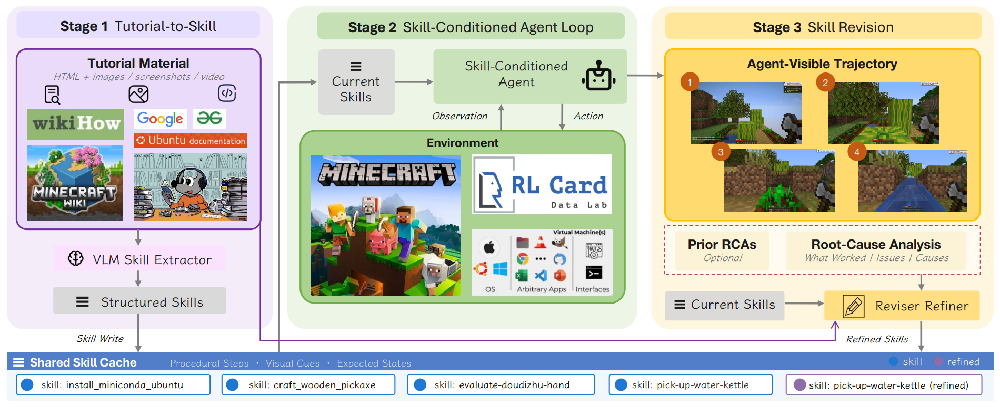

# MMG2Skill

> **分类**: Agent 技能生成 | **成熟度**: 🟡 成长期 | **综合评分**: 0.53

---

## 一句话描述

MMG2Skill 将网上的**多模态人类教程**（HTML、截图、Wiki）自动转化为 Agent 可执行的 **SKILL.md 技能**，然后通过**闭环精炼**：用执行轨迹的反馈反复修改技能文件：直到能真正跑通。六个 VLM 底座、三类环境、**18 组模型-环境组合全部正向**，跨底座宏平均增益 **+12.8 到 +25.3 个百分点**。

**来源**:
- 南京大学 & 快手，论文 arXiv: 2606.01993
- 发布年份：2026

**链接**:
- 论文：https://arxiv.org/abs/2606.01993
- 代码：https://github.com/NJU-LINK/MMG2Skill

---

## 核心实现

**1. 第一阶段：多模态教程到结构化技能的四层提取**

VLM 技能提取器将 HTML+截图教程标准化为可编辑的 SKILL.md，每条技能拆为四层：**可复用操作步骤**、**适用条件**、**预期状态线索**（操作完后环境应该长什么样）、**恢复知识**（偏离了怎么拉回来）。四层结构的关键价值不在格式而在**可编辑**：后续精炼时可精确修改某一层而不碰其他层。

**2. 第二阶段：带着技能执行，模型冻结不动**

技能被注入 Agent 上下文，与最近 W-1 轮的观测-动作历史持久共存。每个动作在任务说明、近期历史和当前技能集的联合条件下采样。整个闭环中 **VLM 模型全程冻结**，只有技能文件被修改。

**3. 第三阶段：基于轨迹反馈的闭环精炼**

每轮 rollout 后，分析器只看任务说明和 Agent 可见轨迹（**没有 benchmark 分数、没有隐藏环境状态、没有 gold action 序列**），输出轨迹级问题诊断$e_k$和自判结果 $r_k$（$likely_{success}$）。

精炼器综合原始教程、当前技能和所有累积诊断更新技能：补上缺失的检查条件、写清模糊的状态线索、删掉教程抄来但跑不通的建议。闭环最多 N=5 轮，自判 l$likely_{success}$ 时可提前终止，节省 **25% 到 53%** 试次。

---

## 主要能力

- 从多模态人类教程（HTML+截图+Wiki）自动提取为结构化、可编辑的 **SKILL.md 技能**
- **闭环精炼**：执行→诊断→修订→重跑，每次失败轨迹转化为对技能文件的一次精确修改
- 分析器仅依赖 Agent 可见轨迹判断 success，不依赖 benchmark 分数，**自判信号可做部署停止条件**
- 提前终止机制在任务达成率不降反升同时节省 **25%-53%** 试次
- 覆盖三类交互模式（桌面 GUI、开放世界游戏、回合制策略），**18/18 组合全部正向**

---

## 局限性

- **教程质量是未观测变量**：精炼器能修"教程与运行时不匹配"，修不了"教程本身的知识就错了"
- 四层结构是**概念设计而非强约束**，实际实现中四层塞在自由 Markdown 里，修订粒度仍受限于段落边界
- **success-inferable 边界限制自进化范围**：无法从轨迹推断结果的任务（部分信息博弈、隐藏状态）上自进化链条断裂
- 当前实验环境均为模拟/游戏场景，真实生产环境中的效果有待验证

---

## 成熟度评分

| 维度 | 评分 (0.0-1.0) | 说明 |
|------|---------------|------|
| 技术成熟度 | 0.55 | VLM+闭环精炼的流程设计可行，仍处于实验阶段 |
| 创新性 | 0.60 | 多模态教程转可执行技能的角度新颖 |
| 落地程度 | 0.45 | 论文阶段，18组组合全部正向但无生产级部署 |
| 生态活跃度 | 0.50 | GitHub开源，社区规模尚小 |

**综合评分**: **0.53**

---

## 参考资料

- [论文](https://arxiv.org/abs/2606.01993)
- [代码](https://github.com/NJU-LINK/MMG2Skill)
