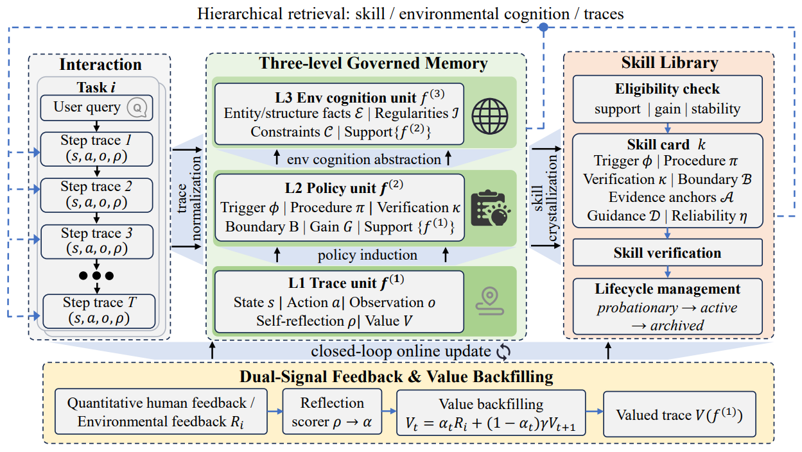

# MSCE

> **分类**: Skill优化 | **成熟度**: 🟡 成长期 | **综合评分**: 0.53

---

## 一句话描述

**MSCE** 是一个训练无关的记忆-技能协同进化框架，将 Agent 经验组织为 **L1 轨迹证据 → L2 策略抽象 → L3 环境认知** 三层记忆，通过**反射加权价值回填**将稀疏终局反馈分摊到步级，再经**证据支撑+正增益+稳定性三道闸门**将 L2 策略结晶为可调用技能，实现记忆治理与技能进化的闭环。

**来源**:
- From Memory to Skills: Evidence-Grounded Co-Evolution Governance for Long-Horizon LLM Agents
- 发布年份：2026

**链接**:
- https://arxiv.org/abs/2607.16621
- https://github.com/MemTensor/MemOS

---

## 核心实现

**1. 三层记忆架构**

- **L1 轨迹记忆**：存储每一步的截断状态、动作、观测和自我反思，作为审计证据层。不存原始观测，只保留结构化元数据和证据标识符。
- **L2 策略记忆**：从跨 episode 的 L1 轨迹中归纳可复用过程模式。每条策略含触发条件、流程描述、验证准则、适用范围和支撑证据集合。同一模式签名下攒够 $n_{min}$ 条不同 episode 的证据才触发抽取，防止单条偶然成功轨迹产生错误归纳。
- **L3 环境认知**：当多个活跃 L2 策略共享同一领域时，抽象出声明式环境知识（实体结构、操作规律、约束），不含可执行指令。技能调用时从 L3 读取环境约束来实例化参数。

**2. 技能结晶化（两步晋升闸门）**

1. 第一步检查源 L2 策略的**证据支撑和正增益**：关联轨迹的值函数均值与其他轨迹均值之差必须为正。
2. 第二步检查**稳定性**：近期证据与当前触发条件、流程、边界一致，策略仍在剧烈震荡则不提成技能。通过后，正例证据归纳共同流程，反例证据收缩适用范围并生成反模式，确定性验证器检查 Schema 完整性和证据引用合法性。

**3. 反射加权价值回填**

终局奖励 $R_i$ 沿轨迹反向传播。每步价值 $V(f_{i,t}) = \alpha_{i,t}R_i + (1-\alpha_{i,t})\gamma V(f_{i,t+1})$。$\alpha$ 由 LLM 对自我反思评分得出——反思具体、因果相关则权重高，空洞套话则权重低。稀疏终局信号通过密集但质量参差的反思被重分布为可区分的步级价值。

---

## 主要能力

- 三层记忆保留证据链路，策略和技能的来源可追溯、可审计、可修正
- 反射加权回填将稀疏奖励分摊到步级，不依赖密集环境奖励
- 证据+收益+稳定性三道闸门决定"什么能变成技能"，反例证据自动收缩适用范围
- 技能部署后带平滑可靠性追踪（$\eta = (n_{pass}+1)/(n_{trial}+2)$），低可靠性自动归档
- 跨域迁移实验六组全正向，平均 +3.93pp

---

## 局限性

- 回填机制依赖自我反思质量，空洞反思权重为零时不区分步骤差异
- L3 抽象触发条件（多策略共享同一领域）在大规模异质环境中可能过于保守
- 技能结晶的增益估计是启发式信号而非因果推断，可能过高估计罕见策略的效用
- 实验未覆盖极长周期（千步以上）的记忆膨胀与检索退化

---

## 成熟度评分

| 维度 | 评分 (0.0-1.0) | 说明 |
|------|---------------|------|
| 技术成熟度 | 0.50 | 三层记忆+三道闸门+反射加权回填已完整建模，跨域实验六组全正向，属原型验证 |
| 创新性 | 0.80 | 证据接地协同进化治理，记忆→技能晋升的因果证据链设计开创性 |
| 落地程度 | 0.35 | 基于 MemOS 开源框架，尚处研究阶段无生产部署 |
| 生态活跃度 | 0.45 | MemOS 开源社区有一定维护，论文+代码双发布 |

**综合评分**: **0.53**（0.50×0.30 + 0.80×0.25 + 0.35×0.25 + 0.45×0.20）

---

## 参考资料

- [论文](https://arxiv.org/abs/2607.16621)
- [MemOS 代码](https://github.com/MemTensor/MemOS)
