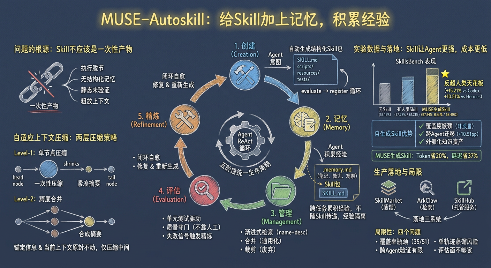
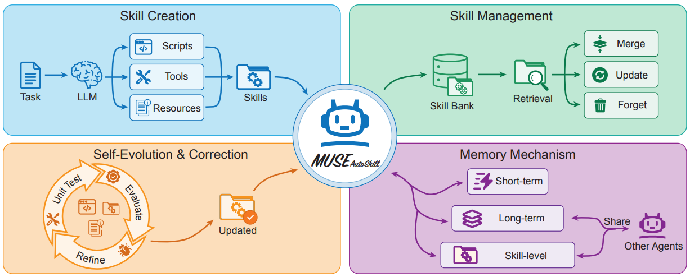

# MUSE-Autoskill

> **分类**: Skill 生成 / Skill 管理 | **成熟度**: 🟡 成长期 | **综合评分**: 0.56

---

## 一句话描述

MUSE-Autoskill提出 **Skill五阶段生命周期**（**创建、记忆、管理、评估、精炼**），通过 **Skill 级记忆**（`.memory.md`）累积跨任务经验与**测试驱动评估闭环**保障质量，将 Skill 从一次性产物升级为**可进化、可测试、可迁移**的 Agent 资产。SkillsBench 上以 **68.40%** SOTA，自生成 Skill 达 **87.94%** 反超人类天花板。

**来源**:
- 学术论文：字节跳动 ByteBrain 团队 & 罗切斯特理工学院
- 发布年份：2026年

**链接**:
- arXiv：https://arxiv.org/abs/2605.27366v1

---

## 核心实现

MUSE-Autoskill 将 Skill 生命周期定义为五个耦合阶段，在统一 Agent 循环中运转。

**五阶段生命周期**

1. **Skill 创建（Creation）**：内置 `skill_create` 在 Agent 的 ReAct 循环内发起创建，消除创建与执行的脱节。
2. **Skill 记忆（Memory）**：构建**三级记忆体系**。短期记忆保存当前任务上下文并随增长自适应压缩，长期记忆跨会话持久化通用经验教训，**Skill 级别记忆**则为每项 Skill 维护独立的 `.memory.md` 文件，累积失败模式、输入陷阱和性能注意事项。
3. **Skill 管理（Management）**：采用**渐进式检索**，启动时只注入 Skill 目录，Agent 决定使用后才加载完整内容。同时，辅以**合并**重叠 Skill 和**裁剪**失败或闲置 Skill 两层维护机制。
4. **Skill 评估（Evaluation）**：单元测试充当质量守门人，创建时把关注册，复用中失败则自动触发精炼。
5. **Skill 精炼（Refinement）**：基于错误反馈修订或重新生成 Skill，与评估耦合形成**自动纠错闭环**。

**关键设计**

- **Skill 级别记忆**：采用 "Skill 与经验分离" 的设计：每个 Skill 对应一个 `.memory.md` 文件，用于存储 Agent 在使用过程中沉淀的所有经验教训。该文件被刻意隐藏且不随 Skill 打包导出，从机制上保证了 Skill 是可共享的公共资产，经验则是每个 Agent 独有的私有资产，彻底避免了经验的交叉污染。
- **自适应上下文压缩**：对话建模为 **DAG 节点图**，每节点为 plan-action-observation 三元组。**Level-1** 将超标节点压缩为摘要并保留链位置，**Level-2** 将中间连续节点合并为合成节点。

---

## 主要能力

- **版本化自进化**：自生成 Skill 中位数 326 行（15.8KB），为人类 Skill 的 2.2 倍，包含详细的输入输出模式、失败模式和逐步操作流程
- **跨 Agent Skill 迁移**：MUSE 生成的 Skill 注入 Hermes（完全不同设计的 Agent）后提升 +10.51pp，弥合 79% 与人类 Skill 的差距，验证 Skill 是真正外部化知识资产
- **跨会话能力积累**：Skill 级别 `.memory.md` 机制使经验在每次使用时自动激活，无需重复推导
- **多域覆盖**：SkillsBench 覆盖科学计算、数据分析、文档处理、运维规划四个超级领域

---

## 局限性

- **覆盖率瓶颈**：仅 68.6%（35/51）任务成功生成 Skill，失败集中在科学计算和系统运维等 Phase 1 基线薄弱领域，呈现"强者恒强"的马太效应
- **单轨迹蒸馏泛化风险**：每个 Skill 仅从一条成功轨迹蒸馏，可能包含源轨迹特化的噪声假设，hvac-control 从 80% 跌至 20% 即为典型翻车案例
- **跨 Agent 迁移验证不完整**：仅验证 MUSE → Hermes 单向，其他方向和更多 Agent 组合未测试
- **评估覆盖不足**：SkillsBench 94 个任务仅跑 51 个，排除的任务环境更复杂，报告数字可能高估系统表现
- **版本膨胀风险**：缺乏 Skill 版本的自动裁剪和压缩机制，高频使用 Skill 的 `.memory.md` 和版本号可能持续增长

---

## 成熟度评分

| 维度 | 评分 (0.0-1.0) | 说明 |
|------|---------------|------|
| 技术成熟度 | 0.55 | 论文发表，SkillsBench SOTA，但覆盖率瓶颈（68.6%）和单轨迹风险待解决 |
| 创新性 | 0.80 | Skill五阶段生命周期、Skill级别记忆（.memory.md）、自适应上下文压缩 |
| 落地程度 | 0.45 | 字节跳动 ByteBrain 团队研究成果，实际产品部署案例不明 |
| 生态活跃度 | 0.40 | 2026年5月发布，社区关注刚起步 |

**综合评分**: 0.56

---

## 参考资料

- [论文](https://arxiv.org/abs/2605.27366v1)