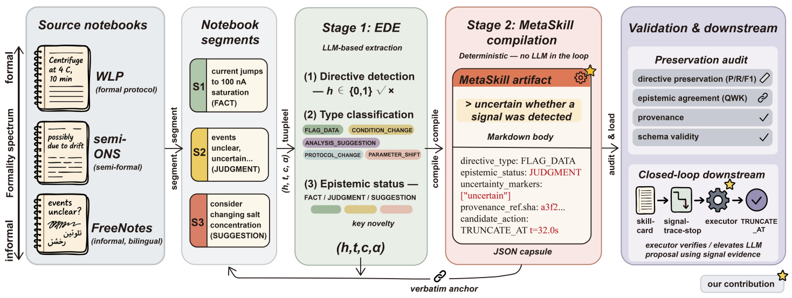

# Notes2Skills

> **分类**: Agent 技能执行 | **成熟度**: 🟡 成长期 | **综合评分**: 0.50

---

## 一句话描述

Notes2Skills 在实验记录 → Agent 技能的编译链条中插入**确定性标签**（FACT/JUDGMENT/SUGGESTION），将作者的事实、判断和建议拆分开：**FACT 驱动强操作、JUDGMENT 默认退回人工复核、SUGGESTION 保持建议**：防止两种致命错误：不确定判断被当成确定结论（**不确定性漂白**）和确定指令被当成建议忽略（**指令丢失**）。实验表明只有完整 Notes2Skills 在两种偏误上都没有犯错。

**来源**:
- 南方科技大学 & 港科大（广州），论文 arXiv: 2606.11897
- 发布年份：2026

**链接**:
- 论文：https://arxiv.org/abs/2606.11897

---

## 核心实现

**1. Stage 1 — Epistemic Directive Extraction：从实验记录中提取带确定性标签的指令**

输入实验记录文本，LLM 提取指令并叠加两维标签：
- **第一维**：操作类型，FLAG_DATA、CONDITION_CHANGE、ANALYSIS_SUGGESTION、PROTOCOL_CHANGE、PARAMETER_SHIFT；
- **第二维**：确定性标签，**FACT**（作者确认的观测事实）、**JUDGMENT**（作者不确定的判断）、**SUGGESTION**（留给下次实验的建议）。这三个标签直接控制 Agent 后续执行权限：FACT 允许强操作（不可逆数据处理），JUDGMENT 默认退回审查保留模式，SUGGESTION 不触发任何文件级操作。

**2. Stage 2 — 确定性 MetaSkill 编译：零 LLM 参与的确定性编译**

输入带标签的指令集，输出符合 SKILL.md 标准的技能胶囊文档。编译过程**完全确定性**：不是让 LLM 重新理解再写，胶囊的每个字段要么从 Stage 1 的 EDE 记录继承，要么由领域配置固定。让 LLM 做编译可能自行将不确定判断升级为指令，这个决定本身就引入新的不确定性源。每个胶囊还带原文片段的加密链接，Agent 执行强操作时可回溯到实验记录原文对应语句。

**3. 执行时门控：确定性标签 + 信号证据联合检查**

每条胶囊的确定性标签与实际文件的信号证据做 joint check。FACT 胶囊且数据特征与作者描述一致时授权强操作。JUDGMENT 胶囊仅在文件信号证据完全独立支持同样结论时才执行，否则只能标为待人工复核。SUGGESTION 胶囊不触发任何永久修改。本质上是简化贝叶斯决策逻辑：**在没有观察到独立验证信号之前，不对基于不确定判断的结论做不可逆操作**。

---

## 主要能力

- **确定性三元标签体系**：FACT/JUDGMENT/SUGGESTION，每个标签直接控制 Agent 的操作许可级别
- 零 LLM 参与的**确定性编译**：Stage 2 编译完全由规则驱动，不引入新的不确定性源
- 执行时 **joint check 门控**：确定性标签与实际信号证据双重验证后才授权强操作
- 在 JUDGMENT 主导和 FACT 主导的实验中，只有 Notes2Skills **同时避免了不确定性漂白和指令丢失**

---

## 局限性

- 确定性分类为**离散三元**，实际实验推理中确定性是一个连续谱，混合型陈述被简化为 JUDGMENT
- 可审计性保证的是**溯源性**（FACT 胶囊确实来自原文被标记 FACT 的语句），但不保证**准确性**（原文那段语句是否真的应该是 FACT）
- **跨记录本迁移**在初期：不同作者用语习惯差异大，确定性分类器跨作者风格的泛化性能未测量
- 当前仅在单一实验记录本的 split 评估上验证，科学工作流的多样性和规模有限

---

## 成熟度评分

| 维度 | 评分 (0.0-1.0) | 说明 |
|------|---------------|------|
| 技术成熟度 | 0.55 | 三标签体系设计完整，实验验证充分 |
| 创新性 | 0.55 | 确定性标签拆分的思路解决了一个真实痛点 |
| 落地程度 | 0.40 | 论文阶段，尚未见实际生产部署 |
| 生态活跃度 | 0.50 | 南方科大+港科大联合出品，有开源代码 |

**综合评分**: **0.50**

---

## 参考资料

- [论文](https://arxiv.org/abs/2606.11897)
