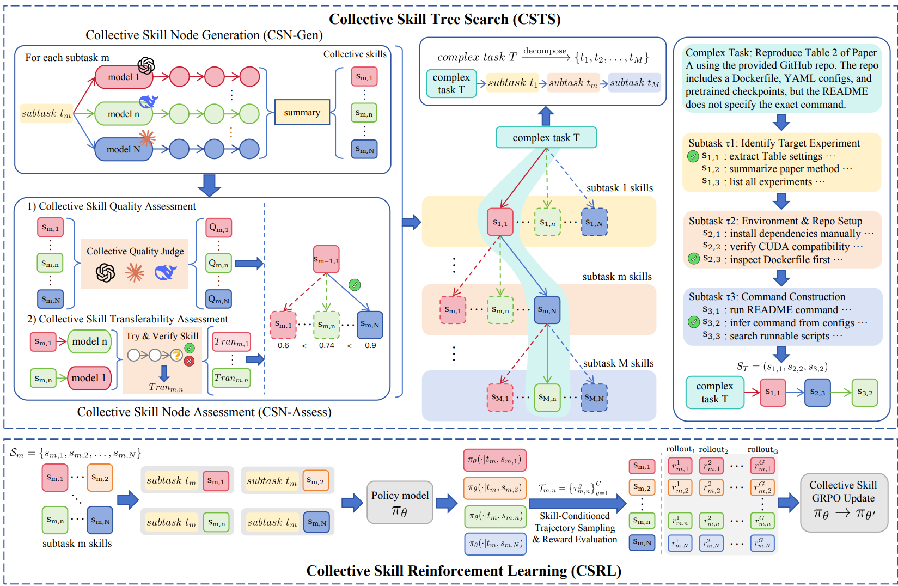

# OpenClaw-Skill

> **分类**: Agent 技能生成 | **成熟度**: 🟡 成长期 | **综合评分**: 0.53

---

## 一句话描述

OpenClaw-Skill 引入 **CSTS（集体技能树搜索）**：利用多个异构模型的集体智能自动构建结构化技能树，以及 **CSRL（集体技能强化学习）**：通过比较同一子任务下不同技能条件的轨迹来优化策略。QwenClawBench 上 9B 模型从 34.5 提升至 **44.9**（+10.4），PinchBench 123 任务上最优 **68.2%**（+7.1），以较小的开源权重（9B）逼近闭源模型的竞争力。

**来源**:
- 香港理工大学、南洋理工大学、清华大学、RMIT、北航，论文 arXiv: 2606.16774v1
- 发布年份：2026

**链接**:
- 论文：https://arxiv.org/abs/2606.16774

---

## 核心实现

**1. CSTS：集体技能树搜索三阶段**

1. 第一阶段**复杂任务分解**：将复杂任务按依赖关系分解为有序子任务序列。
2. 第二阶段 **CSN-Gen（集体技能节点生成）**：多个异构模型并行对同一子任务产生执行轨迹，共享技能合成器将每条轨迹总结为一个候选技能节点：每个节点是集体智慧的独立投票。
3. 第三阶段 **CSN-Assess（集体技能节点评估）**：双评分机制，**集体质量评分**（每个模型对自己的技能节点做多次 rollout 验证）+ **集体可迁移性评分**（每个节点在 N-1 个其他模型上交叉测试，取平均成功率）。最终分 = 质量 + 可迁移性，每子任务选最高分节点。

**2. CSRL：跨技能条件的对比策略优化**

扩展 GRPO 风格的截断优化。对每个子任务，在所有候选技能条件下分别采样 rollout，计算**跨技能组的相对优势（cross-skill normalization）**：不是比较同一技能下不同行动的好坏，而是比较同一子任务下不同技能条件导致的轨迹质量差异。这推动策略偏好更有效的技能条件化策略，同时避免策略坍缩到单一技能依赖。

**3. 训练与规模效应**

CSTS 产出 2K SFT 样本，在 8 个 H100 GPU 上训练 2 个 epoch。消融显示每个组件独立贡献：基础 34.5，+CSN-Gen 39.8（+5.3），+CSN-Gen+CSN-Assess 42.8（+3.0），Full +CSRL 44.9（+2.1）。跨类别增益不均：SVM 类从 33.2 跳至 70.9（+37.7），CS 类从 30.2 跳至 78.4（+48.2），说明技能树搜索对**原模型弱势领域**的增益最显著。

---

## 主要能力

- **CSTS 集体技能树搜索**：多异构模型并行产生候选技能，通过交叉验证筛选最优节点
- **CSRL 跨技能条件策略优化**：比较同一子任务下不同技能条件的轨迹质量，驱动策略偏好更优技能
- 技能树作为**结构化、可导航的技能组织方式**，天然支持多步复杂任务的技能路由
- 以 9B 开源权重在 QwenClawBench 上逼近闭源模型的竞争力

---

## 局限性

- **多模型并行的计算开销**是 CSTS 的固有成本，每子任务需多个模型同时 rollout
- 集体可迁移性评分在**模型间能力差距过大时可能偏向中位数**，而非识别最优技能
- 当前技能树是**静态构建的**，不支持生产部署后的持续进化更新
- 仅在 Qwen 系列模型上验证，**非 Qwen 模型族的泛化性和集体智能的模型多样性效益待探索**

---

## 成熟度评分

| 维度 | 评分 (0.0-1.0) | 说明 |
|------|---------------|------|
| 技术成熟度 | 0.55 | CSTS+CSRL双集体机制设计完整，多模型协同架构可行 |
| 创新性 | 0.60 | 集体技能树搜索+群体智慧投票的思路独特 |
| 落地程度 | 0.45 | 港理工+NTU+清华等联合出品，9B模型效果逼近闭源 |
| 生态活跃度 | 0.50 | 论文新发，有开源代码，社区关注度待积累 |

**综合评分**: **0.53**

---

## 参考资料

- [论文](https://arxiv.org/abs/2606.16774)
