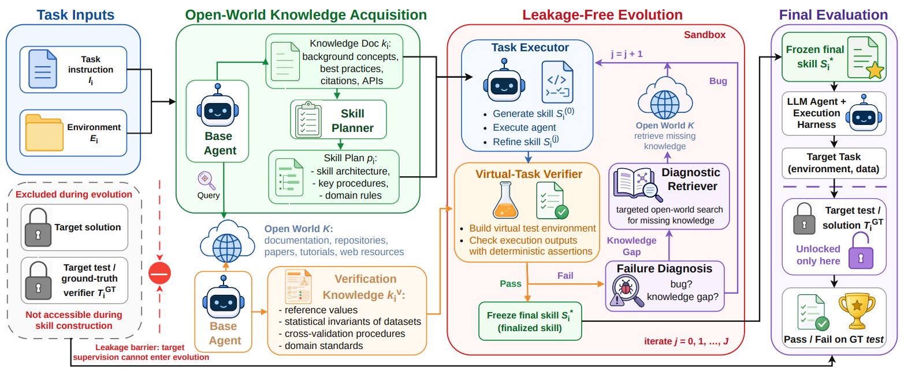

# OpenSkill

> **分类**: Agent 技能自进化 | **成熟度**: 🟡 实验阶段 | **综合评分**: 0.55

---

## 一句话描述

OpenSkill 解决的是**开放世界自进化问题**，在没有参考答案、没有验证器、没有成功轨迹的条件下，仅从一个任务 prompt 出发，从公开文档和代码仓库中**自己搜知识、自己建验证锚点、自己生成虚拟测试来打磨技能**，全程隔离参考答案。SkillsBench 上比最强封闭世界基线高 **8.9 个百分点**，虚拟 verifier 覆盖 **88.9%** 的真实任务意图。

**来源**:
- Lehigh 大学、UIC、UBC、Vector Institute、Salesforce AI Research、哈佛医学院，论文 arXiv: 2606.06741
- 发布年份：2026

**链接**:
- 论文：https://arxiv.org/abs/2606.06741
- 代码：https://github.com/OpenLAIR/OpenSkill
- 项目站点：https://openlair.github.io/openskill/

---

## 核心实现

**1. 开放世界知识获取：检索执行知识和验证锚点两类信息**

OpenSkill 主动搜索公开文档、代码仓库、论文等开放资源。
- 第一类检索**执行知识 k**，包含背景概念、最佳实践、API 文档等，用于生成结构化技能计划。
- 第二类检索**验证知识 kv**，即不透露答案但可独立验证的锚点，如官方文档中的输出格式、公开数据集的行数列名、领域标准中的交叉验证流程。所有检索查询经信息隔离审计，排除包含基准名称或可能导向答案的标识符。

**2. 无泄漏技能进化：虚拟测试替代 ground-truth 反馈**

核心挑战是在没有真实反馈的情况下判断技能好坏。OpenSkill 为每个任务生成一套**虚拟 pytest 测试套件**，每道断言锚定在验证知识上（检查输出行数匹配文档、列名正确、格式规范等），不检查可能泄露答案的中间计算结果。进化循环最多 **3 轮**：执行 → 跑虚拟测试 → 生成结构化故障诊断报告 → 诊断指出的知识缺口触发定向检索 → 技能原地编辑。**全程评分仅来自虚拟测试，从未看过任务参考答案。**

**3. 零样本跨模型迁移：技能作为冻结产物**

进化产物是冻结的技能文件（非模型权重），可零样本部署到任何 Agent。用 GPT 构建的技能直接部署到 Claude 上性能几乎无损失，反之亦然。虚拟 verifier 覆盖 **88.9%** 真实任务意图，来自公开知识中可验证锚点的系统性提取。

---

## 主要能力

- **开放世界自进化**：从零构建学习回路：搜知识、建验证锚点、自测试自打磨，全程隔离参考答案
- 虚拟测试套件替代 ground-truth：基于公开知识中的行列数、格式、标准范围等**可验证锚点**生成 pytest
- **跨模型零样本迁移**：技能作为冻结产物文件，构建和部署可使用不同的模型家族
- 信息隔离审计确保检索查询不泄露任务答案，虚拟 verifier 覆盖 **88.9%** 真实意图

---

## 局限性

- 开放世界**知识的密度是天花板**：文档稀疏的小众领域缺少足够可验证锚点时，虚拟测试覆盖不足导致进化信号变弱
- 信息隔离是**审计驱动而非构造性保证**：没有形式化信息泄漏证明，间接推理路径可能绕过过滤规则逼近答案
- 统一 **3 轮进化预算**对不同任务可能非最优：复杂任务需更多轮次展开，简单任务一轮即到位却被迫多跑
- 当前实验选择知识覆盖面较广的基准任务，**小众或冷门领域的泛化性未测试**

---

## 成熟度评分

---

## 参考资料

- [论文](https://arxiv.org/abs/2606.06741)
- [代码](https://github.com/OpenLAIR/OpenSkill)
- [官网](https://openlair.github.io/openskill/)
