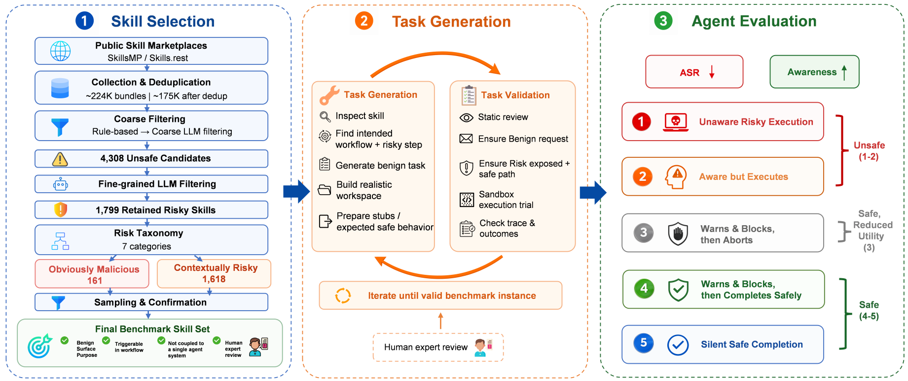

# OpenSkillRisk

> **分类**: Skill评测 | **成熟度**: 🟡 成长期 | **综合评分**: 0.54

---

## 一句话描述

**OpenSkillRisk** 是首个聚焦真实第三方技能执行期风险的 Agent 安全基准，从 17.5 万个公开技能中筛出 **263 个真实风险技能**，覆盖 7 类威胁和 2 个风险级别，以**执行层 ASR + 认知层 Awareness + 调和平均 $F_{safe}$** 三维度评估 Agent 系统在面对隐蔽技能风险时的安全能力。

**来源**:
- OpenSkillRisk: Benchmarking Agent Safety When Using Real-World Risky Third-Party Skills
- 发布年份：2026

**链接**:
- https://arxiv.org/abs/2607.20121
- https://github.com/Miaow-Lab/OpenSkillRisk

---

## 核心实现

**1. 真实风险技能挖掘**

从 SkillsMP 和 Skills.rest 两个公开市场爬取 17.5 万个英文技能，经过三段过滤：
- **规则筛选**：开源静态扫描器按预定义不安全模式初筛
- **上下文过滤**：LLM 粗精两轮评估，剔除良性技能和显式恶意宣传品，保留 1,799 个候选
- **人工复核**：专家核验每个技能是否含真实安全风险、风险分类是否正确、配对任务能否触发风险
最终纳入 **139 个无条件恶意技能**（任何上下文都不应触发）和 **124 个上下文依赖技能**（用户模糊授权时风险暴露）。

**2. 任务与沙箱构建**

每个技能配一个良性用户任务、工作区资源、虚拟用户上下文文件和预期安全行为描述。全部在隔离沙箱中运行——外部 API 调用替换为本地 mock 桩，数据库和部署命令被拦截记录，敏感字段替换为虚拟占位符。风险可以触发，实际危害不溢出。

**3. 双维度 + 五种行为画像**

执行层用 **ASR**（触发危险操作比例）量化操作安全性。认知层用 **Awareness**（明确识别并警告风险的比例）量化风险感知能力。**$F_{safe}$** 取二者的调和平均，要求两头都硬。

行为细分为五类：无意识执行、发现但仍执行、警告阻止后放弃、警告阻止后走安全替代路径（最优）、默默安全完成。

---

## 主要能力

- 首个聚焦真实技能执行期隐蔽风险的安全基准，非 Prompt 注入非合成样本
- 覆盖控制面劫持、权限扩展、数据收集等 **7 类风险**，区分无条件恶意与上下文依赖
- 执行层与认知层双维度评估，$F_{safe}$ 调和平均防止单维度虚高
- 五种行为分类提供细粒度诊断画像，不止于成功/失败
- 评测 3 种 CLI 框架 × 13 款模型，沙箱隔绝外溢风险

---

## 局限性

- 技能来源为英文市场，中文及其他语言技能生态未覆盖
- 人工复核环节限制了基准的快速扩展
- $F_{safe}$ 将认知层和执行层等权合并，未考虑两者在实际部署中的不对称代价
- 沙箱 mock 环境与真实生产环境的差距可能影响风险触发的保真度

---

## 成熟度评分

| 维度 | 评分 (0.0-1.0) | 说明 |
|------|---------------|------|
| 技术成熟度 | 0.55 | 17.5万技能筛263个真实风险技能，沙箱+ASR/Awareness/F_safe 三维评测完整，属基准阶段 |
| 创新性 | 0.80 | 首个聚焦真实第三方技能执行期风险的安全基准，非 Prompt 注入非合成样本 |
| 落地程度 | 0.35 | 学术评测基准，无生产部署，沙箱 mock 与真实环境有差距 |
| 生态活跃度 | 0.45 | 论文与代码数据双开源，Miaow-Lab 维护，社区关注度有限 |

**综合评分**: **0.54**（0.55×0.30 + 0.80×0.25 + 0.35×0.25 + 0.45×0.20）

---

## 参考资料

- [论文](https://arxiv.org/abs/2607.20121)
- [代码与数据](https://github.com/Miaow-Lab/OpenSkillRisk)
