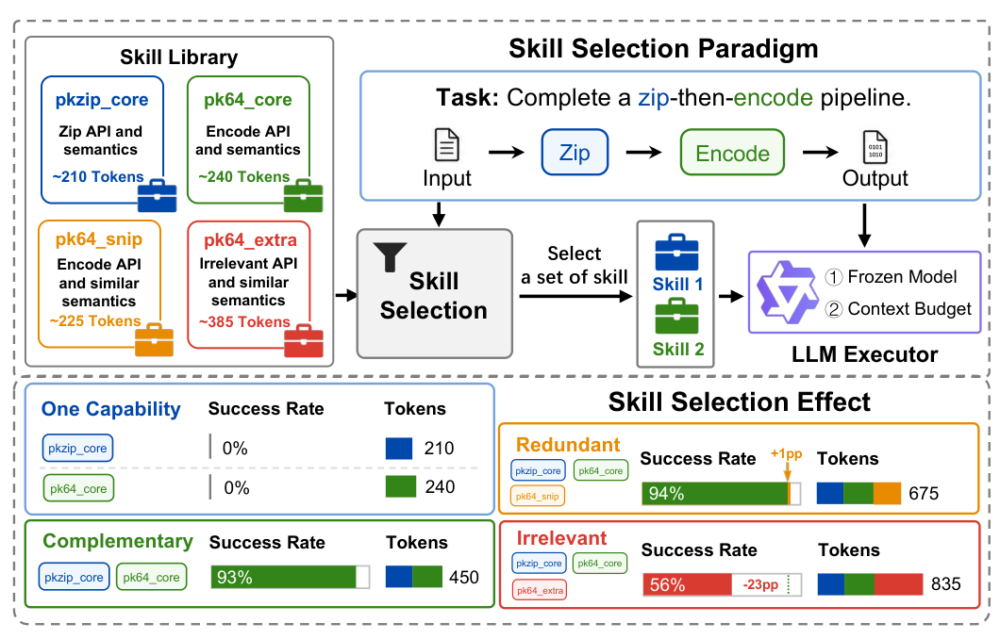

# OptimalSkillSelection

> **分类**: Skill召回 | **成熟度**: 🟡 成长期 | **综合评分**: 0.55

---

## 一句话描述

把 LLM agent 的**技能选择形式化为正则化子模最大化**（预算约束下能力效益减 token 惩罚），**BPS 算法**给出首个多项式时间最优的 $(1-1/e,1)$ **双准则保证**，实测成功率 **0.73** 超部署基线 0.20–0.52 且少用 28% token。

**来源**:
- Optimal Skill Selection for LLM Agents with Provable Bicriteria Guarantees（Yu Chen, Ruishuo Chen, Xun Wang, Zhuoran Li, Longbo Huang，清华大学交叉信息研究院）
- 发布年份：2026

**链接**:
- https://arxiv.org/abs/2608.19993

---

## 核心实现

立论：技能选择不是逐项排序，而是预算下的集合级决策——冻结执行器下"选哪些技能文档注入上下文"是一个正则化子模最大化问题。

**1. 结构化目标：能力效益减 token 惩罚**

- 输入任务查询、技能库、token 预算 $B$，在潜在能力空间建模：每技能提供能力供给向量，每查询有需求向量，同一维度内用凹函数 $h_k$ 刻画递减收益，跨维度加和形成**单调子模效益** $G(S)$。
- 控制点：固定饱和形式 $h_k(x)=1-e^{-x}$（非降、凹、有界），保证子模性；跨维度乘积对应"成功率"的乘积结构。
- 每技能文档有 token 长度 $\ell_i$，按执行器一阶敏感度 $\kappa$ 线性收费，总长度不得超过预算 $B$（硬约束）。最终目标：$F(S)=G(S)-\kappa\ell(S)$，在 $\ell(S)\le B$ 下取最大。

**2. BPS 算法：偏枚举密度贪心 + 最优前缀**

- 枚举所有规模不超过二的种子，从每个种子按"边际效益/token"密度贪心增长链，**记录链上每个可行前缀**，最后按 $F$ 选最优前缀输出整数技能集。
- 关键判断：非单调目标下最优解未必在链终点，可能落在链中部，所以记全前缀而非只比终点。

**3. 双准则保证：预算对齐插值证法**

- 核心是惩罚 $\kappa\ell$ 与密度链轨迹共用同一长度坐标，分数界的插值可转为某个记录在册的整数前缀，由此证得 $\hat F(S_{\text{BPS}})\ge(1-1/e)\hat G(T)-\hat\kappa\ell(T)$。
- **效益系数 $1-1/e$ 在多项式时间下不可改进**（Feige 定理），惩罚系数为 1（全保留），这是该问题首个紧的双准则保证。

**4. 参数拟合与误差传递**

- 只估有效需求与有效供给（乘积因子），用两个文本编码器加非负输出层，梯度下降最小化 pass/fail 对数损失拟合 **281 个参数**。
- 命题 1 保证：拟合误差 $\varepsilon$ 与优化误差 $\delta$ 传为选择遗憾 $\le 2\varepsilon+\delta$，即模型够准时选出的集合就是接近最优的。

---

## 主要能力

- **首个可证保证**：$(1-1/e,1)$ 双准则近似，效益系数在多项式时间下不可改进，依赖预算与惩罚共用长度坐标的插值证法。
- **集合级目标**：显式建模冗余（同维递减）、互补（跨维加和）、上下文代价（线性惩罚），区别于逐项打分拼装的启发式模板。
- **低参数高保真拟合**：281 参数从 pass/fail 记录拟合，预测到 1 个百分点以内，AUC **0.996** 还原隐藏能力覆盖矩阵。
- **端到端领先**：0.73 成功率对部署系统 0.20–0.52，少用 28% token；神经编码器版 0.68 仍超部署系统 0.17–0.48。
- **防污染基准**：BigCodeBench 分叉换私有模块，准入门槛只收需全部能力的任务，63,596 次真实执行。

---

## 局限性

- 基准是构造的防污染分叉而非公开基准，任务集和技能库固定，外部泛化靠神经编码器单点验证。
- 退化模型只到线性每 token 收费，长上下文非线性退化未覆盖。
- BPS 时间复杂度 $O(dL^4)$，依赖上游高召回检索器把 $L$ 缩到短列表，全规模库不直接跑。
- 拟合需冻结执行器的 pass/fail 反馈，换执行器要重拟合，无零样本迁移。

---

## 成熟度评分

| 维度 | 评分 (0.0-1.0) | 说明 |
|------|---------------|------|
| 技术成熟度 | 0.54 | 正则化子模最大化 + BPS 算法 + 双准则保证，未开源 |
| 创新性 | 0.78 | 首个可证 (1-1/e,1) 双准则保证，效益系数多项式时间不可改进 |
| 落地程度 | 0.45 | 0.73 成功率超部署基线少 28% token，但构造防污染基准 |
| 生态活跃度 | 0.38 | 单篇论文，未开源 |

**综合评分**: 0.55

---

## 参考资料

- [Optimal Skill Selection for LLM Agents with Provable Bicriteria Guarantees](https://arxiv.org/abs/2608.19993)
