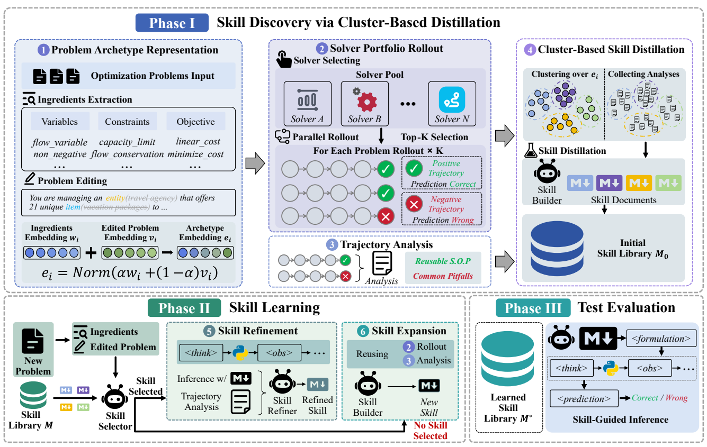

# OPTSKILLS

> **分类**: Skill 生成 | **成熟度**: 🟡 成长期 | **综合评分**: 0.49

---

## 一句话描述

**OPTSKILLS** 不按案例而是按 **问题原型（archetype）** 来组织和复用经验——把优化问题的描述剥离所有场景叙事后保留数学骨架，用 **DBSCAN 聚类 + 并行探索蒸馏** 构建技能库，在 NLCO 数据集上实现 **OOD 泛化提升 10 个百分点**。

**来源**:
- 华东师大 & 蚂蚁集团
- 发布年份：**2026**

**链接**:
- 论文：https://arxiv.org/pdf/2605.29829
- 代码：https://github.com/fujiwaranoM0kou/OptSkills

---

## 核心实现

**1. 原型表示提取：剥离叙事的数学骨架**

对每个训练问题，LLM 提取"优化成分"——变量角色、约束机制、目标函数方向，同时生成一个"脱敏版"问题描述（将具体实体替换为抽象术语），数字和数学关系保留不变。两种嵌入加权融合得到**原型嵌入**。

**2. 聚类蒸馏建库：从案例到原型技能的质变**

OPTSKILLS 不做逐样本技能生成（129 个技能中 62.8% 闲置），而是对原型嵌入做 **DBSCAN 聚类**（余弦距离，$\epsilon=0.05$ 偏保守），同一簇内合并轨迹的正负分析结果蒸馏为一份技能文档（含元数据、工作流、常见陷阱），最终仅 46 个技能覆盖 11 个优化家族，闲置率仅 15.2%。

**3. 增量学习：精炼 + 扩展双模式**

新问题匹配到已有技能时走精炼（成功经验灌入工作流、失败模式灌入陷阱），匹配不到时走扩展——只有至少一条正向轨迹存在才构建新技能入库。这个"无正轨迹不入库"的保守门槛保证可靠性。

---

## 主要能力

- **原型级抽象**：按数学结构而非表面文本组织和复用经验，从根源上解决语言表述变化导致的泛化失败
- **聚类蒸馏防冗余**：DBSCAN 聚类合并同原型的多元轨迹分析结果，闲置技能率从 62.8% 降至 15.2%
- **强 OOD 泛化**：在 NLCO 基准上学习后达到 72.79%，比纯基线高 10.19 个百分点，新技能利用率达 41.2%
- **工业级规模适用**：MIPLIB-NL 上求解了决策变量维度达 87,482 的问题，技能引导策略未被规模压垮
- **跨基座迁移**：DeepSeek-V3.2 和 Qwen3-235B 两种基座上均有效，增益来自系统设计而非堆模型

---

## 局限性

- **级联错误风险**：依赖 LLM 做成分提取和问题编辑，若关键约束丢失或目标函数抽象错误，后续全链偏差
- **聚类粒度固定**：DBSCAN 参数固定，不同问题域的合理粒度可能不同，缺乏自适应调整机制
- **评测局限运筹优化场景**：在组合优化和数学建模类任务上验证，通用 Agent 任务的泛化性未测试

---

## 成熟度评分

| 维度 | 评分 (0.0-1.0) | 说明 |
|------|---------------|------|
| 技术成熟度 | 0.45 | 学术论文阶段，华东师大+蚂蚁集团联合研究，有开源代码，NLCO数据集验证 |
| 创新性 | 0.70 | 按问题原型而非案例组织技能，DBSCAN聚类+并行探索蒸馏，跨域泛化思路新颖 |
| 落地程度 | 0.35 | 代码开源但面向运筹优化特定领域，通用性待验证 |
| 生态活跃度 | 0.40 | 学术+工业联合，单篇论文 |

**综合评分**: 0.49

## 参考资料

- [OPTSKILLS 论文](https://arxiv.org/pdf/2605.29829)
- [OPTSKILLS 代码](https://github.com/fujiwaranoM0kou/OptSkills)
