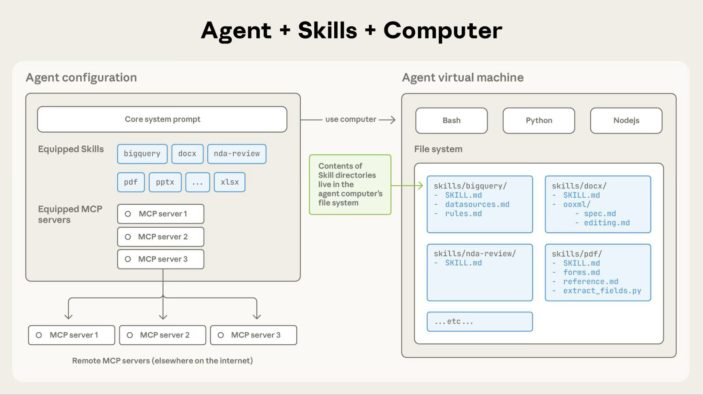

# Claude Agent Skills (渐进式披露)

> **分类**: AI Agent 能力扩展系统 | **成熟度**: 🟡 早期应用 | **综合评分**: 0.74

---

## 一句话描述

**Claude Agent Skills** 是 Anthropic 于 2025 年 10 月推出的**模块化 AI 能力扩展系统**，通过文件夹式技能结构将**领域知识、工作流程与最佳实践**系统化注入模型，并采用**渐进式披露机制**实现按需加载，将通用 Claude 转化为面向特定任务的专业智体。

**来源**:
- Anthropic 官方文档 & 工程博客
- 发布年份：2025

**链接**:
- https://docs.claude.com/en/docs/agents-and-tools/agent-skills/overview
- https://www.anthropic.com/engineering/equipping-agents-for-the-real-world-with-agent-skills
- https://github.com/anthropics/skills/tree/main

---

## 核心实现

**1. 技能文件夹结构：知识封装层**

每个 Skill 是一个**标准化的文件夹**，包含三部分：
- **YAML 元数据**：定义技能名称与触发条件；
- **Markdown 指令**：描述工作流程与最佳实践；
- **脚本和参考资料**：作为可执行资源。该结构将分散的领域知识收敛为可复用、可组合的模块单元，Agent 在沙盒虚拟机内通过文件系统直接访问这些内容。

**2. 渐进式披露：上下文加载控制层**

Skills 加载分为三个级别：
- **元数据**在智体启动时始终预加载至系统提示词，仅占用极少 Token；
- **指令文本**仅在 Claude 判定技能相关时，通过 Bash 工具读取加载；
- **脚本与资源**仅在指令明确引用或执行需要时才被调用。这种"用多少读多少"的策略从根本上解决了上下文窗口膨胀问题。

**3. 沙盒执行模型：代码隔离层**

脚本在**沙盒虚拟机**中执行，LLM 通过 Bash 运行脚本并**仅接收输出结果**，脚本代码本身不进入上下文窗口。这使得技能可捆绑任意数量的 API 文档、代码脚本和数据集，未调用内容不产生任何 Token 消耗，实现了知识与执行的解耦。

> 核心链路：技能文件夹封装知识 → 元数据预加载触发匹配 → 指令按需注入上下文 → 脚本沙盒执行返回结果。

---

## 主要能力

- **按需文件访问**：仅加载任务实际需要的文件，未被引用的文档保留在文件系统中且不占用 Token
- **高效脚本执行**：脚本代码本身不进入上下文，仅输出结果消耗 Token，比动态生成代码更高效
- **无限制内容捆绑**：技能可捆绑大量文档与数据，未使用内容不产生上下文浪费，理论上无容量上限
- **MCP 互补协作**：Skill 提供"如何使用工具"的指令，MCP 提供"连接工具"的管道，两者可组合使用
- **开源模板生态**：Anthropic 已开源十几个技能模板，覆盖 PDF 处理、品牌指南等常见场景

---

## 局限性

- **脚本安全风险**：沙盒虚拟机中执行脚本存在恶意代码风险，如非法文件访问或破坏性指令，当前缺乏细粒度的权限控制机制
- **技能规模管理挑战**：随着技能库增长，如何高效发现、检索和去重技能，并保证触发精度，仍是待解决问题

---

## 成熟度评分

| 维度 | 评分 (0.0-1.0) | 说明 |
|------|---------------|------|
| 技术成熟度 | 0.75 | 官方文档完善，已开源模板和 CLI 工具链，但推出不足一年，API 仍在迭代中 |
| 创新性 | 0.85 | 渐进式披露机制创新性地解决了 Agent 上下文管理的根本性挑战，与 MCP 形成互补架构 |
| 落地程度 | 0.65 | Anthropic 官方及部分开发者已采用，但广泛的企业级部署案例仍然有限 |
| 生态活跃度 | 0.70 | GitHub 开源仓库已有社区关注和贡献，但第三方技能数量和社区规模尚在成长中 |

**综合评分**: 0.74

---

## 参考资料

- [Claude Agent Skills 官方文档](https://docs.claude.com/en/docs/agents-and-tools/agent-skills/overview)
- [Anthropic 工程博客：Equipping Agents for the Real World with Agent Skills](https://www.anthropic.com/engineering/equipping-agents-for-the-real-world-with-agent-skills)
- [Anthropic Skills 开源模板仓库](https://github.com/anthropics/skills/tree/main)