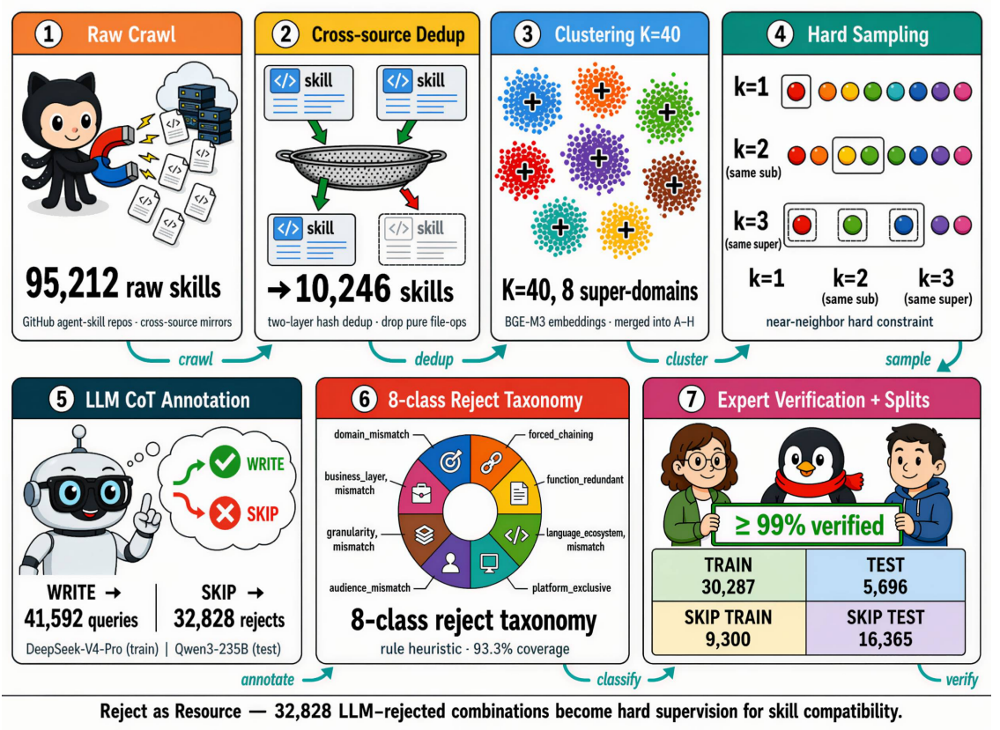

# R3-Skill（SKILL IS NOT DOCUMENT）

> **分类**: Agent 技能检索 | **成熟度**: 🟡 实验阶段 | **综合评分**: 0.58

---

## 一句话描述

R3-Skill 从根上区分了技能检索和文档检索：**技能检索 ≠ 文档检索**。两个技能能否一起被检索，不取决于技能间的全局关系，而是由**查询条件化的技能兼容性**决定的。R3-Skill 构建了首个**双语技能路由基准**（10,246 技能/41,592 接受查询/32,828 拒绝注释），把通常被丢弃的 LLM 拒绝信号用作兼容性监督，训练两阶段检索器达到 **Hit@1=0.7521、Set-Compat=0.3188**。

**来源**:
- 腾讯 IMA 产品中心 & 优图实验室，论文 arXiv: 2606.03565v3
- 发布年份：2026

**链接**:
- 论文：https://arxiv.org/abs/2606.03565

---

## 核心实现

**1. 形式化定义：将技能兼容性分解为可操作的检索因子**

给定查询 q 和目标技能集 S*，联合检索概率被分解为两个因子：每个技能独立被检索的**相关性**概率乘积 + 查询条件化的**技能兼容性修正项 C(q, S*)**。C≈1 恢复文档检索的独立性假设；C<1 表示技能集在查询下存在冲突（功能重叠、生态系统不兼容）；C>1 表示技能相互增强。**C 是查询条件化的，同一对技能在不同查询下兼容性完全相反。** 这个分解将文档检索与技能检索的本质差异锁定在 C 项上。

**2. 数据构建：将 LLM 拒绝信号从废料变为兼容性监督**

现有技能合成管线中，LLM 判断一组技能"不自然可组合"就将样本丢弃。R3-Skill 反向保留这些 **SKIP 注释**，作为 C 的二进制监督信号。数据生成管道对每个技能组先做两阶段评估（CoT 推理→WRITE/SKIP 判定），WRITE 分支生成 6 种风格×4 语言方向的查询，SKIP 分支归档进入 8 类拒绝原因分类体系（domain_mismatch 占 45.9%，forced_chaining 占 33.9%）。训练/测试集在技能池级别完全不相交，测试集由多位专家交叉验证。

**3. 两阶段检索：Bi-encoder 粗召回 + Cross-encoder 兼容性重排**

**R3-Embedding**（bi-encoder，Qwen3-Embedding-0.6B 微调）用多正例 InfoNCE 目标做粗召回，将 GT 中的同辈技能从分母中掩码掉避免互相排斥。**R3-Reranker**（cross-encoder）在候选池中施加三级兼容性标签：**GT 技能=3，SKIP 伙伴=1，其他=0**，用 graded ListNet 优化 C 条件化的排序。梯度分析证明 bi-encoder 下双边平衡使兼容性信号被稀释，而 cross-encoder 因其对每个 (q,s) 独立评分的能力可有效利用该信号。

---

## 主要能力

- **查询条件化技能兼容性**被形式化定义并作为可训练监督信号，从机制上区分于文档检索
- R3-Skill 是首个**双语（中英）四方向**技能检索基准，测试查询使用 LLM 改写逼近真实用户请求
- 8 类拒绝原因分类体系提供精细化的**兼容性失败分析**，揭示跨语言方向间拒绝模式的结构性差异
- R3-Embedding + R3-Reranker 两阶段流水线在 R3-Skill 和 SkillRet 两个基准上全面超越现有技能检索器
- **Set-Compat 指标**直接衡量整个 GT 技能集是否被同时检索到 top-m 位置

---

## 局限性

- **SKIP 信号来自 LLM 判断而非真实 Agent 执行反馈**，LLM 系统性偏差可能传播为兼容性标注偏差
- 当前训练/测试技能池**故意不相交**确保了评估严谨性，但可能低估零样本泛化到全新技能族的表现
- 8 类拒绝分类体系中 **domain_mismatch 和 forced_chaining 占近 80%**，细粒度类别的训练样本稀疏
- 中文用户查询虽经 6 种风格改写但仍然是 **LLM 模拟的而非真实用户采集的**

---

## 成熟度评分

| 维度 | 评分 (0.0-1.0) | 说明 |
|------|---------------|------|
| 技术成熟度 | 0.45 | 两阶段检索器架构成熟，但未开源，仅论文报告 |
| 创新性 | 0.75 | 查询条件化兼容性和拒绝信号再利用的设计思路 |
| 落地程度 | 0.45 | 双语基准对中文 Agent 生态有直接价值，实际部署待验证 |
| 生态活跃度 | 0.65 | 论文承诺开源数据集、模型权重和评估脚本 |

**综合评分**: **0.58**

---

## 参考资料

- [论文](https://arxiv.org/abs/2606.03565)
