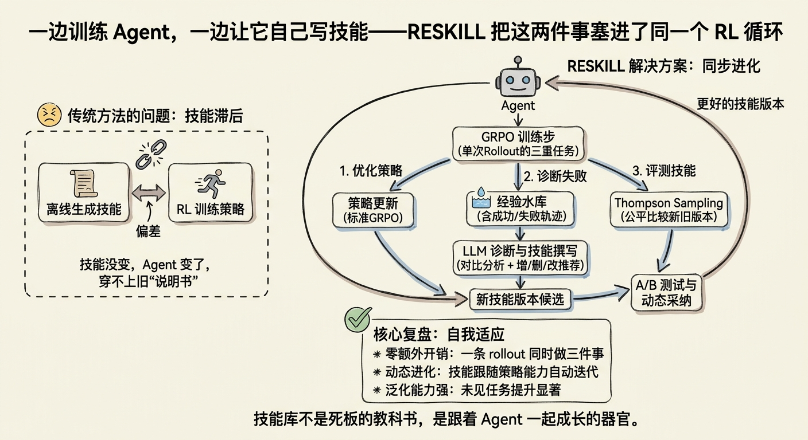
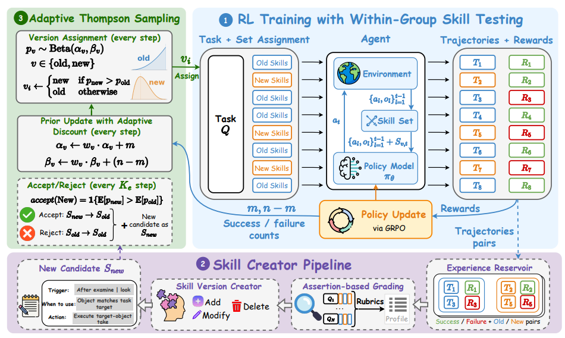

# RESKILL

> **分类**: Skill 生成 | **成熟度**: 🟡 成长期 | **综合评分**: 0.46

---

## 一句话描述

**RESKILL** 将技能生成嵌入 **GRPO 强化学习训练循环**中，让 Agent 在训练过程中 **自己写技能、自己测技能、自己决定留不留**。一条 rollout 同时承担策略优化、失败诊断、技能评测三重职责，零额外采样开销。技能库不再是离线生成的固定说明书，而是 **随策略同步进化的活系统**。

**来源**:
- AWS AI Labs
- 发布年份：**2026**

**链接**:
- 论文：https://arxiv.org/pdf/2606.01619
- 代码：https://github.com/ZLHe0/ReSkill

---

## 核心实现

**1. 三重身份 rollout：零额外开销的技能生成**

利用 GRPO 每条 rollout 独立采样的特性，RESKILL 让同一条 rollout 同时完成三件事：奖励信号按标准 GRPO 流程更新策略参数（**策略优化**）；完整轨迹存入 **经验水库**，LIFO 更新确保水库始终反映 Agent 最近行为分布（**失败诊断**）；rollout 所属技能版本的奖励更新 Thompson Sampling 后验（**技能评测**）。rollout 总数与标准 GRPO 完全一致，不额外消耗采样预算。

**2. 经验水库驱动的技能生成管道**

水库存储的轨迹驱动四阶段技能创建管道。**断言评分**：规则化断言扫过水库所有轨迹，低通过率直接标注高发失败模式，断言由 LLM 诊断器动态更新——删掉不再触发的旧断言，添加针对新失败模式的新断言。**对比分析**：水库按任务分组，LLM 逐组对比成功与失败案例，区分技能是被正确遵循还是被无视。**推荐 → 撰写 → 验证**：推荐器提出 ADD/MODIFY/DELETE 操作，撰写器生成包含触发条件（general/beginning/action_pattern）的结构化技能，最后新技能必须在水库上触发率超 50% 否则打回重写（最多 3 次）。

**3. Thompson Sampling + 自适应折扣：技能版本公平竞争**

新旧技能版本作为两臂 Bandit 问题处理。每个训练步 Thompson Sampling 从 Beta 后验中采样决定 rollout 分配比例，好的版本自然拿到更多 rollout。由于策略在持续进化，旧 rollout 数据随策略漂移而"变质"，RESKILL 引入 **自适应折扣**：合并新观察前伪计数先收缩一个与当前步 rollout 数量相关的因子，记忆参数 M 从已完成的 A/B 测试数据中通过预测似然准则自动估计，无需手动调节。周期结束时新版本后验均值超过旧版本则接受，否则回滚。

---

## 主要能力

- **训练内技能生成**：技能在 RL 训练中随策略同步进化，策略学到的新能力即时沉淀为可复用技能，过时技能自动淘汰
- **零额外采样开销**：一条 rollout 同时完成策略优化、失败诊断、技能评测，总计算量与标准 GRPO 持平
- **自适应版本竞争**：Thompson Sampling 动态分配 rollout 给新旧技能版本，自适应折扣让评分随策略进化保持有效
- **全自动技能生命周期管理**：ADD/MODIFY/DELETE 操作全程自动，训练早期补基础、中期做精做细，无人干预
- **跨域技能迁移**：冻结策略后技能库可在新领域独立进化，Agent 学会了"怎么从技能中受益"的元能力

---

## 局限性

- **进化频率是固定超参数**：目前每 5 步一次，不同领域需要不同频率，太密 Agent 来不及适应、太稀技能跟不上策略变化
- **小模型存在技能理解天花板**：4B 模型偶尔把技能名当环境动作执行或在不该用时强行套用，技能当指令读还是当推理指引用的认知鸿沟未被解决
- **评测局限文本交互 + 特定模型**：主要在 Qwen3-4B/8B 上验证，更大规模模型和更多模型族的泛化性未知
- **水库质量依赖断言设计**：断言评分是技能生成管道的入口，断言质量不足会连锁影响诊断和技能推荐的有效性

---

## 成熟度评分

| 维度 | 评分 (0.0-1.0) | 说明 |
|------|---------------|------|
| 技术成熟度 | 0.45 | 学术论文阶段，主要在Qwen3-4B/8B上验证，更大规模模型泛化性待验证 |
| 创新性 | 0.70 | 三重身份rollout零额外采样开销，Thompson Sampling+自适应折扣技能版本公平竞争 |
| 落地程度 | 0.35 | 代码已开源（GitHub），但仅在研究环境中验证，未在生产环境中部署 |
| 生态活跃度 | 0.30 | AWS AI Labs单篇论文，社区贡献有限 |

**综合评分**: 0.46

## 参考资料

- [RESKILL 论文](https://arxiv.org/pdf/2606.01619)
- [RESKILL 代码仓库](https://github.com/ZLHe0/ReSkill)
