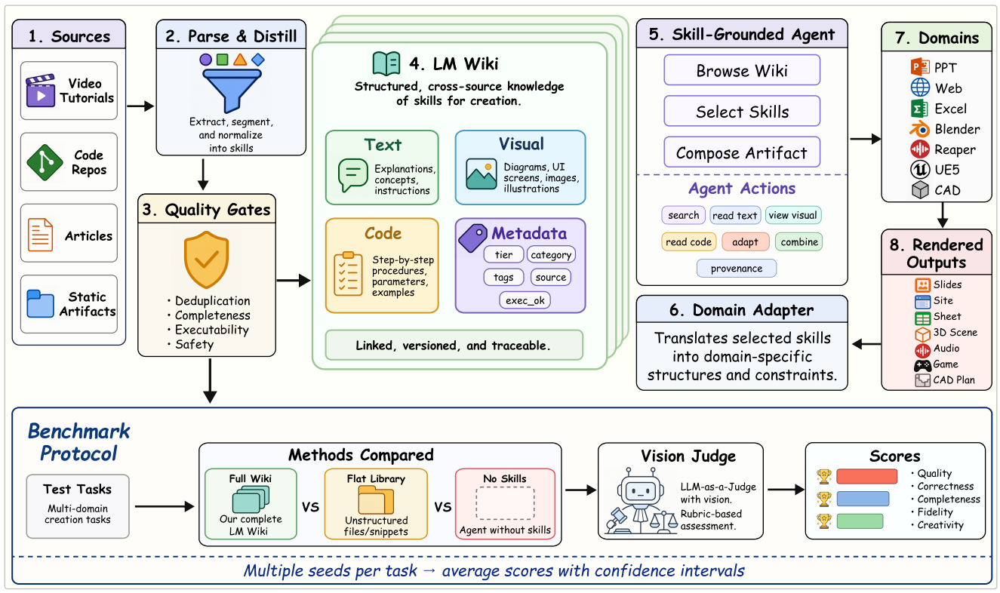

# RESOURCE2SKILL：多模态技能蒸馏

> **分类**: Skill生成 | **成熟度**: 🟡 研究验证阶段 | **综合评分**: 0.63

---

## 一句话描述

微软提出的 **RESOURCE2SKILL** 是一套将**教学视频、代码仓库、文章教程、参考作品**自动蒸馏为 Agent 可检索、可执行技能的多模态管线。通过**四步工程链路**（提取→Wiki组织→双层选择→MCP执行+在线补漏），在 **7 个创意软件领域、4 个模型后端**上全面超越无技能基线，平均 **+11.9 个百分点**，人类偏好盲测胜率 **83.3%**。

**来源**:
- RESOURCE2SKILL: 多模态资源到 Agent 技能的蒸馏管线（微软）
- 发布年份：2026 年 7 月

**链接**:
- https://arxiv.org/pdf/2606.29538
- https://github.com/waltstephen/Resource2Skills
- https://huggingface.co/datasets/YijiaFan/Resource2Skill
- https://waltstephen.github.io/Resource2Skills/

---

## 核心实现

RESOURCE2SKILL 用四步可控工程管线替代端到端"让模型看懂视频"的方案：

**1. 多模态技能提取（质量门控）**

从四个来源定向提取：
- **视频**捕获操作顺序和视觉效果
- **代码仓库**提供可执行调用模式
- **文章**解释概念和适用场景
- **参考作品**提供风格和质量基准

提取由领域特定查询驱动，视觉语言模型提取关键帧、代码片段、文字描述和元数据，拼成结构化条目。入库前过**五道质量门控**：完整性、来源可追溯性、与已有条目去重、多模态信息一致性、代码可执行性。不通过的丢弃，确保后续检索不受低质量信息污染。

**2. 层级 Wiki 树组织**

按领域构建分类体系（PPT 按版面/字体/色彩/图表/动画；Blender 按几何/材质/光照/相机），技能以树结构组织。每条条目含三个互补字段：**文本字段**解释适用场景，**视觉字段**提供缩略图和渲染预览锚定目标，**代码字段**包含可直接执行的程序片段。**层级 Wiki 比平铺列表高出 2.5-8.2 个百分点**——树结构将语义空间约束到相关子树，避免跨类别的语义干扰。

**3. METABROWSE 双层选择**

- **第一步（词汇层）**：BM25 对技能名称、标签、适用描述和层级路径做关键词匹配，从数千条缩到 20 条候选。层级路径使检索沿树路径聚焦，避免全库乱撞。
- **第二步（语言模型）**：20 条候选交给语言模型做**子集选择**而非排序——允许选 0 条（无相关技能）或 3-5 条组合，不强制喂 top-K。BM25 在这个任务上比向量检索高 **2.9 个百分点**：技能名称和标签已是精炼自然语言，关键词匹配比语义向量更精准。

**4. MCP 执行与在线补漏**

技能代码通过 MCP 协议直接执行，语言模型不在"选中"和"执行"之间翻译，保证原始意图不被 LLM 改写偏差破坏。离线库覆盖不到时，同一套提取管线在线补漏：在刻意构造的未覆盖测试集上，100 条在线技能将分数从 **41.2** 拉到 **62.8**（**+21.6 个百分点**）。

---

## 主要能力

- **四种资源多模态蒸馏**：将教学视频、代码仓库、文章教程、参考作品统一转为结构化技能条目，文本/视觉/代码三字段互补
- **层级 Wiki 技能库**：按领域构建分类树，检索时约束到相关子树，比平铺列表高出 2.5-8.2pp
- **METABROWSE 双层选择**：词汇层 BM25 初筛 + 语言模型子集精选，在 7 个领域平均 68.9% 准确率，超越纯向量检索 +4.7pp
- **MCP 直接执行 + 在线补漏**：选中的技能代码直执行不翻译，离线缺口触发在线提取补漏，离线在线用同一套管线

---

## 局限性

- **依赖高质量源资源**：需要教学视频、代码仓库等外部素材，在资源稀缺或低质量的领域提取效果会显著下降
- **领域分类体系需人工设计**：Wiki 树的分类结构目前依赖领域专家构建，自动分类法生成尚未覆盖
- **视觉语言模型的提取上限**：多模态提取受限于当前 VLM 对操作序列的理解能力，复杂长视频中的步骤遗漏仍需改善
- 目前覆盖 7 个创意软件领域（PPT/Web/Excel/Blender/CAD/UE5/Reaper），在更多样化的工具生态（如命令行工具链、API 平台）中的泛化性待验证

---

## 成熟度评分

| 维度 | 评分 (0.0-1.0) | 说明 |
|------|---------------|------|
| 技术成熟度 | 0.60 | 微软完整四步管线，GitHub+HuggingFace+项目页面，多模态提取+METABROWSE双层选择 |
| 创新性 | 0.75 | 将教学视频/代码/文章统一蒸馏为可执行技能，层级Wiki树+METABROWSE子集选择范式创新 |
| 落地程度 | 0.50 | 7个创意软件领域验证，但尚未报告生产环境大规模部署 |
| 生态活跃度 | 0.60 | GitHub开源+HuggingFace数据集+项目官网，微软团队维护 |

**综合评分**: 0.61

---

## 参考资料

- [RESOURCE2SKILL 论文](https://arxiv.org/pdf/2606.29538)
- [GitHub 代码](https://github.com/waltstephen/Resource2Skills)
- [HuggingFace 数据集](https://huggingface.co/datasets/YijiaFan/Resource2Skill)
- [项目官网](https://waltstephen.github.io/Resource2Skills/)
