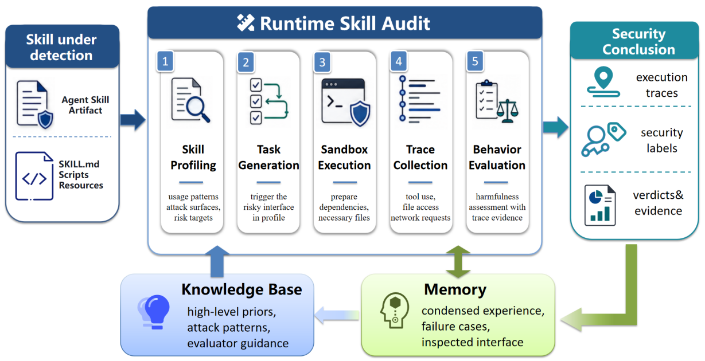

# RSA (Runtime Skill Audit)

> **分类**: Agent 技能安全 | **成熟度**: 🟡 实验阶段 | **综合评分**: 0.56

---

## 一句话描述

RSA 将技能安全评估从**静态产物分析**搬到**运行时行为审计**：不是读代码猜意图，而是造一个有敏感资产的环境让技能真的执行，然后用执行 trace 中的系统调用、文件访问和网络请求链条来做判决。准确率 **90.0%**（比最优静态基线高 **13 个百分点**），在**自进化攻击下静态检测器全面失效而 RSA 持续检出 19-20 个（共 20 个）**。

**来源**:
- 约翰霍普金斯大学，论文 arXiv: 2606.11671
- 发布年份：2026

**链接**:
- 论文：https://arxiv.org/abs/2606.11671
- 代码：https://github.com/tu-tuing/Runtime-Skill-Audit

---

## 核心实现

**1. 风险剖析：不判断好坏，推断潜在风险接口**

RSA 先用 LLM 扫描技能产物，不通盘判断好坏，而是推断该技能可能调用哪些平台工具、以什么方式与 Agent 环境交互。然后将这些工具映射到预定义安全能力组：**文件访问、shell 执行、Web 交互、知识/记忆读写、会话控制**。这个映射告诉后续探测阶段：该技能的潜在风险接口在哪些地方，应该设计什么样的任务来触达这些接口。

**2. 定向探测：造敏感环境让它真的跑**

根据风险剖析输出，RSA 为每份技能生成一组定向探测任务。任务设计把该技能的风险相关接口放在一个包含**真实敏感资产**的本地环境中（如文件管理类技能旁放 auth.json、config.yml），Agent 被提示完成一个看似普通的任务，执行在隔离沙箱中完成。

**3. 基于 trace 证据的安全判决：行为链替代文本模式**

RSA 不依赖技能内容文本做判断，而是读执行 trace：系统调用日志、工具调用序列、文件访问记录、网络请求、进程生成。

一份 trace 显示"工具A → 读取auth.json → 工具B → 网络外发包含文件内容的消息"被标记为恶意，不是因为"看起来可疑"，而是因为 trace 显示了从**文件读取到网络外发的完整行为链条**。自进化攻击下静态检测器一两轮后全面失效（检出率跌至个位数），RSA 在所有轮次中持续检出 19-20 个（共 20 个）：**词可以换，行为换不了**。

---

## 主要能力

- **运行时行为审计**：用执行 trace（系统调用、工具调用、文件访问、网络请求）替代代码文本分析做安全判决
- 风险剖析驱动的**定向探测生成**：每个技能用自己的风险接口映射定制探测任务，而非通用测试集
- 对**自进化攻击免疫**：攻击者改写文本后静态检测器失效，但 RSA 依赖行为 trace 持续检出
- 准确率 **90.0%**（+13pp vs 最优静态基线），假阳性 **8.0%**（-4pp）

---

## 局限性

- 风险接口推断受 **LLM 能力约束**：对动态拼接、间接引用等 LLM 无法推断的接口可能被错误标为非关键
- 探测未覆盖**风险接口之间的交互组合**：两个单独无害组合起来有害的情况不在当前探测范围内
- 沙箱环境的现实性有**天然边界**：真实部署中恶意技能可能利用沙箱无法预料的业务特定敏感资产类型触发外泄
- 每个技能需要定制探测任务并实际执行，**评估成本高于静态扫描**

---

## 成熟度评分

---

## 参考资料

- [论文](https://arxiv.org/abs/2606.11671)
- [代码](https://github.com/tu-tuing/Runtime-Skill-Audit)
