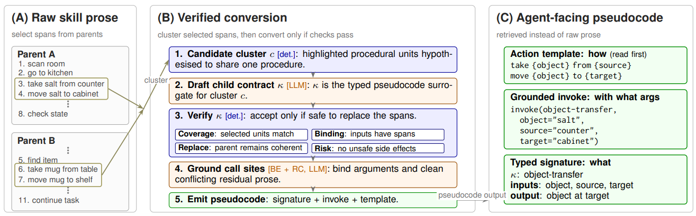

# Skill-as-Pseudocode (SaP)

> **分类**: Skill 召回 | **成熟度**: 🟡 成长期 | **综合评分**: 0.52

---

## 一句话描述

**SaP** 将技能文档从自然语言散文自动转换为 **带类型的伪代码合约 + 具体动作模板**，通过 **四重确定性校验（Coverage/Binding/Replacement/Risk）** 保证转换质量。Agent 不再需要从散文中推导"调哪个工具、传什么参数"，从根本上剪断了"散文→动作"的死循环。在 ALFWorld 134 局中 **82/402 的配对比分** 赢过 GoS 基线。

**来源**:
- NTU、复旦大学、上海 AI 实验室联合研究
- 发布年份：**2026**

**链接**:
- 论文：https://arxiv.org/pdf/2605.27955

---

## 核心实现

**1. 五阶段转换流水线**

Parser 按 Markdown 标题将技能散文拆为程序单元 → 对每个单元提取框架元组（动词、宾语、代码语言、脚本）并做单链聚类（故意保持高召回，假阳性由后续验证滤掉）→ 对每个聚类调用一次 LLM 产出**类型化合约 κ**（触发条件、I/O schema、前后置条件、副作用）→ 四重确定性校验 → 通过验证的合约写回父技能，对应段落替换为 `invoke(κ, {arg=value})` 占位符。

**2. 四重确定性校验——全部基于规则**

- **Coverage**：合约是否覆盖原段落 Token。
- **Binding**：每个输入参数在原文中是否有对应绑定。
- **Replacement**：原段落结构上是否允许被 invoke 占位符替换。
- **Risk**：AST 扫描附带资源是否含危险调用（裸 rm -rf、未声明网络出口等），加权风险分 ≥ 0.80 直接驳回。

四条检查各有过滤重点且近乎互斥，用 30 个合成负样本标定决策阈值，确保零假阳性。

**3. 三层级运行时呈现**

Agent 拿到三合一套餐：
- **具体动作模板**：环境直接接受的动词和参数格式，先看；
- **重写的父技能骨架**：段落被 invoke 替换保留结构位置，再看；
- **内联子合约**：类型签名，需要时看。

消融证明子合约作为独立检索条目浮出而非内联嵌入——得分反掉 27%——说明 Agent 需要的是"在父技能上下文中被替换好的类型化信息"而非多一个检索条目。

---

## 主要能力

- **命中率突破**：82/402 配对比分 win GoS（47/402），输入 Token 减少 22.8%，LLM 调用次数减少 14.5%
- **"散文→动作"死循环的剪断**：类型签名的"what"和动作模板的"how"分开提供，Agent 不再反复重新推导同一段散文
- **确定性质量保证**：四重规则校验确保 LLM 生成的合约不偏离原文、不制造幻觉
- **与 SkillSmith 互补**：SkillSmith 优化技能加载后的执行效率，SaP 优化技能被 Agent 读取时的格式

---

## 局限性

- **依赖 Markdown 结构**：Parser 按标题拆分，非结构化或格式混乱的技能散文效果存疑
- **ALFWorld 单一环境验证**：仅在 ALFWorld 的 skills_500 库上测试，更多环境和技能库未经验证
- **子合约调用点约 30% 被过滤**：Binding Extraction 后处理中约 30% 候选 invoke 调用点被剔除

---

## 成熟度评分

| 维度 | 评分 (0.0-1.0) | 说明 |
|------|---------------|------|
| 技术成熟度 | 0.50 | 学术论文阶段，NTU+复旦+上海AI Lab联合研究，有开源代码，四重确定性校验保证转换质量 |
| 创新性 | 0.75 | 首次将技能文档转换为带类型伪代码合约，从格式层面剪断散文到动作的死循环 |
| 落地程度 | 0.35 | 代码已开源但研究阶段，需与其他技能系统集成 |
| 生态活跃度 | 0.45 | 三机构联合+InternLM团队，开源生态较好 |

**综合评分**: 0.52

## 参考资料

- [SaP 论文](https://arxiv.org/pdf/2605.27955)
- [代码](https://github.com/InternLM/Skill-as-Pseudocode)
